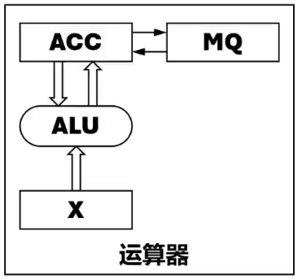
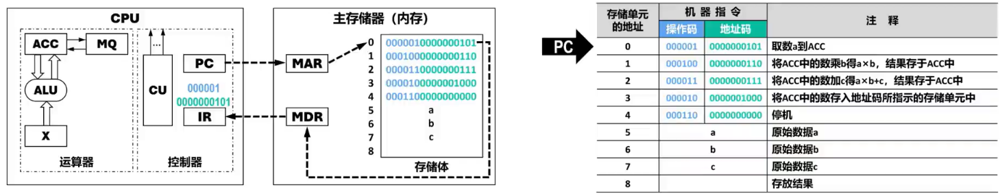
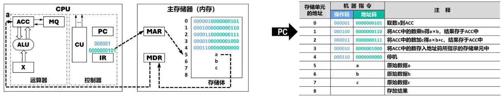
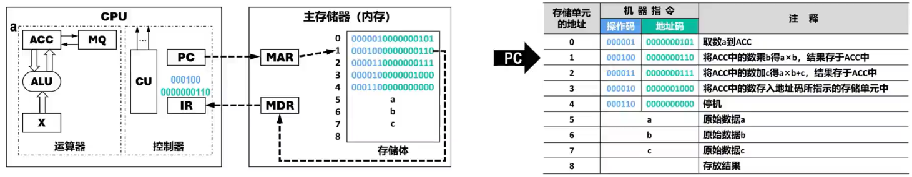
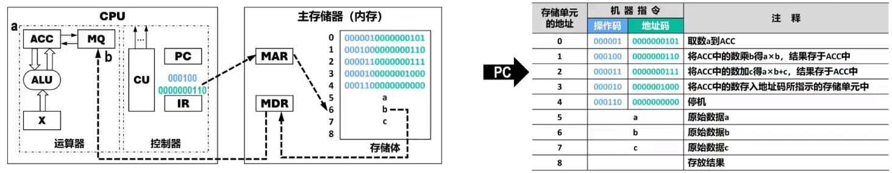
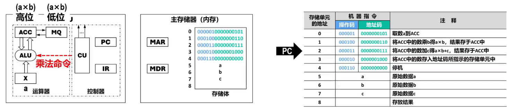

# 计算机硬件组成的细化

## 运算器

### Remind

- 

### 算术逻辑单元ALU（Arithmetic and Logic Unit）

### 相关寄存器

#### 累加器ACC（Accumulator）

#### 乘商寄存器MQ（Multipler-Quotient Register）

#### 操作数寄存器X

### Tip

| ALU算术执行 | 加        | 减        | 乘            | 除          |
| ----------- | --------- | --------- | ------------- | ----------- |
| ACC         | 被加数/和 | 被减数/差 | 乘积高位      | 被除数/余数 |
| MQ          |           |           | 乘数/乘积低位 | 商          |
| X           | 加数      | 减数      | 被乘数        | 除数        |

## 主存储器

### ==存储体==

#### Remind

- > 由很多存储单元组成

#### ==存储单元==

##### Remind

- > 由若干个存储元件组成

##### ==存储元件==

- 每个存储元件能存储==一位二进制“0”或“1”==

##### Tip

- 一个存储单元中可存储一串二进制信息，称这串二进制信息为一个==存储字==，这串==二进制信息的位数==称为==存储字长==（可以是8位、16位、或32位等）

#### ==存储单元的地址==

- 每个存储单元的编号

### 存储器==地址寄存器MAR==（Memory Address Register）

#### Remind

- > ==存放欲访问的存储单元的地址==

#### ==MAR的位数==（长度）

- ==决定了存储单元的数量==

### 存储器数据寄存器MDR（Memory Data Register）

#### Remind

- > ==存放从存储体的某个存储单元取出的信息或准备往某个存储单元存入的信息==

#### ==MDR的位数==（长度）

- ==与存储字长相等==

## 控制器

### Remind

- 控制器是计算机的神经中枢，由它指挥各部件自动、协调地工作
  1. 控制从主存中读取一条指令，称为==取指==过程（阶段）
  2. 对指令进行分析，指出该指令要完成何种操作，并按寻址特征指明操作数的地址，称为==分析==过程（阶段）
  3. 根据指令的操作码和操作数所在的地址完成某种操作，称为==执行==过程（阶段）

### 控制单元CU

- > ==分析当前指令所需完成的操作，并发出各种微操作命令序列==，用以控制所有被控对象

### 相关寄存器

#### 程序计数器PC（Program Counter）

- > ==存放当前欲执行指令的地址==

- ==PC与MAR之间有一条直接通路==

- ==PC自动形成下一条指令的地址==（自动加1）

#### 指令寄存器IR（Instruction Register）

- > ==存放当前的指令==

- ==IR的内容来自MDR==

- ==IR中的操作码==（用OP(IR)表示）会送至CU（用==OP(IR)->CU==表示），用来==分析指令==

- ==IR中的地址码==（用Ad(IR)表示）作为操作数的地址送至MAR（用==Ad(IR)->MAR==表示），用来==从内存中取操作数==

# 计算机的基本工作原理

## Remind

- 指令详见 [-005-指令系统](..\-005-指令系统) 

## 基本过程

1. ==取指==
2. ==分析==
3. ==执行==

## 具体步骤

1. 初始化：PC=0（(某某)表示某某中的数据）
2. 编号为0=(PC)的存储单元
   1. 
      ==取指==
      1. (PC)->MAR
      2. (MDR)->IR
   2. (PC)=1=(PC)+1
   3. ==分析==
      1. OP(IR)->CU
   4. 
      ==执行==
      1. Ad(IR)->MAR
      2. (MDR)->ACC
3. 
   1. 
      ==取指==
      1. (PC)->MAR
      2. (MDR)->IR

   2. (PC)=2=(PC)+1
   3. ==分析==
      1. OP(IR)->CU

   4. ==执行==
      1. 
         1. Ad(IR)->MAR
         2. (MDR)->MQ

      2. 
         1. CU向ALU发送乘法操作指令，并把运算结果（a×b）的高位存放在ACC中、低位存放在MQ中

## Tip

- ==取指==->==分析==->==执行==每个过程涉及多个步骤，每个步骤都需要特定的==控制信号==进行控制
  - 控制信号的发出时机、持续时间等都需要相应的==定时信号==来调控

# Tip

- 随着硬件技术的发展，内存都制成大规模集成电路芯片，而将MAR和MDR集成到了CPU芯片中