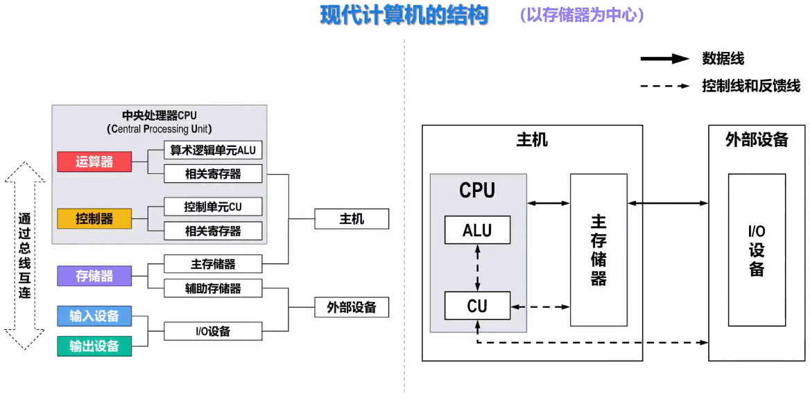
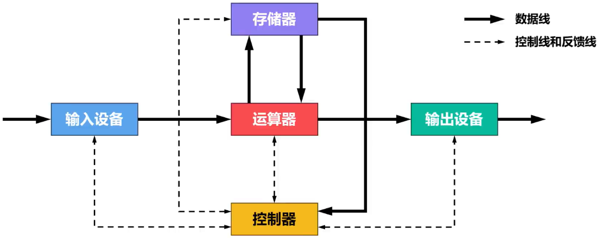
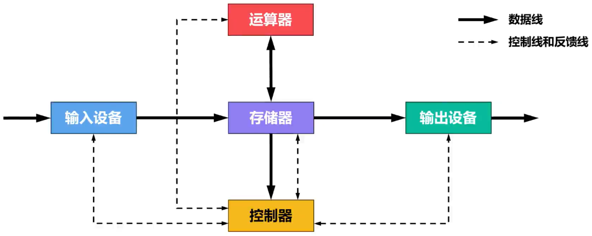
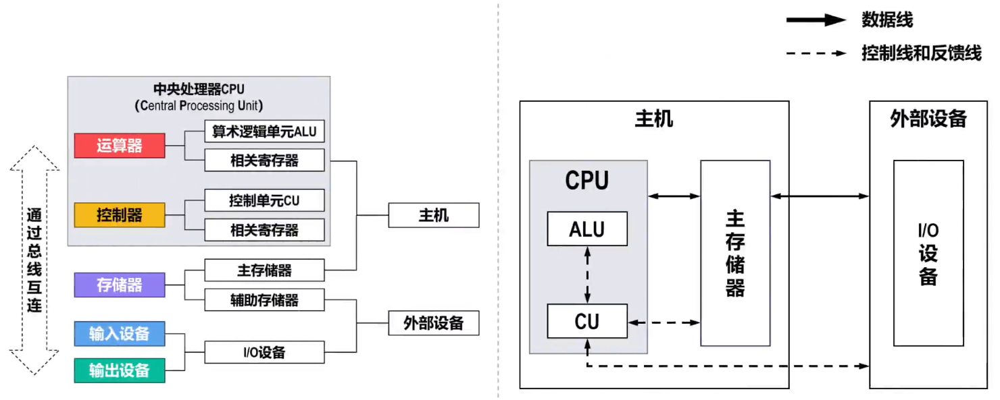

# Remind

- 

# 冯诺依曼计算机的结构（以运算器为中心）

## 核心思想

- > 存储程序

## 主要特点

- 指令和数据均采用==二进制==表示
- ==指令和数据存放在存储器==中，按地址访问
- ==指令==在存储器中==按顺序存放==。一般情况下，指令==顺序执行==
- 指令由==操作码==和==地址码==组成
  - 操作码：表示执行何种操作
  - 地址码：表示操作数在存储器中的位置
- 机器==以运算器为中心==，输入/输出设备与存储器间的数据传送通过运算器完成，浪费很多可以用于运算的时间
- 计算机硬件由5大部件组成
  - ==运算器==
  - ==控制器==
  - ==存储器==
  - ==输入设备==
  - ==输出设备==

## Tip

- 

# 现代计算机结构（以存储器为中心）

## Remind

- 对于冯诺依曼结构导致的I/O操作浪费运算时间问题，现代计算机让I/O设备直接与存储器交换数据，提高整体效率
- 

## 主机

### 中央处理CPU

#### 运算器

##### 算术逻辑单元ALU

###### ==算术运算==

- 加、减、乘、除

###### ==逻辑运算==

- 与、或、非、异或等

##### 相关寄存器

#### 控制器

##### 控制单元CU

- ==解释==存储器中的==指令，并发出各种操作命令==来执行指令
- 控制输入/输出设备完成相应的输入/输出操作

##### 相关寄存器

### 主存储器

- 存放程序和数据，又称为内存储器，简称内存或主存
- 可以==直接与CPU交换信息==

## 外部设备

### 辅助存储器

- 帮助主存存储更多的信息。又称为外部存储器，简称外存或辅存
- ==辅存中的信息必须调入主存后，才能被CPU访问==

### I/O设备

#### 输入设备

- 将人们熟悉的信息形式转换为计算机能够识别的信息形式

#### 输出设备

- 将计算机运算结果转换为人们熟悉的信息形式

## Tip

- 