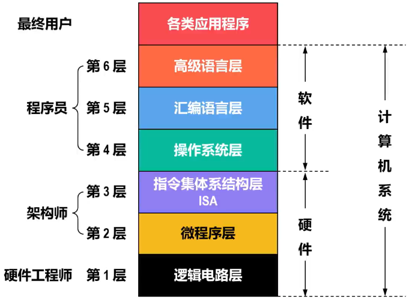

# 计算机系统的分层思想

- 计算机是一个非常复杂的系统，为了==简化对计算机系统的研究和实现==，可==采用分层思想将计算机系统划分成一个层次结构的系统==
  - 系统中的==每一层都向其上层提供一个简洁和抽象的接口==
  - ==每一层的实现细节==对其上层而言都是“看不见”的，也就是==透明==的
- 计算机解决问题的过程就是层次结构中的各层逐层转换的过程

# 分层

- 与计算机网络体系结构的分层不同，计算机系统的分层方式，目前并==没有统一标准==，这个课程介绍一种将计算机系统划分为六个抽象层的层次结构

- | 层级                | 描述                                                         |
  | ------------------- | ------------------------------------------------------------ |
  | 高级语言层          | 使用与机器无关的高级语言编程，==无需掌握机器的底层技术细节==，只要掌握某种高级语言额的语法规则以及算法和数据结构等方面的知识进行编程 |
  | 汇编语言层          | 使用汇编语言进行编程。由于汇编语言的每条语句都与机器语言的某条语句对应，因此==仍要求程序员对实际机器的内部组成和指令系统非常熟悉== |
  | 操作系统层          | 设计人员不仅要对操作系统的设计理论有比较深入的理解，还需要掌握具体机器的==指令集==和==汇编语言==以及适用于编写操作系统软件的==高级语言== |
  | 指令集体系结构层ISA | 定义了某计算机可执行的所有==机器指令的集合==，规定了对于每条机器指令计算机应执行什么操作，所处理的操作数应存放的位置以及操作数的类型等 |
  | 微程序层            | 将一条机器指令编写成一个==微程序==                           |
  | 逻辑电路层          | 计算机硬件系统的底层，由逻辑门、寄存器等==逻辑电路==组成     |

- 

# 软件和硬件的逻辑功能等价性

- 在特定条件下，用软件实现的逻辑功能也可以通过硬件电路来实现，反之亦然

  - 对于一些特定的计算或控制任务，可以选择将其==使用软件编程来实现==，也可以选择==设计专用硬件电路来实现==，而两者的结果将在==功能上等效==
  - DMA方式就是一个经典的硬件加速例子

- 软件和硬件的逻辑功能等价性是计算机科学中的一个重要概念，也是计算机体系结构和工程中的基本原则之一

  - 当选择在软件层面实现某些逻辑功能时，这通常意味着使用通用处理器（例如CPU）来执行程序
  - 而当选择在硬件层面实现这些逻辑功能时，这通常意味着使用专用的硬件电路，例如现场可编程门阵列FPGA（Field Programmable Gate Array）或专用集成电路ASIC（Application Specific Integrated Circuit）技术

- || 软件实现 | 硬件实现 |
  |---| -------- | -------- |
  | 性能与速度 | 性能与速度弱于硬件实现 | 更高的性能和更快的响应时间 |
  | 灵活性 | 相对容易地进行修改和更新 | 需要重新设计和制造 |
  | 成本 | 开发软件相对便宜 | 开发和制造硬件比较昂贵 |
  | 应用需求 | 有些任务更适合在软件层面完成，例如操作系统的功能 | 有些任务更适合在硬件层面完成，例如高频交易系统 |
  
  