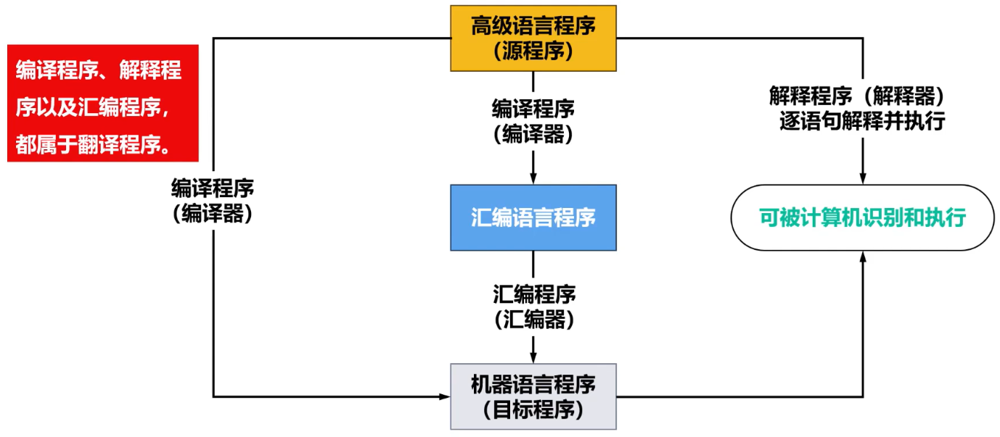

# 应用软件

- > 为了解决某个应用领域的相关问题而编制的程序

# 系统软件

- > 为了用户能够高效、安全地使用和管理计算机硬件资源以及为开发和运行应用软件而编制的各种软件

- 操作系统

- 数据库管理系统

- 语言处理程序

- 服务性程序

# 计算机软件的发展

## 编程语言的发展

### ==面向机器==

#### Remind

- 不同计算机的指令系统不同

#### 机器语言

- 使用==机器指令二进制编码==编写程序
- 编程繁琐、易出错且不易排错，限制了计算机的使用
- ==计算机可以直接识别和执行==用机器语言编写的程序（机器语言程序），因此又称为目标程序

#### 汇编语言

- 用==表示机器指令的特殊符号==（汇编语言）编写程序
- 相比于用机器语言编写程序，汇编语言这种符号语言简单直观、便于记忆
- ==计算机不能识别和执行==用汇编语言编写的程序（汇编语言程序），需要将其通过汇编器（汇编程序）翻译成机器语言程序

### 面向问题

#### Remind

- ==与机器无关==

#### 高级语言

- 用规划好的==一套基本符号和编程规则==（接近数学语言的高级语言）编写程序
- 直观通用，==与具体机器无关==，稍加学习就能掌握，便于推广使用计算机
- ==计算机不能识别和执行==用高级语言编写的程序（高级语言程序），需要将其通过编译器（编译程序）翻译成汇编语言或机器语言

### Tip

- 机器语言到汇编语言是机器指令符号化
- 汇编语言到高级语言是编程语言自然化

## 程序设计语言和语言翻译程序的关系

- 

## Tip

- 随着硬件和软件的不断发展，人们又创造出了一类程序，称为==操作系统==（属于系统软件）
  - 操作系统提供了在==汇编语言和高级语言的使用和实现过程中所需的某些基本操作==
  - 操作系统负责==控制并管理计算机系统全部硬件资源==和==软件资源==
  - 操作系统==为用户使用计算机系统提供了极为方便的条件==
- 随着计算机应用领域的逐渐扩大，还相应地出现了==其他各类系统软件==（例如数据库管理系统、网络系统等）以及多种多样应用软件
- 随着软件的进一步发展，将会出现==更高级的计算机语言==，其发展方向是标准化、积木化、产品化以及智能化，最终向自然语言发展，它们能够自动生成程序