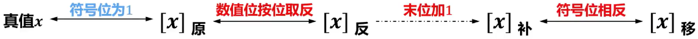

# 原码

## Remind

- 
- 又称==带符号的绝对值表示==

## 定点整数的原码定义

- n为定点整数x的原码表示中数值位的位数（比特数量）
- $$
  [x]_原 =
  \begin{cases}
  0,x &0 \leq x < 2^n\\[2ex]
  2^n + |x| &-2^n < x \leq 0
  \end{cases}
  $$

## 定点小数的原码定义

- x为定点小数
- $$
  [x]_原 =
  \begin{cases}
  x &0 \leq x < 1\\[2ex]
  1 + |x| &-1 < x \leq 0
  \end{cases}
  $$

## 优点

- 表示方法简单直观

## 缺点

- 真值0在原码中有两种不同的表示
- 符号位不能直接参与运算

## Tip

- 鉴于原码的缺点，原码在计算机中目前仅仅用于表示浮点数的尾码

# 补码

## Remind

### ==模==

- 
- 模（或称模数），是一个数值计量系统的==计量范围==，记作mod或M
- 只要确定了“模”，就可以找到一个==与复数等价的正数==来代替此负数，该正数就是负数的==补数==
- ==超过计量范围的数都应该自动舍弃模数==

### 补数

- 一个负数可用它的正补数来替代，而这个正补数可以用==模数加上负数本身==求得
- 一个正数和一个负数==互为补数时，他们绝对值之和即为模数==
- ==正数的补数即该正数本身==

### Tip

- ==将补数的概念应用到计算机内部==，便出现了==补码==这种机器码（机器数）
  - 整数的补码：符号位为0，数值就是它本身
  - ==负数的补码：等于模数加上该负数本身，而模数就是最高位进位的权值==

## 定点整数的补码定义

- n为定点整数x的补码表示中数值位的位数（比特数量），==模数为2^n+1^==

- 

- $$
  [x]_补 =
  \begin{cases}
  0,x &0 \leq x < 2^n\\[2ex]
  2^{n+1} + x &-2^n \leq x < 0&(mod \; 2^{n+1})
  \end{cases}
  $$

## 定点小数的补码定义

- 定点小数x，==模数为2^1^=2==

- $$
  [x]_补 =
  \begin{cases}
  x &0 \leq x < 1\\[2ex]
  2 + x &-1 \leq x < 0&(mod \; 2)
  \end{cases}
  $$

## 优点

- 补码表示方法使得减法运算可以转换成加法运算
- 真值0在补码中只有一种表示，这使得补码比原码多表示一个最小负数
- 符号位可以直接参与运算，运算时符号位的进位作为模会被自动舍弃

## 缺点

- 补码的表示相对原码更加复杂
  - 原码的数值位与真值的绝对值相同。因此，通过原码可以很容易得出真值。但是，补码就没有这么简单了

## Tip

- 现代计算机中多采用IEEE 754标准表示浮点数，而其中的==定点小数采用原码表示==，因此通常==不会涉及定点小数的补码表示==

# 反码

## Remind

- 通常用于作为有原码求补码或由补码求原码的==中间过渡==
  - 正数的反码：符号位为0，数值位就是它本身
  - ==负数的反码：符号位为1，数值位就是真值数值位取反==

## 定点整数的反码定义

- n为定点整数x的反码表示中数值位的位数（比特数量）

- $$
  [x]_补 =
  \begin{cases}
  0,x &0 \leq x < 2^n\\[2ex]
  (2^{n+1} - 1) + x &-2^n < x \leq 0
  \end{cases}
  $$

## 定点小数的反码定义

- n为定点小数x的反码表示中数值位的位数（比特数量）

- $$
  [x]_补 =
  \begin{cases}
  x &0 \leq x < 1\\[2ex]
  (2 - 2^{-n}) + x &-1 < x \leq 0
  \end{cases}
  $$

## 优点

- 符号位可以参与运算

## 缺点

- 最高位（符号位）产生的进位要加到运算结果的低位（循环进位）
- 真值0在反码中有两种不同的表示

## Tip

- 反码在计算机中目前很少被使用

# 移码

## Remind

- 移码就是在==真值上加一个常数2^n^==
  - 在数轴上，移码所表示的范围对应于真值在数轴上的范围向轴的正方向移动2^n^个单元
  - 移码==只用于定点整数==的表示

## 移码定义

- n为定点整数x的移码表示中数值位的位数（比特数量）

- $$
  [x]_移 = x + 2^n \quad-2^n \leq x < 2^n
  $$

## 优点

- 真值0在移码中只有一种表示
- 移码保持了真值原有的大小顺序，可以直接比较大小
- 最小真值的移码为全0，最大真值的移码为全1，符合人们的习惯

# 编码间的转换

- 真值x为==正数==
  - 
- 真值x为==负数==
  - 