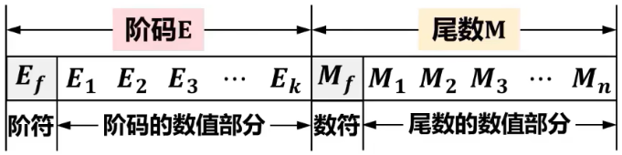
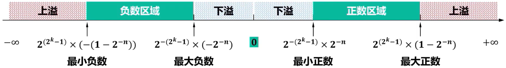
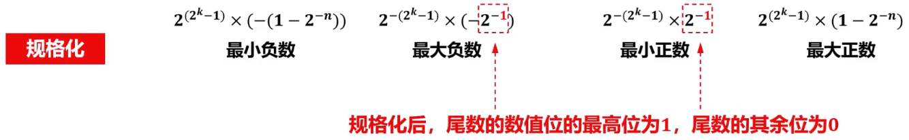
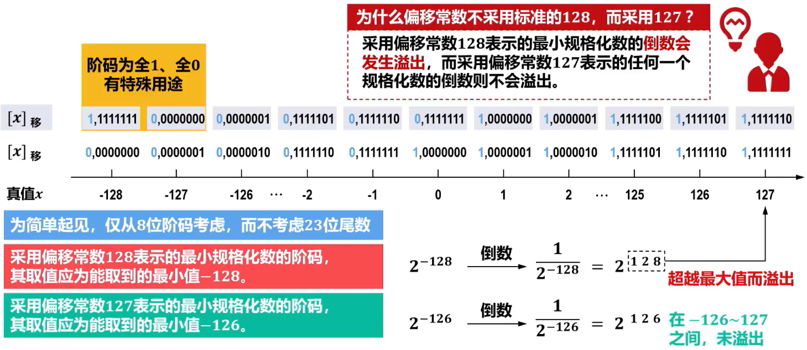
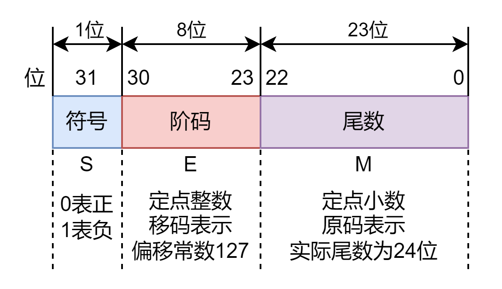
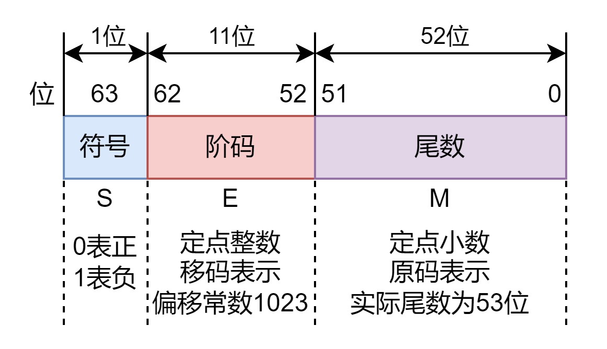

#  浮点数在机器中的表示形式

- N = r^E^ × M (r可取2、4、...、2^n^)
- 
- 阶码：定点整数可采用==原码、补码、反码、移码==
- 尾数：定点小数可采用==原码、补码、反码==
- 对应的浮点数表示范围会略有不同

# 浮点数表示范围

- 
- 尽管浮点数扩大了数据表示范围，但==受机器字长限制，浮点数仍然存在溢出现象==
  - 当浮点数的阶码大于最大阶码时，称为==上溢==，此时机器==停止运算==，浮点运算器件会显示溢出标志
  - 当浮点数的阶码小于最小阶码时，称为==下溢==，虽然此时数据不能被精确表示，但由于发生下溢时数据的绝对值很小，通常将尾数各位强置为0，==按机器0处理==，此时机器可以==继续运行==
- 一旦浮点数的位数确定后，合理分配==阶码E==和==尾数M==的位数，直接影响浮点数的==表示范围==和==精度==
  - IEEE 754
    - 短实数（32位）：阶码E取8位（含1位阶符），尾数M取24位（含1位数符）
    - 长实数（64位）：阶码E取11位（含1位阶符），尾数M取53位（含1位数符）
    - 临时实数（80位）：阶码E取15位（含1位阶符），尾数M取65位（含1位数符）

# 浮点数的规格化

- 通常要求浮点数在数据表示时==对尾数进行规格化处理==，即==使得尾数的最高数值位必须是一个有效值==
- 浮点数规格化带来以下好处
  - 使浮点数的表示==形式唯一==
  - 使浮点数的表示==精度最高==
- 对于非规格化尾数，需要对其进行==规格化操作==，即根据具体形式通过将非规格化==尾数的数值部分==进行==左移或右移==，并==相应减少或增加阶码值==的操作进行规格化，对应的规格化方法分别称为向左规格化（简称==左规==）和向右规格化（简称==右规==）
- 对于==基数r不同的浮点数==，因其==规格化的形式不同==，规格化==过程也不同==
  - 当==r=2^1==时，尾数==数值部分最高1位不全为0==的数为规格化数
    - 左规：尾数数值部分==每左移1位，阶码减1==
      右规：尾数数值部分==每右移1位，阶码加1==
  - 当==r=2^n==时，尾数==数值部分最高n位不全为0==的数为规格化数
    - 左规：尾数数值部分==每左移n位，阶码减1==
      右规：尾数数值部分==每右移n位，阶码加1==
- ==基数r==不同，对数的==表示范围和精度等都有影响==
  - ==基数r越大==，可表示的==浮点数范围越大==，而且所表示的数的==个数越多==。但浮点数的==精度反而下降==
- 

# IEEE 754浮点数标准

## Remind

### ==基数==

- > 2

### ==符号==

- > 取值0表示正数；取值1表示负数

### ==阶码==

- > 定点整数，用==移码==表示

### ==尾数==

- > 定点小数，用==原码==表示

## ==32位单精度浮点数==

### 阶码

- > 定点整数，用==移码==表示，==偏置常数2^7^-1=127==，而==不是标准移码的2^7^=128==

  - [x]~移~ = x + (2^7^ - 1)    -2^7^ <= x < 2^7^

- 

### 尾数

- > 定点小数，用==原码==表示。==符号位==前移到最左侧。==相邻左侧隐藏一个1==（因为规格化中前n位必须不全为0），表示数值而不表示符号。
- 尾数实际有24位，但不保存隐藏的那个1，只保存23位，节省的比特位可用于提高尾数的精度。==完整的尾数形式为1.M==

## ==64位双精度浮点数==

### Remind

- 对应C语言中的==double==型
- 类似32位单精度浮点数

## Tip

- 

- 

- | 数值的分类      |            |                  | 符号S | 阶码E       | 尾数M | 单精度（32位，对应C语言中的==float==）对应的真值 | 双精度（64位，对应C语言中的==double==）对应的真值 |
  | --------------- | ---------- | ---------------- | ----- | ----------- | ----- | ------------------------------------------------ | ------------------------------------------------- |
  | 阶码E为全0      | 机器0      | 正0              | 0     | 0（全0）    | 0     | +0                                               |                                                   |
  |                 |            | 负0              | 1     | 0（全0）    | 0     | -0                                               |                                                   |
  |                 | 非规格化数 | 非规格化正数     | 0     | 0（全0）    | M ≠ 0 | (-1)^0^ × 2^-126^ × 0.M                          | (-1)^0^ × 2^-1022^ × 0.M                          |
  |                 |            | 非规格化负数     | 1     | 0（全0）    | M ≠ 0 | (-1)^1^ × 2^-126^ × 0.M                          | (-1)^1^ × 2^-1022^ × 0.M                          |
  | 阶码E全为1      | 无穷大     | 正无穷大         | 0     | 255（全1）  | 0     | +∞                                               |                                                   |
  |                 |            | 负无穷大         | 1     | 255（全1）  | 0     | -∞                                               |                                                   |
  |                 | 非数NaN    | 无定义数（非数） | 0或1  | 255（全1）  | M ≠ 0 | NaN（not a number）                              |                                                   |
  | 阶码E非全0和全1 | 规格化数   | 规格化正数       | 0     | 1 ≤ E ≤ 254 | M     | (-1)^0^ × 2^E-127^ × 1.M                         | (-1)^0^ × 2^E-1023^ × 1.M                         |
  |                 |            | 规格化负数       | 1     | 1 ≤ E ≤ 254 | M     | (-1)^1^ × 2^E-127^ × 1.M                         | (-1)^1^ × 2^E-1023^ × 1.M                         |

  - 引入无穷大数可使计算过程出现异常的情况下程序能继续执行，并且可为程序提供错误检测功能。例如非0浮点数除0运算的结果就是无穷大，因此非0浮点数除0不会像整型数除0一样产生严重错误
  - 非数NaN用于表示0/0、∞/∞、0×∞、负数的平方根等。部分非数NaN运算结果可能会产生异常
  - 非规格化数可用于处理阶码下溢，使得出现比最小规格化数还小的数时程序也能继续进行下去

