# 定点数的加减法运算

## Remind

- ==定点数==在==计算机内部==采用==补码==表示
  - 补码的==符号位可以与数值位一起参与运算==
  - 采用补码可==将减法运算转换成加法运算==

## 补码加减法运算公式

- [A]~补~ + [B]~补~ = [A + B]~补~
- [A]~补~ - [B]~补~ = [A - B]~补~ = [A]~补~ + [-B]~补~

## 一位全加器

- 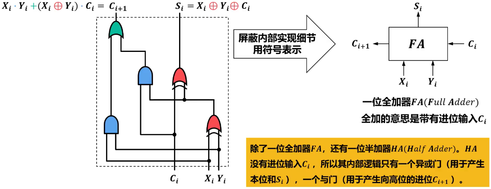

## 先行进位加法器

- $$
  G_i = X_i Y_i,\\
  P_i = X_i \oplus Y_i
  $$

  - G~i~：==进位生成函数==
  - P~i~：==进位传递函数==

- 构建先行进位电路

  - $$
    S_i = P_i \oplus C_i\\
    C_{i+1} = G_i + P_i C_i
    $$

  - $$
    C_1 = G_0 + P_0 C_0\\
    C_2 = G_1 + P_1 C_1 = G_1 + P_1(G_0 + P_0 C_0) = G_1 + P_1 G_0 + P_1 P_0 C_0\\
    .\\
    .\\
    .\\
    C_n = G_{n-1} + P_{n-1} G_{n-2} + P_{n-1} P_{n-2} G_{n-3} + ......+ P_{n-1} P_{n-2}...P_1 P_0 C_0
    $$

  - 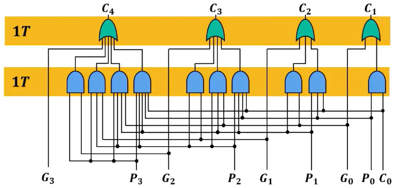

- 构建快速加法器

  - 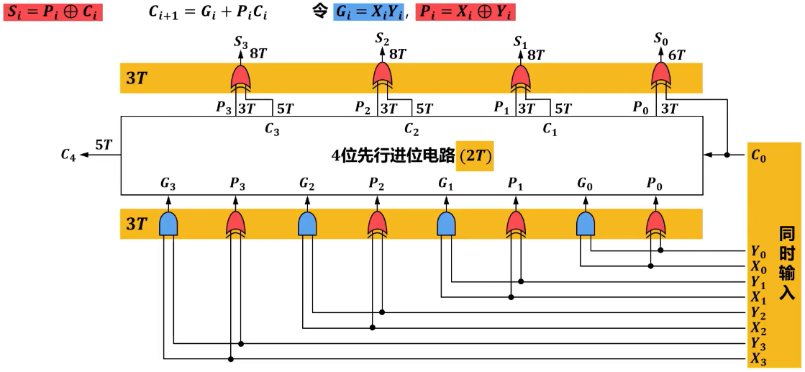

- 构建可级联的4位先行进位电路

  - $$
    C_4 = \underbrace{G_3 + P_3 G_2 + P_3 P_2 G_1 + P_3 P_2 P_1 G_0}_{记为G^*} + \underbrace{P_3 P_2 P_1 P_0}_{P^*} C_0\\
    C_4 = G^* + P^* C_0
    $$

    

  - $$
    G^* = G_3 + P_3 G_2 + P_3 P_2 G_1 + P_3 P_2 P_1 G_0\\
    P^* = P_3 P_2 P_1 P_0
    $$

    - G^*^：==组进位生成==函数
    - P^*^：==组进位传递==函数

  - 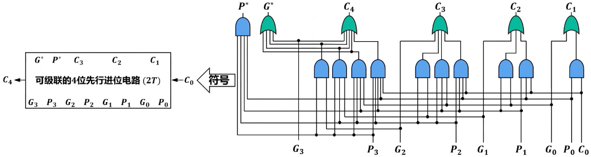

- 构建16位组内并行、组间并行加法器

  - 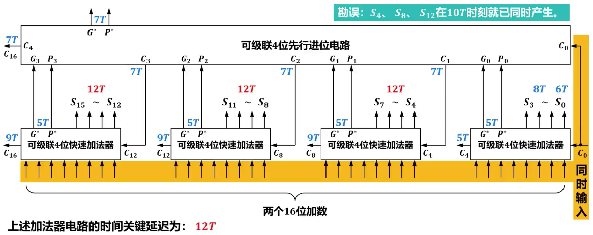

- Tip

  - 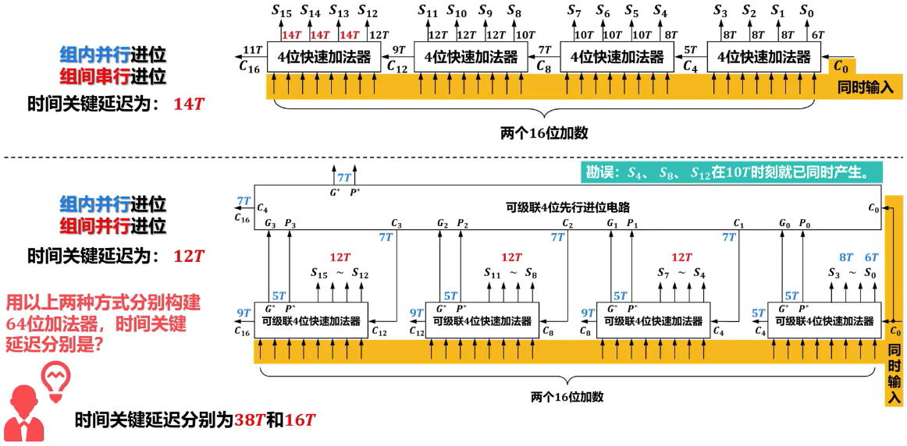

# 无符号数乘法运算

## 硬件逻辑实现

- 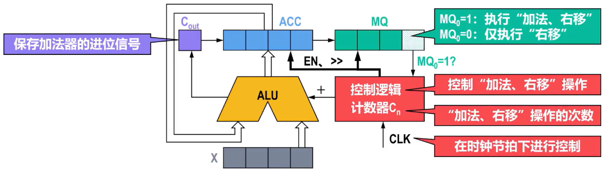

- 例如：设x=0.1101，y=0.1011，计算xy

  - | 状态                                     | 加数/被乘数 | 进位信号 | 被加数/乘积高位 | 乘数/乘积低位 |
    | ---------------------------------------- | ----------- | -------- | --------------- | ------------- |
    |                                          | X           | C~out~   | ACC             | MQ            |
    | 初始状态                                 | 1101        | 0        | 0000            | 1011          |
    | MQ~0~为1，加法(ACC)=(X)+(ACC)后          | 1101        | 0        | 1101            | 1011          |
    | 右移(C~out~)、(ACC)、(MQ)>>1后           | 1101        | 0        | 0110            | 1101          |
    | MQ~0~为1，加法(ACC)=(X)+(ACC)后          | 1101        | 1        | 0011            | 1101          |
    | 右移(C~out~)、(ACC)、(MQ)>>1后           | 1101        | 0        | 1001            | 1110          |
    | MQ~0~为0，右移(C~out~)、(ACC)、(MQ)>>1后 | 1101        | 0        | 0100            | 1111          |
    | MQ~0~为1，加法(ACC)=(X)+(ACC)后          | 1101        | 1        | 0001            | 1111          |
    | 右移(C~out~)、(ACC)、(MQ)>>1后           | 1101        | 0        | 1000            | 1111          |

## 阵列乘法器（硬件加速）

- 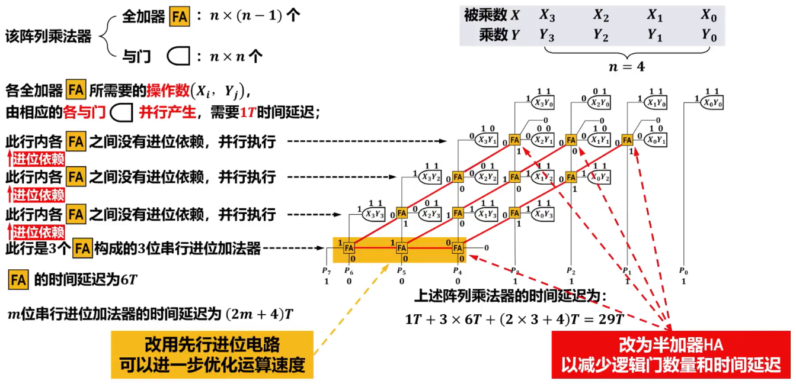

# 定点数的乘除法运算

## 定点数的乘法运算

### 原码一位乘法运算硬件逻辑实现

- 设[X]~原~ = X~0~X~1~...X~n~，[Y]~原~ = Y~0~Y~1~...Y~n~，其中==X~0~==和==Y~0~==分别为[X]~原~和[Y]~原~的==符号位==。

  - $$
    [X]_原 \times [Y]_原 = [X × Y]_原 = \underbrace{X_0 \oplus Y_0}_{乘积的符号位} \cdot ((\underbrace{0.X_1 X_2 ... X_n}_{|X|}) \times (\underbrace{0.Y_1 Y_2 ... Y_n}_{|Y|}))
    $$
    
  - |X| × |Y|即无符号数乘法

### 补码乘法运算硬件逻辑实现

#### Booth算法的推导和分析

- 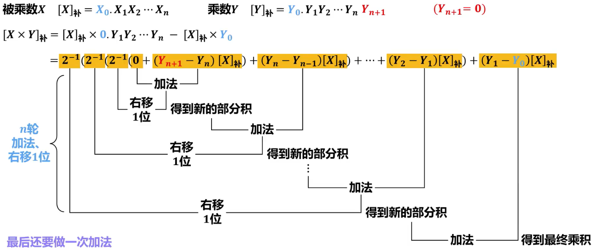
- 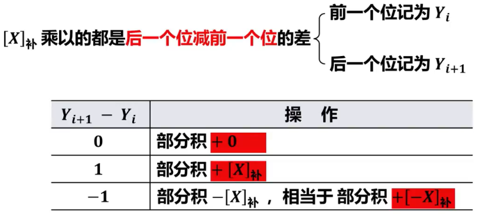

### Booth算法的硬件逻辑实现

- 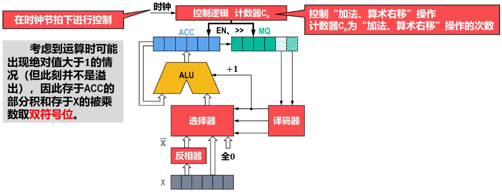

  - 使用单符号位符号位的加减运算会导致结果覆盖符号位，而这里补码采用==带符号的算术移位==，会导致无法正确移位。所以采用双符号位，将溢出检测功能替换为==保留符号功能==。

- 例如：设X = -0.1001，Y = -0.1101，计算[X × Y]~补~

  - [X]~补~ = 11.0111，[-X]~补~ = 00.1001，[Y]~补~ = 1.0011==0==

  - | 状态                                             | 加数/被乘数 | 被加数/乘积高位 | 乘数/乘积低位 |
    | ------------------------------------------------ | ----------- | --------------- | ------------- |
    |                                                  | X           | ACC             | MQ            |
    | 初始状态                                         | 110111      | 000000          | 100110        |
    | Y~i+1~-Y~i~为-1，加法(ACC) = (非X + 1) + (ACC)后 | 110111      | 001001          | 100110        |
    | 右移(ACC)、(MQ)>>1后                             | 110111      | 000100          | 110011        |
    | Y~i+1~-Y~i~为0，加法(ACC) = 全0 + (ACC)后        | 110111      | 000100          | 110011        |
    | 右移(ACC)、(MQ)>>1后                             | 110111      | 000010          | 011001        |
    | Y~i+1~-Y~i~为1，加法(ACC) = (X) + (ACC)后        | 110111      | 111001          | 011001        |
    | 右移(ACC)、(MQ)>>1后                             | 110111      | 111100          | 101100        |
    | Y~i+1~-Y~i~为1，加法(ACC) = (X) + (ACC)后        | 110111      | 111100          | 101100        |
    | 右移(ACC)、(MQ)>>1后                             | 110111      | 111110          | 010110        |
    | Y~i+1~-Y~i~为-1，加法(ACC) = (非X + 1) + (ACC)后 | 110111      | 000111          | 010110        |
    

#### 运算逻辑

- 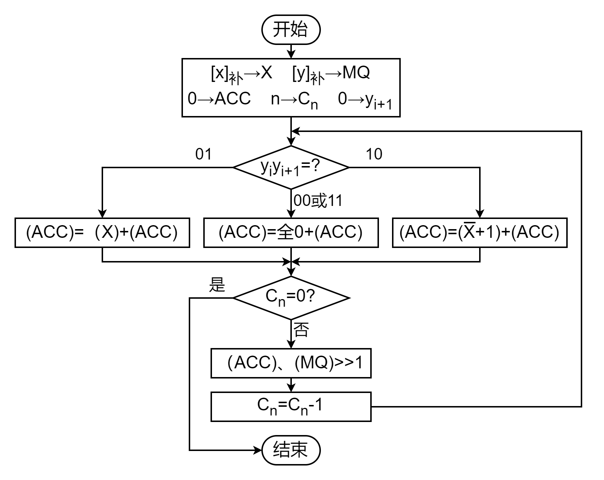

### 补码阵列乘法器

- ==原码和补码==之间可以相互转换，可采用==反码法==或==扫描法==
  - 如果将==补码的符号位单独处理，将补码的数值位转换成原码的数值位，就可利用无符号阵列乘法器==进行乘法运算。
  - 得到的结果为==无符号乘积==，将其==转换成补码的数值位==，然后在其前面==添加单独处理的符号位==，即可得到补码乘法的结果
- 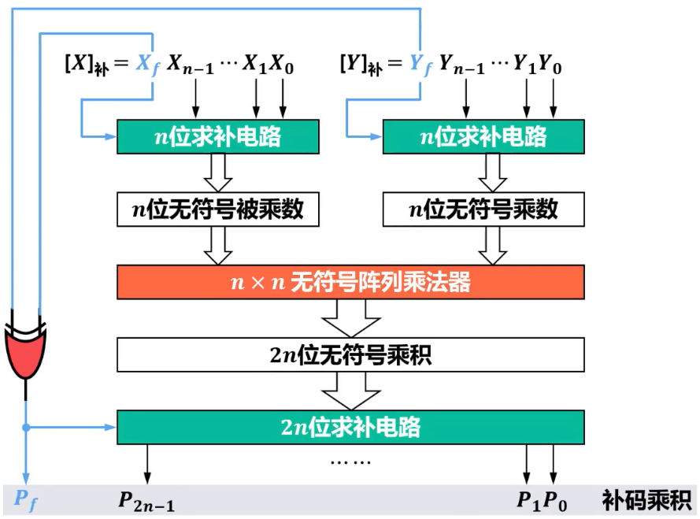

## 定点数的除法运算

### 原码除法运算

#### Remind

- 由于原码表示与无符号数非常类似，仅比无符号数多一个符号，因此，进行原码除法运算时，可将==符号位与数值部分分开处理==

  - 商的符号：由被除数和除数各自的==符号==进行==异或==运算求得
  - 商的数值部分：由被除数和除数各自的==数值部分==（即==真值的绝对值==）==相除==求得

- 设[X]~原~ = X~0~X~1~...X~n~，[Y]~原~ = Y~0~Y~1~...Y~n~，其中==X~0~==和==Y~0~==分别为[X]~原~和[Y]~原~的==符号位==

  - $$
    [X]_原 \times [Y]_原 = [X × Y]_原 = \underbrace{X_0 \oplus Y_0}_{乘积的符号位} \cdot ((\underbrace{0.X_1 X_2 ... X_n}_{|X|}) \times (\underbrace{0.Y_1 Y_2 ... Y_n}_{|Y|}))
    $$

#### 恢复余数法

- 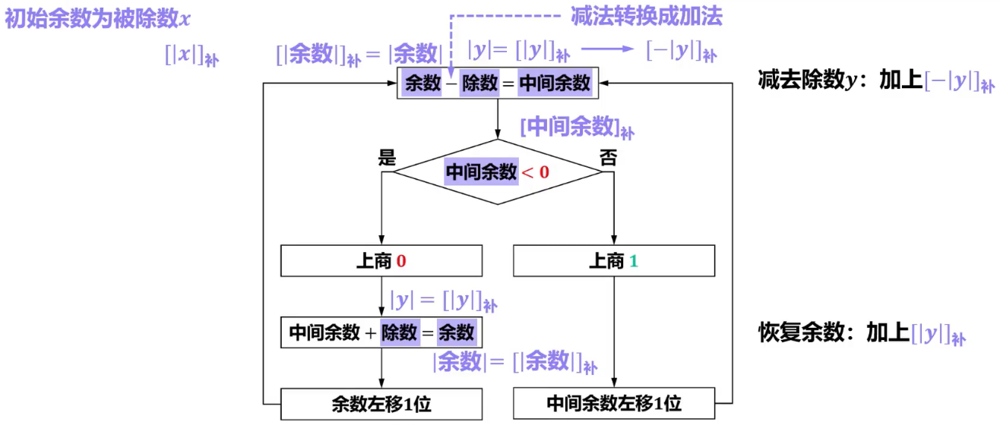
- 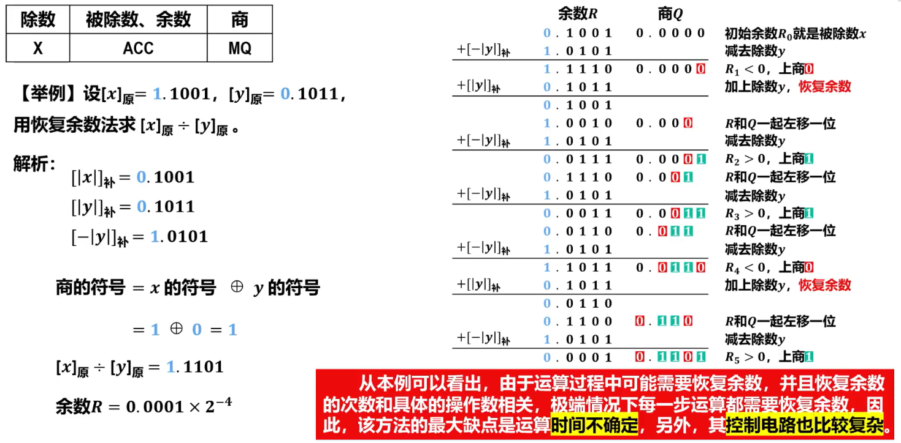

#### 不恢复余数法

- 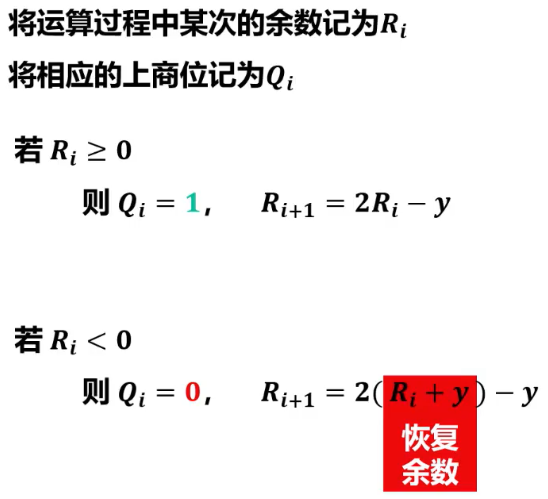
  - 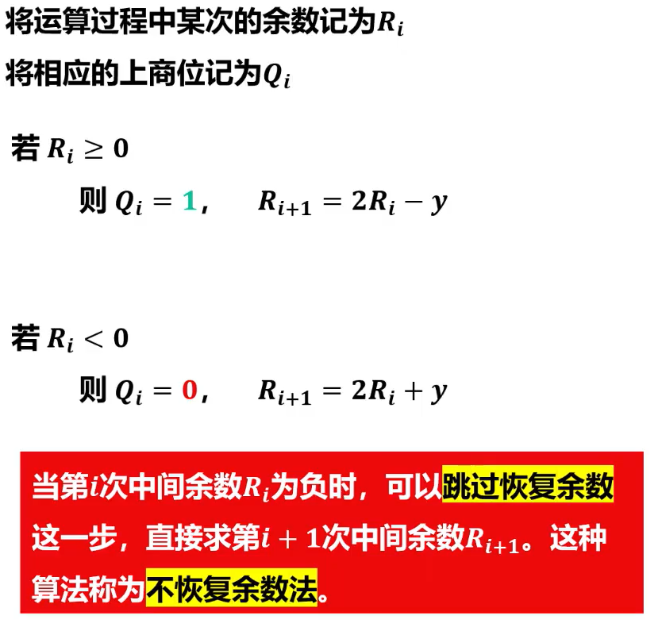
- 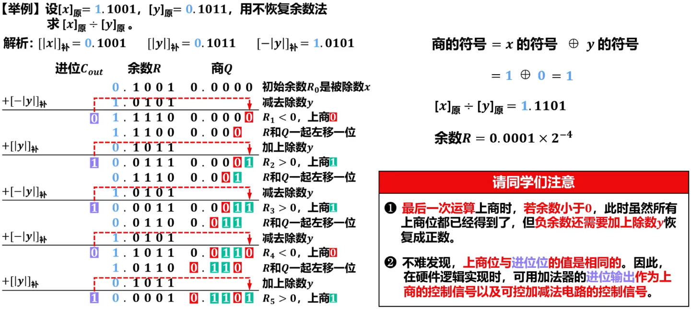

### 补码除法运算

#### 不恢复余数法

- 与原码除法将符号位和数值部分分开处理不同，==补码出发将符号位和数值部分一起参与运算，商符是在求商的过程中自然形成的==。因此，补码除法的运算方法没有原码除法的运算方法直观，需要解决以下3个主要问题

  - 如何确定==商值==

    - 由于==补码除法==中的被除数、除数和中间余数都是有符号的，因此，==不能==像原码除法（符号位单独处理）那样==直接用减法来判断是否“够减”==

    - 补码除法==判断是否“够减”==的依据是：==中间余数（初始为被除数）与除数之间符号的异同以及相应做减法或加法后结果的符号==

    - 在判断出是否“够减”后，就可以==确定相应的上商位的值==

      - 若[X]~补~与[Y]~补~同号，则==商为正==，==“够减”时上商1，“不够减”时上商0==（按==原码规则==上商）
      - 若[X]~补~与[Y]~补~异号，则==商为负==，==“够减”时上商0，“不够减”时上商1==（按==反码规则==上商）

    - 被除数记为X，除数记为Y，余数记为R~i~（初始余数为R~0~，R~1~、R~2~、...表示中间余数）
      | [X]~补~的符号位与[Y]~补~的符号位 | 求[R~1~]~补~                   | 比较[R~i~]~补~与[Y]~补~的符号                      |
      | -------------------------------- | ------------------------------ | -------------------------------------------------- |
      | 同号                             | [R~1~]~补~ = [X]~补~ - [Y]~补~ | 同号，表示“够减”，上商1；异号，表示“不够减”，上商0 |
      | 异号                             | [R~1~]~补~ = [X]~补~ + [Y]~补~ | 同号，表示“不够减”，上商1；异号，表示“够减”，上商0 |

  - 如何形成==商符==

    - ==在定点小数（纯小数）的除法中，被除数的绝对值必须小于除数的绝对值，否则商会大于1而溢出==

  - 如何得到==新余数==

    - | [R~i~]~补~与[Y]~补~的符号 | 上商位 | [R~i+1~]~补~                          |
      | ------------------------- | ------ | ------------------------------------- |
      | 同号                      | 1      | [R~i+1~]~补~ = 2[R~i~]~补~ + [-Y]~补~ |
      | 异号                      | 0      | [R~i+1~]~补~ = 2[R~i~]~补~ + [Y]~补~  |

- 被除数记为X，除数记为Y，余数记为R~i~（初始余数为R~0~，R~1~、R~2~、...表示中间余数）

  | [X]~补~的符号位与[Y]~补~的符号位 | 商符 | 求[R~1~]~补~ | [R~i~]~补~与[Y]~补~的符号 | 上商位 | [R~i+1~]~补~ |
  | -------------------------------- | ------------ | ----------------------------- | ----------------------------- | ----------------------------- | ----------------------------- |
  | 同号                             | 正 | [R~1~]~补~ = [X]~补~ - [Y]~补~ | 同号，表示“够减” | 1 | [R~i+1~]~补~ = 2[R~i~]~补~ + [-Y]~补~ |
  |  |  |  | 异号，表示“不够减” | 0 | [R~i+1~]~补~ = 2[R~i~]~补~ + [Y]~补~ |
  | 异号                             | 负 | [R~1~]~补~ = [X]~补~ + [Y]~补~ | 同号，表示“不够减” | 1 | [R~i+1~]~补~ = 2[R~i~]~补~ + [-Y]~补~ |
  |  |  |  | 异号，表示“够减” | 0 | [R~i+1~]~补~ = 2[R~i~]~补~ + [Y]~补~ |
  
  如果对==商==的精度没有特殊要求，一般可采用“==末尾恒置1==”法，这种方法操作简单，易于实现，而且最大误差仅为2^-n^