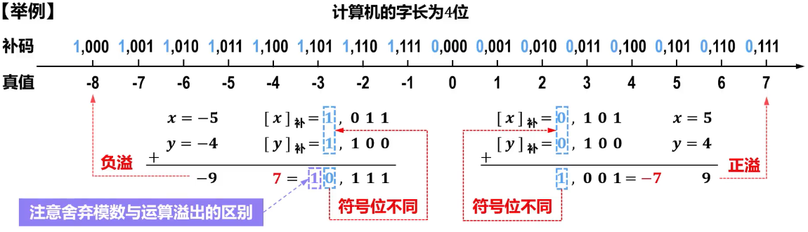

# 概述

- 计算机==字长有限==，因此==所能表示的数据范围==也是==有限==的
- 当==运算结果超出所能表示的数据范围==时，就会出现==溢出==

  - ==一处会导致错误的运算结果==
  - 计算机系统设计人员必须要解决溢出的检测问题，以便在发生溢出时计算机能够作出相应的处理

# 方法

- 根据==操作数的符号位==与==运算结果的符号位==是否一致进行判断。==符号位不同，溢出==；==符号位相同，未溢出==
  - 

- 根据运算过程中==最高数值的进位==与==符号位的进位==是否一直进行判断。==不同，溢出==；==相同，未溢出==

- 利用==变形补码==（==双符号补码==，具有2位符号位的补码）的符号位进行判断。==01，正溢出==；==10，负溢出==