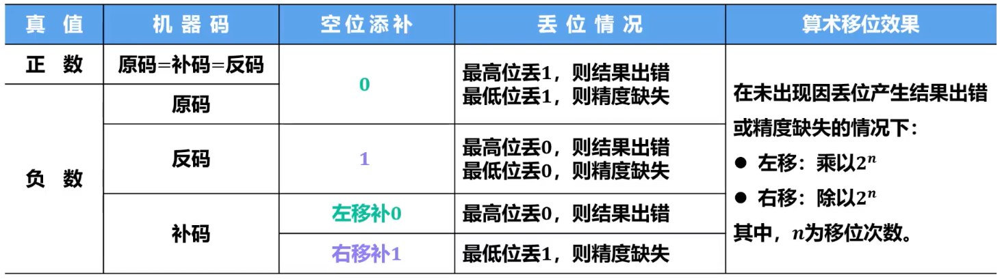
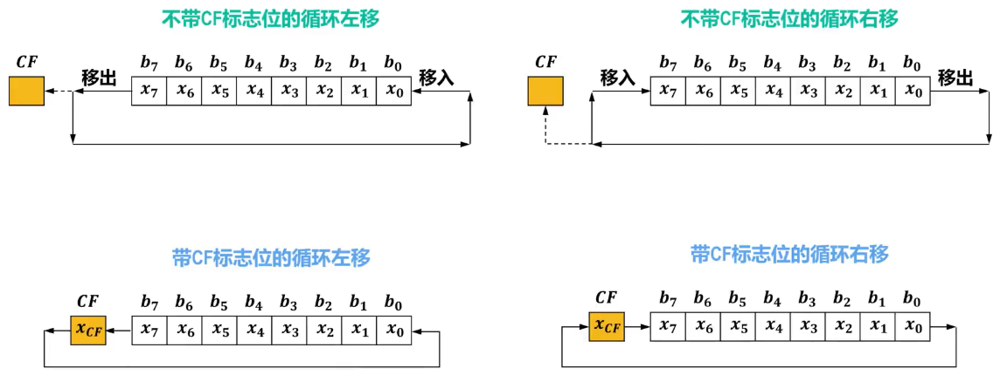

# 逻辑移位

## 对象

- > ==无符号数==

## 规则

- ==逻辑左移==：==高位移除，低位补0==
- ==逻辑右移==：==低位移除，高位补0==

# 算术移位

## 对象

- > ==有符号数==（针对定点数）

## 规则

- 不论正数还是负数，==符号位保持不变，仅对数值位进行位移==（左移或右移）
- 对于真值的原码、反码和补码进行==算术移位后==，他们==各自所对应的新的真值应该保持一致==
  - 

- ==仅针对补码==

  - 左移：==高位移除，低位添补0==；移动前后==若符号位发生变化==，则==发生溢出==

  - 右移：==低位溢出，高位添补符号==

# 循环移位

## Remind

- 将无符号数二进制形式中的各个位向左或向右移动，被==移出的位会重新出现在另一端，形成循环==
- ==循环移位指令会影响==状态寄存器中的==进位标志CF==（Carry Flag）位，CF标志位用于标识在执行算术或逻辑操作时是否发生了进位

## 对象

- ==无符号数==

## 规则

- 

## 应用

- ==加密算法==：通过循环移位可以实现数据的混淆和置换，增强加密算法的安全性
- ==哈希函数==：通过循环移位可以用来改变输入数据的排列顺序，以产生不同的哈希值，有利于增强哈希函数的混淆性和扩散性
- ==优化算法==：在某些算法中，循环移位可以用于优化性能和节省资源

# C语言中的移位运算

- C语言中的移位运算操作符“<<”和“>>”两种，分别表示左移和右移
  - ==左移==：对应汇编指令中的==逻辑左移==
  - ==右移==：根据操作数是无符号还是有符号类型分别对应汇编指令中的==逻辑右移==和==算术右移==
- C语言中不直接提供循环移位操作符