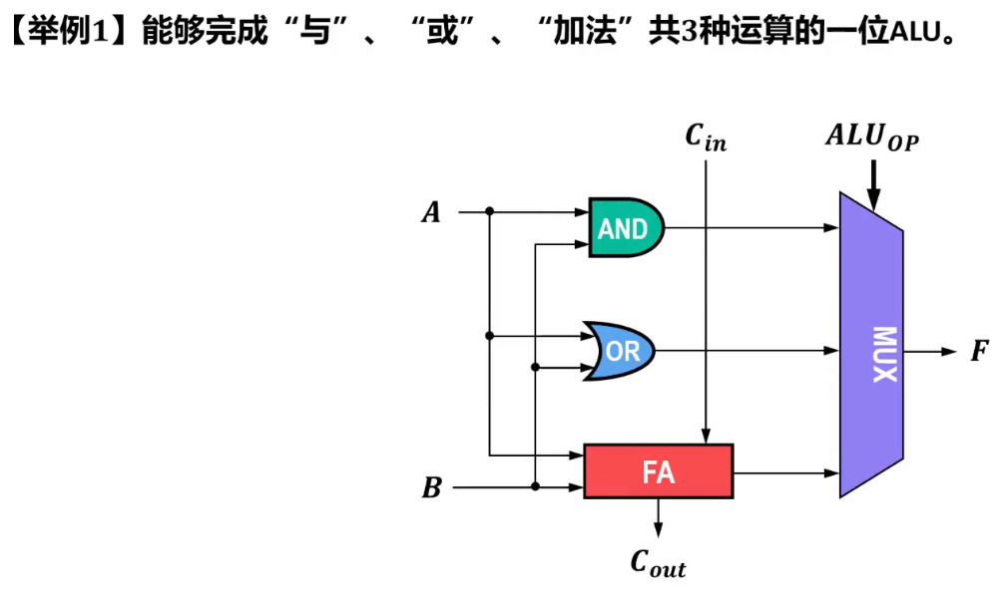

# 概述

- 通过本章中前面各节课的介绍可知
  - 计算机中的==各类算术运算==都可以==利用基本的定点加法运算和位移运算==来实现
  - 将实现加法运算、移位运算、逻辑运算以及各种算术运算所需的数字逻辑电路集成在一起，就可以构成==CPU中的运算器==
- 运算器一般分为以下两种
  - ==定点运算器==：以==算术逻辑单元ALU==为核心，可以进行定点数的位移、算术、逻辑运算
  - ==浮点运算器==：以==浮点运算单元FPU==为核心，负责进行浮点数的算术运算

# 算术逻辑单元ALU

- 

# 常见的状态标志位

- | 状态标志位           | 描述                                                 |
  | -------------------- | ---------------------------------------------------- |
  | ZF（Zero Flag）      | 为1表示运算结果为0                                   |
  | OF（Overflow Flag）  | 为1表示有符号运算溢出                                |
  | SF（Sign Flag）      | 为1表示运算结果为负数                                |
  | CF（Carry Out Flag） | 表示加法进位输出、减法借位输出或逻辑左移操作的溢出位 |

- 不同计算机利用这些标志的方法和时机可能不同

  - 很多计算机将这些标志位暂存在一个==状态寄存器==中，为后续指令提供执行依据。例如，==x86的EFLAGS寄存器==，x86中的条件分支指令会根据标志位的不同进行不同的操作
  - 有些计算机==没有状态寄存器==，例如==MIPS、RISC-V==，其条件分支指令直接根据==ALU当前状态标志位==执行不同的分支