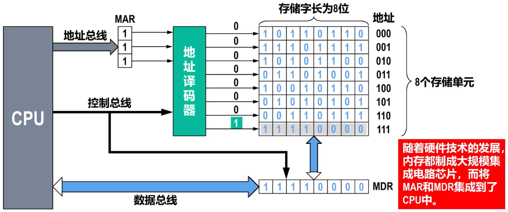
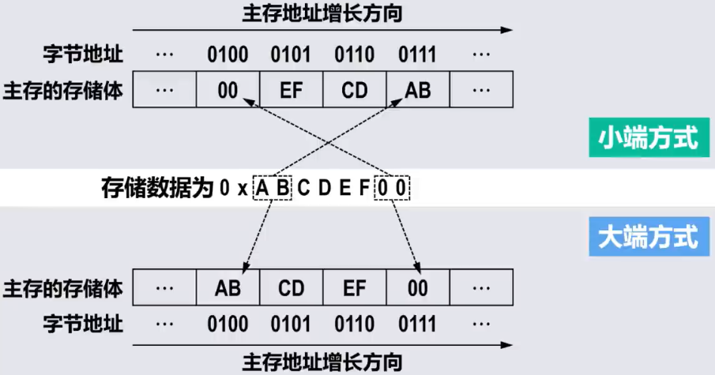
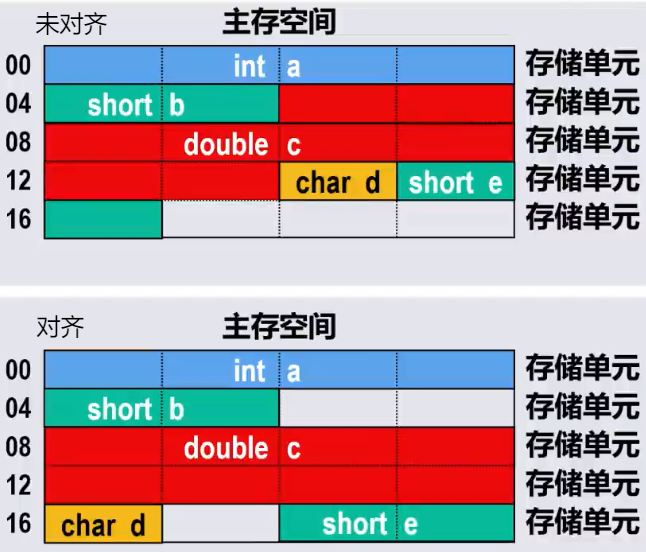
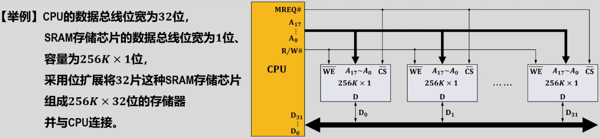
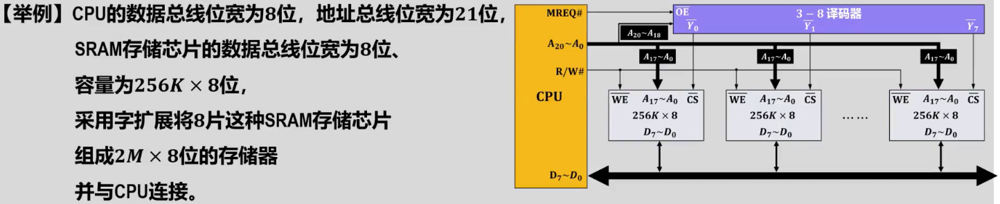
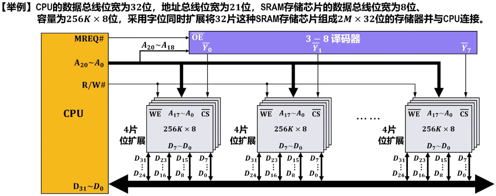
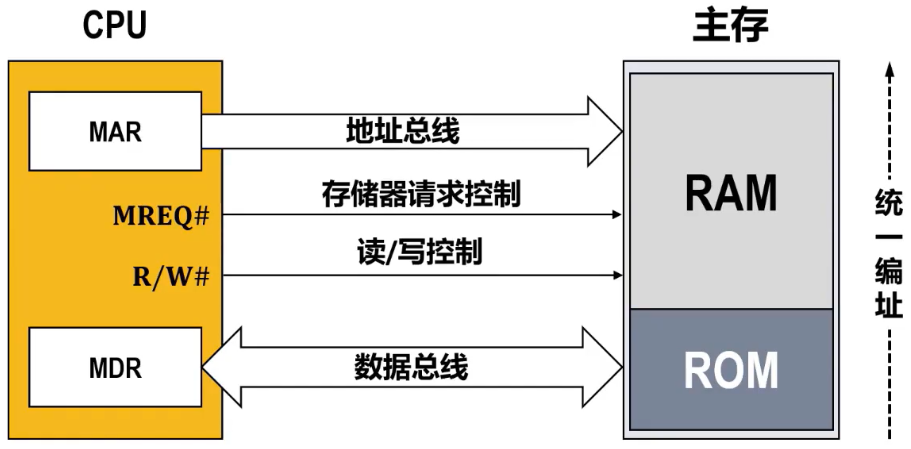
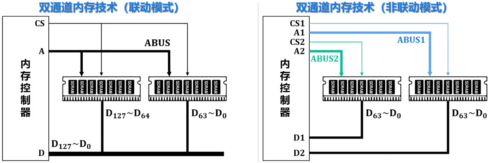
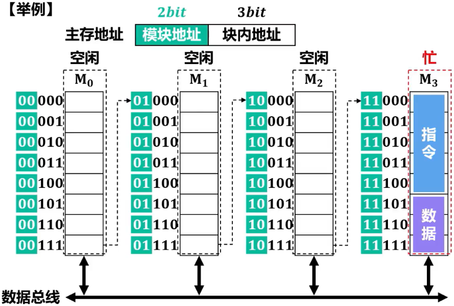
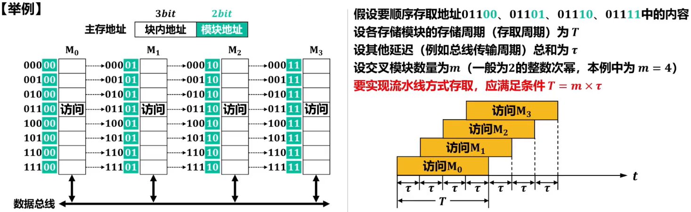

# 基本结构

## Remind

- 主存是机器指令直接操作的存储器，需要基于==主存地址==对其进行==随机访问==
- 

## 译码结构

### 单译码结构

- > 一维地址坐标

- ==译码输入线==：n 条

- ==译码输出线==：2^n^ 条

- ==地址总量==：2^n^

### 双译码结构

- > 二维地址坐标

- 

- ==译码输入线==：m + n 条

- ==译码输出线==：2^m^ + 2^n^ 条

- ==地址容量==：2^mn^

# 机器字长与存储字长的区别

- ==机器字长==：==CPU一次能够处理==的二进制数据的==位数==
- ==存储字长==：主存中的==一个存储单元==所能存储的二进制==位数==

# 地址访问模式

- ==主存==通常==按字节==进行==编址==，而==存储字长是字节的2的整数次幂倍==

- 主存地址分为（==这里字是存储字长的字而不是软件意义上的字，所以字的步长等于存储字长==）

  - ==字节地址==
  - ==半字地址==
  - ==字地址==

- 

- Inter x86汇编语言访问不同存储单元举例（假设数据段寄存器DS的值为0）

  - ```
    #将地址0x4开始的1字节存储单元内容送入AX寄存器的低8位寄存器AL，结果为[AL]=0x00
    MOV AL,[0x4]
    #将地址0x4开始的2字节存储单元内容送入EAX寄存器的低16位寄存器AX，结果为[AX]=0xEF00
    MOV AX,[0x4]
    #将地址0x4开始的4字节存储单元内容送入RAX寄存器的低32位寄存器EAX，结果为[EAX]=0xABCDEF00
    ```

  - 从上述程序可以看出，==不同的地址访问模式所使用的主存地址实际上都是字节地址==，CPU在执行指令的时候可以将字节地址的低2位用于访问控制

    - 采用字节访问模式，字节地址的低2为用于选择字存储单元中的哪一个字节
    - 采用半字访问模式，字节地址的倒数第2位用于选择字存储单元中的哪个半字

# 数据存放方式

## Remind

- 

## 小端方式

- 将数据的==低字节==保存在主存的==低地址==中，而数据的高字节保存在主存的高地址中
- 这样可以==将主存地址的高低与数据的位权有效地结合起来==，高地址存储的数据部分的权值高，低地址存储的数据部分的权值低，符合逻辑
- Inter x86、IA64、RISC-V等处理器采用小端方式

## 大端方式

- 将数据的==高字节==保存在主存的==低地址==中，而数据的低字节保存在主存的高地址中
- 符合人类的正常思维
- PowerPC处理器采用大端方式；ARM、MIPS等处理器同时支持大端方式和小端方式

## Tip

- 两种方式==并没有绝对的优劣之分==，它们在不同的处理器架构和应用场景中都有各自的适用性和优势
- 除处理器外，大小端方式还涉及==外部设备设计、网络数据传输、音视频文件保存==等
- 小端与大端方式的区别不仅存在于处理器的寄存器、存储器中，在指令集、系统总线等各个层次中也可能存在差别

# 数据的边界对齐

- ==主存空间==通常==按字节==进行==编址==
- 高级语言中==不同数据类型的变量==所包含的==字节数量可能不同==
  - 编译器在为这些变量分配主存空间时，理论上可以从主存空间的==任何一个字节地址开始==
  - 当一个多字节变量被编译器==分布在不同字存储单元中==时，访问该变量就需要==多个存取周期==
  - 为了==提高数据访问的效率==，应该要考虑数据变量、数据结构在==主存空间中的边界对齐问题==
- 
  - 数据边界未对齐
    - 对存储空间的利用率高
    - 存在访问性能问题
      - 变量c的8个字节分布在3个存储单元中（访问该变量需要3个周期）
      - 变量e的2个字节分布在2个存储单元中（访问该变量需要2个周期）
  - 数据边界对齐
    - 有效提升了访问性能
      - 变量c的8个字节分布在2个存储单元中（访问该变量需要2个存取周期）
      - 变量e的2个字节分布在1个存储单元中（访问该变量需要1个存取周期）
- 边界对齐规则
  - 字节数据不存在边界对齐问题（因为主存空间就是按字节编址的）
  - 数据量是字节的n倍的数据的起始字节地址的最低log~2~n位为全0（即地址是n的整数倍）

# 主存扩展

## 位扩展

- 当==存储芯片的数据总线位宽小于CPU数据总线位宽时==，采用位扩展的方式进行扩展
  - 
  - 将所有存储芯片的==地址引脚、写使能引脚WE==分别并联后再分别与CPU的地址引脚和读写控制引脚R/W连接
  - 将各存储芯片的==数据引脚==依次与CPU的数据引脚进行相应连接
  - 将所有存储芯片的==片选引脚CS==并联后与CPU的存储器请求控制引脚MREQ相连
- ==位扩展==又称为==数据总线扩展==或==字长扩展==

## 字扩展

- 当==存储芯片的存储容量不能满足存储器对存储容量的需求时==，采用字扩展的方式进行扩展
  - 
  - 将所有存储芯片的==数据引脚、地址引脚、写使能引脚WE==各自并联后再分别与CPU的数据引脚、地址引脚、读写控制引脚R/W连接
  - 各存储芯片的==片选引脚CS==可以由==CPU多余的地址引脚通过译码器产生==
- ==字扩展==又称为==容量扩展==或==地址总线扩展==

## 字位同时扩展

- 当==存储芯片的数据位宽和存储容量均不能满足存储器的数据位宽和存储总容量要求时==，采用字位同时扩展
  1. 通过==位扩展==满足数据位宽的要求
  2. 通过==字扩展==满足存储容量的要求
- 

# 主存与CPU的连接

- 

# 主存系统的优化

## 概述

- 随着计算机技术，==主存的存取速度已经成为提升计算机系统性能的瓶颈==
- ==提高主存的存取速度==的方法
  - 使用==高速元件==来提高主存的访问速度
  - 通过存储器的==并行工作==来提高主存的访问速度
    - ==双端口存储器==
    - ==单体多字存储器==
    - ==多体交叉存储器==

## 双端口存储器

- 同一个存储器具有两个相互独立的存储器端口，每个端口都具有自己独立的数据总线、地址总线和控制总线。每个端口可以独立地进行读写操作
- 两个端口访问的存储单元的==地址不相同==时，可以同时进行操作，也就是==并行读写==
- 两个端口访问的存储单元的==地址相同==时，则会产生读写冲突
  - 当冲突发生时，由判断逻辑决定哪个端口==优先==进行读写操作，而将另一个端口的忙信号输出低电平，以==延迟==该端口对存储器的访问。高优先端口读写操作完成后，被延迟端口的忙信号输出高电平后，该端口就可以对存储器进行访问
  - 由于==冲突访问是不可避免==的，因此双端口存储器的==访问速度不可能提高1一倍==
- 双端口广泛用于各领域，但PC中的内存并未使用

## 单体多字存储器

- 单体多字存储器的构建与存储器==位扩展==方式完全相同
  - 多个存储模块==共享地址总线==
  - 按同一地址==并行访问不同存储模块的同一单元==
- 实现了==同一个存取周期内访问多个存储字==
  - 若n个存储模块并发工作，则主存带宽提升n倍
- 常见的多通道内存技术采用的就是单体多字技术
  - 
  - 双通道内存技术（联动模式）：采用单字多体存储器。两个内存条的==容量、频率、时序==需要==完全一致==
  - 双通道内存技术（非联动模式）：非单体多字存储器。==内存控制器有两套独立的端口==分别连接两个内存条。两个内存条只需==频率相同即可==，==可并发工作==，但他们的==地址、读写命令不需要同步==。该模式灵活性更高，但控制更复杂

## 多体交叉存储器

### 概述

- 多体交叉存储器==也由多个存储模块构成，这些模块的容量和存取速度相同==
- 根据==对多个模块编址方式的不同==，又分为以下两种
  - ==高位多体交叉==
  - ==低位多体交叉==

### 高位多体交叉（顺序编址模式）

- ==程序具有局部性和连续性==的特点
- 采用高位多体交叉==程序的指令和数据基本分布在同一个主存模块==（存储体）中。导致在程序执行过程中，同一个主存模块被频繁访问，而其他主存模块基本处于空闲状态，==无法实现多个主存模块的并行工作==
- 高位多体交叉方式主要目的是扩充存储器的容量，与存储器字扩展完全相同
- 

### 低位多体交叉（交叉编址模式）

- 为==提高顺序访问时各存储模块的并行性==，低位多体交叉中各存储模块均==有独立的==地址寄存器、数据寄存器和读写控制电路
- 顺序访问时，各存储模块一般按==流水线==的方式轮流存取
- 
  - 在一次流水线存/取过程中，所有的存储模块（本例中m=4）都被访问1次（不能重复访问某一个存储模块）
  - 1次流水线存取过程总耗时为T + (m - 1)τ
  - 连续n次流水线存取过程总耗时为nT + (m - 1)τ

