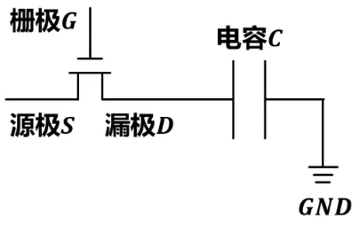

# Remind

- | 存储器的物理层次结构      | 描述                                                 |
  | ------------------------- | ---------------------------------------------------- |
  | 存储元（Storage Element） | 最小存储单位，1bit                                   |
  | 存储单元（Memory Cell）   | 多个存储元组成                                       |
  | 存储阵列（Memory Array）  | 多个存储单元按行列矩阵排列，构成存储器的核心结构     |
  | 存储体（Memory Bank）     | 多个存储阵列组成，支持并行访问                       |
  | 存储芯片（Memory Chip）   | 存储阵列、读写电路和控制逻辑组成。完整的存储集成电路 |
  | 存储模块（Memory Module） | 多个存储芯片封装成的物理模块。如SSD                  |

- 存储阵列是核心结构，通过行列地址访问

- Bank级并行可提高数据吞吐率

# 随机存取存储器RAM（Random-Access Memory）

## Remind

- ==SRAM和DRAM属于易失性存储器==，断电数据就会消失

## 静态随机存取存储器SRAM

### 概述

- 静态随机存取器SRAM（Static Random-Access Memory）是随机存取存储器RAM的一种
  - 所谓“==静态==”，是指这种RAM只要保持通电，其内部所存储的数据就可以保持不变，而==不需要进行周期性地刷新==
- 目前，SRAM内部的存储元（存储1个二进制的单元）一般采用多个金属-氧化物半导体场效应晶体管MOSFET（Metal-Oxide-Semiconductor Field-Effect Transistor）来构建，MOSFET常简称为==MOS管==

### 存储元

#### Remind

- > 触发器
- 
- A或B端的电位可以根据导通情况利用电源电压减去导通MOS管电压得到

#### 特点

- ==上电后初始状态随机==
- ==读操作不会破坏原有数据==
- ==不需要刷新==
- 电源驱动大量晶体管，==功耗大==
- 使用==晶体管的数量多==，占用晶圆面积大，成本高。但==速度快==，常用于高速缓存==cache==

### 存储阵列扩展

- 

### 存储器结构

- 

## 动态随机存取存储器DRAM

### 概述

- 数据只能保存较短时间，==需要进行周期性地刷新==
- ==DRAM在刷新时，是不能响应CPU的访问的==

### 存储元

#### Remind

- 

#### 特点

- MOS管不可能完美关断，电容C上的电荷会逐渐泄露，数据只能保存较短的时间。为避免数据丢失，必须采用类似读操作的方式对电容C补充电荷，称为==刷新==，这也是动态RAM（DRAM）得名的原因
- ==读取==一行中某个存储元的信息，将会==破坏==这==一行中所有存储元的信息==，==读操作后==必须立即进行==写操作==

#### 灵敏读出/恢复放大器

- 根据锁存的值，恢复各存储元中电容的原本状态

#### 读写操作流程

1. 预充电操作
2. 访问操作
3. 信号检测
4. 数据恢复
5. 数据输出/输入

### 动态刷新

#### 刷新周期

- 从数据存入DRAM开始，到数据丢失之前为止的这段时间，称为==最大刷新周期==
  - 采用个不同材料以及不同生产工艺生产的DRAM，其最大刷新周期可能不同，常见的有2ms、4ms、8ms等
- 而==刷新周期==是DRAM实际完成两次==完整刷新==之间的时间间隔
  - 刷新周期 <= 最大刷新周期

#### 刷新存储元的数量

- DRAM==按行==进行刷新
  - 为了==缩短刷新周期==，可==减少==存储阵列的==行数==，增加列数
- 刷新操作由内存控制器负责

#### 刷新与读操作的区别

- 尽管读操作也具有刷新功能，但读操作与刷新操作又有所不同，==刷新操作只需要给出行地址==，而不需要给出列地址

### 刷新方式

#### Remind

- 由于刷新时不能响应CPU访问，所以CPU访问与内存控制器进行刷新就存在==内存争用问题==，而刷新方式提供解决这个问题方案
- ==刷新操作与读操作是类似的，所以刷新一行的时间与存取周期时间相同==
- ==刷新周期==：存储元两次刷新操作之间的最大允许时间间隔
- 读写操作包括刷新，所以==刷新是为了防止在刷新周期内没有被访问过的行的数据丢失==

#### 集中刷新方式

- > 将刷新操作集中在某个时间段内完成，而不是分散在整个刷新周期中

- 

- 读写操作期间不受刷新操作的影响，因此这段时间的访问==速度比较快==

- ==“死区”时间==：CPU长时间不能访问DRAM，也就是集中刷新进行刷新的这段时间

  - 存储体包含的==行数越多==，==“死区”时间越长==

#### 分散刷新方式

- > 读写一次后，执行某一行的刷新

- 

- 相当于将存取周期加上额外的一次刷新1行的时间作为新的存取周期，因此==不存在“死区”时间==。但是==刷新过于频繁，严重影响了系统的速度==

#### 异步刷新

- > 将刷新操作均匀的分布在刷新周期内

- 

- 死区没有被缩短，但是类似分散刷新被分散，并且不像分散刷新刷新周期内刷新时间占比较高

### DRAM发展

#### Remind

- 

#### 异步DRAM

- ==异步DRAM的读写操作与CPU的数据总线时钟无关==，在进行读写操作时可能会有更多的周期，导致性能上的损失，特别是在CPU的时钟频率很高的情况下

#### 同步DRAM

- ==同步DRAM（Synchronous DRAM）的读写操作与CPU的数据总线时钟同步==，内存控制器可以在时钟信号的特 定边缘（上升沿或下降沿）触发数据传输

  - 
    - t~RCD~（RAS to CAS Delay）：从行地址选通（RAS）到列地址选通（CAS）之间的延迟时间
    - CL（CAS Latency）：从列地址选通（CAS）到开始数据传输的延迟时间
    - SDRAM自带时钟信号，==与数据总线时钟同步==
    - SDRAM可以==突发（Burst）传输==：第一个列数据就绪后，每经历一个时钟周期就可得到一个数据，有效减少了数据传输的时间延迟（原理其实是：只有一次读取内存，将突发传输长度的数据从内存读出存入行缓冲区（一般是SRAM的存储元），随后从行缓冲区依次输出数据）
      - 通常SDRAM包含有模式寄存器，可配置==突发传输的长度BL==（Burst Length），例如1、2、4、8以及整行字。该长度是同步地向系统总线上发送数据的存储单元的个数

- 在SDRAM之后出现的==DDR SDRAM==（Double Data Rate SDRAM）

  - DDR1
    - 具有I/O缓冲区，且每Bank一个行缓冲区
    - 双沿技术：使==时钟周期的上升沿和下降沿均可进行一次数据传输==，从而==实现双倍数据传输速率==。这项技术需要CPU支持双沿采样，所以实现双沿技术需要DRAM和CPU同时支持这项技术
  - 在DDR1之后，人们发现由于温度等因素的影响，导致DDR内部时钟的频率不能继续提高了。那么可以提高总线频率，并增加Bank数量又陆续出现了DDR2、DDR3、DDR4，其内部预取分别是4路、8路、16路

- SDRAM缓冲区
  - | 类型      | 行缓冲区（每Bank一个） | I/O缓冲区（全局） | 核心频率 vs. 总线频率 |
    | :-------- | :----------------- | :---------------- | :-------------------- |
    | SDRAM | 有                 | 无                | 1:1（同步）           |
    | DDR1  | 有                 | 有                | 1:1（但DDR双沿采样）  |
    | DDR2  | 有                 | 有                | 1:2（分频设计）       |
    | DDR3+ | 有                 | 有                | 1:4（更低核心频率）   |
    
  - I/O缓冲区频率远高于行缓冲区频率，利用I/O缓冲区最终输出数据，可以适配==更高频率的数据总线==

  - 行缓冲区与I/O缓冲区的关系：行缓冲区是慢传送带，I/O缓冲区是高速传送带，所有慢传送带都会传向高速传送带。所以当我们连续访问同一个Bank的时候，频率就会回到单Bank访问速度

  - 

  - 后续的几代DDR SRAM，使用一些技术使I/O缓冲区频率达到更高（就是使输入I/O缓冲区的频率提高），以适配更高频率的数据总线

  - 目前DDR4是：一个内存条包含内存芯片 -> 一个内存芯片包含多个Bank Group -> 一个Bank Group包含多个Bank -> 一个Bank包含多个存储阵列 -> 一个存储阵列包含多个存储单元 -> 一个存储单元包含多个存储元

    - 一次数据存入：n个芯片就将数据总线数据切为n份，每个芯片存储这1/n数据，且每个芯片存储这1/n数据的Bank Group地址、Bank地址、行地址和列地址均相同。也就是每个芯片选一个Bank Group，被选的Bank Group选一个Bank，被选的Bank根据行地址列地址存入这1/n数据
    - 

#### Tip

- 计算机有一个统一的时钟，一般就是CPU时钟，不过也可以是桥接器提供总线的时钟
- ==传统DRAM没有突发传输模式==，每访问一个数据，就要经历行地址、列地址、访问数据的过程
- ==传统DRAM属于异步DRAM==，其读写操作与CPU的时钟周期无关，在进行读写操作时可能会有更多的等待周期，导致性能上的损失，特别是在CPU的时钟频率很高的情况下

# 只读存储器ROM（Read-Only Memory）

## 概述

- ==只能==从其==读出==信息、而==不能==向其==随意写入==信息的存储器
  - 通过特定方式将信息写入==ROM==后，信息就固定在ROM中，即使电源==断电==，所保存的==信息也不会丢失==，也就是说，ROM==属于非易失性存储器==
- 按照制造工艺的不同，ROM可分为
  - ==掩膜式==只读存储器（Mask ROM，MROM）
  - ==可编程==只读存储器（Programmable ROM，PROM）
  - ==可擦除可编程==只读存储器（Erasable Programmable ROM，RPROM）
  - ==电可擦除可编程==只读存储器（Electrically Erasable Programmable ROM，EEPROM或E^2^PROM）
  - ==闪存==（Flash Memory）

## MROM

- 待存储信息由芯片制造厂家在生产过程中按用户要求做好，芯片制成后存储信息被固定在芯片中，因而==只能读出，不能修改==
- 灵活性差，但所存储的信息固定不变，可靠性高

## PROM

- 存储器出厂时，每个存储元存储的数据为“0”，用户可利用编程器进行==一次==改写
- PROM克服了MROM使用不便的问题，但==仅能改写一次==，灵活性还是不够

## EPROM

- 可==多次写入==，重新写入时需要==先擦除后写入==
- 需要使用==紫外线照射来擦除全部存储元的状态==
- EPROM比PROM和MROM使用方便、灵活、经济

## EEPROM

- 可==多次写入==，写入方式与EPROM相同，但不需要先擦除后写入
- 因为擦除时不用紫外线照射，采用==电可擦除方式（根据命令，内部自动完成）==，可以==精确地擦除==某一个存储元，而非全片擦除

## 闪存

- 逻辑结构与EEPROM相似，但存储元的结构和工艺不同
- EEPROM支持字节级擦写，适合频繁更新小数据量，而闪存以==块为单位擦写（先擦后写，因此读快写慢）==，更==适合存储大量数据==
- 闪存的小数据量更新会导致频繁更新整个块，导致寿命不足。可以使用以块为单位进行磨损均衡，延长寿命
- 例如SD卡、U盘、SSD

# Tip

- PC用到的半导体存储器，且均为随机存取存储器
  - CPU
    - cache：SRAM
      - 作为CPU和主存之间的高速缓存，减少CPU访问主存的次数，提高数据处理速度
  - 内存：==统一编址==
    - 主板BIOS芯片：NOR型闪存或EEPROM
      - 用于存储计算机启动时所执行的固件（例如BIOS或UFEI）的存储器。启动固件负责初始化硬件、硬件检测并加载操作系统到主存中的RAM
    - 内存条多级存储芯片：DDR4 SDRAM
      - 用于存储CPU执行的指令和用户数据的存储器
  - 外存
    - SSD多片存储芯片：NAND型闪存
      - 操作系统
      - 应用程序
      - 用户数据

