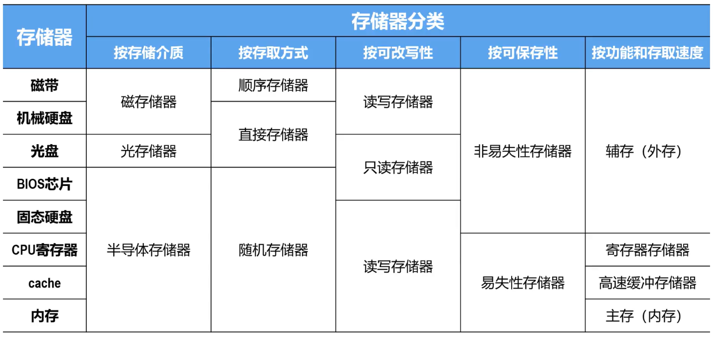
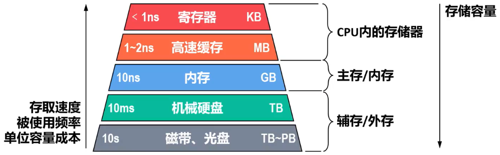

# Remind

- 现代计算机==以存储器为中心==，它是计算机中==存放指令和数据==的主要部件
  - 存储器的容量越大，能存储的信息越多
  - 提高存储系统的访问速度，是提高计算机处理信息速度的重要措施
- 因此，开发具有==大容量、高速度和低成本==的==存储系统==是计算机技术发展的关键目标之一

# 存储器

## 分类

### 存储介质

#### 磁盘存储器

- 以磁性材料作为存储介质
- 利用磁化单元的不同磁化方向来存储数据0和1
- 主要包括磁芯、磁盘、磁带存储器
- 磁盘、磁带中都包含有机械装置，因此体积大、存取速度慢、但其单位容量成本最低

#### 光存储器

- 利用介质的光学特性读出数据
  - 例如CD-ROM、DVD-ROM都以刻痕的形式将数据存储在盘面上，用激光照射盘面，靠盘面的不同反射率来读出信息
- 光存储器成本低廉、适用于电子出版物的发行

#### 半导体存储器

- 用半导体器件组成的存储器
- 存取速度快、体积小、性能可靠，但单位容量成本相对较高

### 存取方式

#### 顺序存储器

- 存储单元中的内容==只能依地址顺序访问==
  - ==存取速度与存储单元的位置有关==
- 磁带存储器就是典型的顺序存储器

#### 随机存储器

- ==可按给定的任何一个存储单元的地址对其内容进行存取==
  - ==存取速度与存储单元的位置无关==
- 早期的磁芯存储器和当前广泛使用的半导体存储器都是随机存储器

#### 直接存储器

- ==不必经过顺序搜索就能在存储器中直接存取信息==
  - ==兼有随机存取和顺序存储器的访问特性==
- 典型的如磁盘存储器。由于磁盘存在机械寻道和旋转延迟，因此数据访问时间和磁头与目标扇区的距离有关

### 可改写性

#### 读写存储器

- ==既能读出也能写入信息==

#### 只读存储器

- ==存储的内容不允许被改变，只能读出==
- 常见的有光盘存储器
- 还有半导体只读存储器，信息只能读出、==不能随意写入==。主要用来存放一些不需要修改的程序（例如BIOS）和常量

### 可保存性

#### 易失性存储器

- ==断电后所保存的信息会丢失==

#### 非易失性存储器

- ==断电后所保存的信息不丢失==

### 功能和存储速度

#### 寄存器存储器

- CPU寄存器

  - CPU内部的多个寄存器（例如MAR、MDR、ACC、MQ等）

  - 用于存放地址、数据以及运算的中间结果

  - ==速度与CPU匹配，容量极小==

#### 高速缓冲存储器

- 高速缓存（cache）
  - CPU内部的寄存器与主存之间的一个==高速小容量==存储器
  - 用于==缓冲CPU与主存之间的性能差异==，提高存储系统的访问速度
  - 存放内容一般是即将或经常要使用的指令和数据

#### 主存储器

- 主存（内存）
  - 用于存放指令和数据
  - CPU可以通过主存地址==随机==地读写主存
  - ==存取速度低于高速缓存，但一般高于辅存==
  - ==容量远大于高速缓存，但一般远小于辅存==

#### 辅助存储器

- 辅存（外存）
  - 存放当前暂不参与运行的程序和数据，以及一些需要长期保存的信息
  - ==容量很大，但存取速度相对较低==

### Tip

- 

## 性能指标

### 存储容量

- > 存储器可以==存储的二进制信息的总量==

### 存取速度

#### 存取时间

- > 启动一次存储器操作到该操作完成所经历的时间

- 读出时间

- 写入时间

- Tip：读出时间与写入时间==可能不同==。例如闪存读快写慢

#### 存取周期

- 连续两次访问存储器操作（读操作或写操作）之间所需要的最短时间间隔
- 对于主存，存取周期除包括存取时间外，还包括存储器状态的稳定恢复时间，因此存取周期略大于存取时间

#### 存储器带宽

- 单位时间内存储器所能传输的信息量（单位：b/s或B/s）
- 它是衡量数据传输速率的重要指标，与一次传输的数据位的多少以及存取时间的长短有关

# 存储器系统层次结构

- 
- ==上层存储器可为下层存储器做缓冲==，将最近常使用的数据的副本调度到上层，使得CPU只需要访问上层的快速小容量存储器即可获得大部分数据。可以==有效提高存储系统的访问速度，缓解CPU与主存（内存）、主存（内存）与辅存（外存）的性能差异==
- 另外，==使用大容量辅存==（外存），==缓解了主存（内存）容量不足的问题==