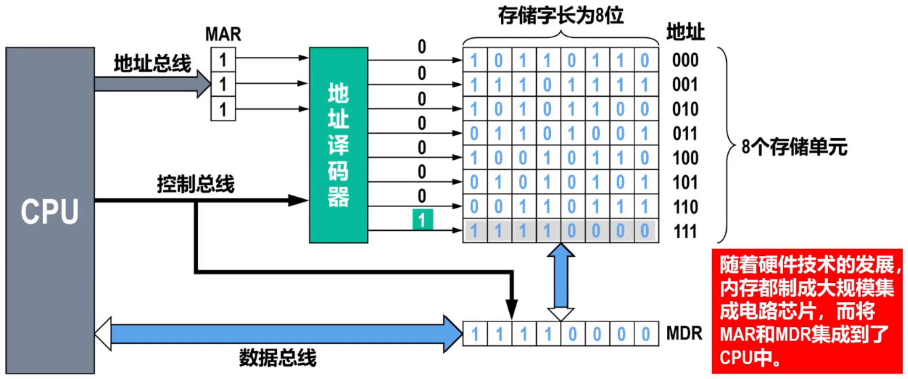
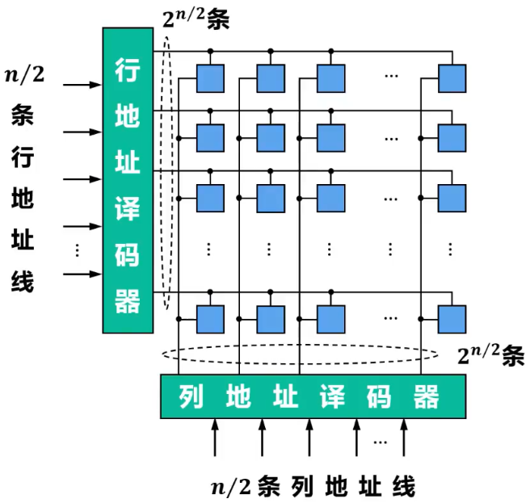
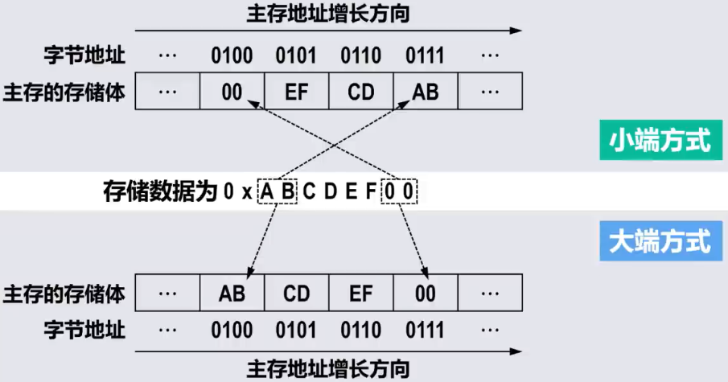
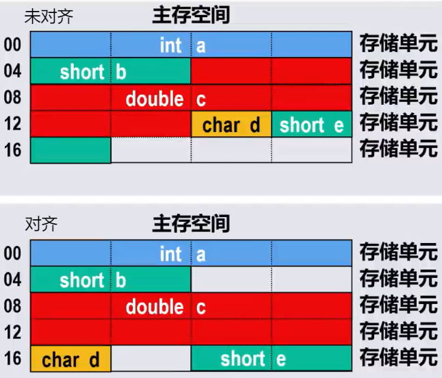

# Remind

- 现代计算机==以存储器为中心==，它是计算机中==存放指令和数据==的主要部件
  - 存储器的容量越大，能存储的信息越多
  - 提高存储系统的访问速度，是提高计算机处理信息速度的重要措施
- 因此，开发具有==大容量、高速度和低成本==的==存储系统==是计算机技术发展的关键目标之一

# 存储器

## 分类

### 存储介质

#### 磁盘存储器

- 以磁性材料作为存储介质
- 利用磁化单元的不同磁化方向来存储数据0和1
- 主要包括磁芯、磁盘、磁带存储器
- 磁盘、磁带中都包含有机械装置，因此体积大、存取速度慢、但其单位容量成本最低

#### 光存储器

- 利用介质的光学特性读出数据
  - 例如CD-ROM、DVD-ROM都以刻痕的形式将数据存储在盘面上，用激光照射盘面，靠盘面的不同反射率来读出信息
- 光存储器成本低廉、适用于电子出版物的发行

#### 半导体存储器

- 用半导体器件组成的存储器
- 存取速度快、体积小、性能可靠，但单位容量成本相对较高

### 存取方式

#### 顺序存储器

- 存储单元中的内容==只能依地址顺序访问==
  - ==存取速度与存储单元的位置有关==
- 磁带存储器就是典型的顺序存储器

#### 随机存储器

- ==可按给定的任何一个存储单元的地址对其内容进行存取==
  - ==存取速度与存储单元的位置无关==
- 早期的磁芯存储器和当前广泛使用的半导体存储器都是随机存储器

#### 直接存储器

- ==不必经过顺序搜索就能在存储器中直接存取信息==
  - ==兼有随机存取和顺序存储器的访问特性==
- 典型的如磁盘存储器。由于磁盘存在机械寻道和旋转延迟，因此数据访问时间和磁头与目标扇区的距离有关

### 可改写性

#### 读写存储器

- ==既能读出也能写入信息==

#### 只读存储器

- ==存储的内容不允许被改变，只能读出==
- 常见的有光盘存储器
- 还有半导体只读存储器，信息只能读出、==不能随意写入==。主要用来存放一些不需要修改的程序（例如BIOS）和常量

### 可保存性

#### 易失性存储器

- ==断电后所保存的信息会丢失==

#### 非易失性存储器

- ==断电后所保存的信息不丢失==

### 功能和存储速度

#### 寄存器存储器

- CPU寄存器

  - CPU内部的多个寄存器（例如MAR、MDR、ACC、MQ等）

  - 用于存放地址、数据以及运算的中间结果

  - ==速度与CPU匹配，容量极小==

#### 高速缓冲存储器

- 高速缓存（cache）
  - CPU内部的寄存器与主存之间的一个==高速小容量==存储器
  - 用于==缓冲CPU与主存之间的性能差异==，提高存储系统的访问速度
  - 存放内容一般是即将或经常要使用的指令和数据

#### 主存储器

- 主存（内存）
  - 用于存放指令和数据
  - CPU可以通过主存地址==随机==地读写主存
  - ==存取速度低于高速缓存，但一般高于辅存==
  - ==容量远大于高速缓存，但一般远小于辅存==

#### 辅助存储器

- 辅存（外存）
  - 存放当前暂不参与运行的程序和数据，以及一些需要长期保存的信息
  - ==容量很大，但存取速度相对较低==

### Tip

- 

## 性能指标

### 存储容量

- > 存储器可以==存储的二进制信息的总量==

### 存取速度

#### 存取时间

- > 启动一次存储器操作到该操作完成所经历的时间

- 读出时间

- 写入时间

- Tip：读出时间与写入时间==可能不同==。例如闪存读快写慢

#### 存取周期

- 连续两次访问存储器操作（读操作或写操作）之间所需要的最短时间间隔
- 对于主存，存取周期除包括存取时间外，还包括存储器状态的稳定恢复时间，因此存取周期略大于存取时间

#### 存储器带宽

- 单位时间内存储器所能传输的信息量（单位：b/s或B/s）
- 它是衡量数据传输速率的重要指标，与一次传输的数据位的多少以及存取时间的长短有关

# 存储器系统层次结构

- 
- ==上层存储器可为下层存储器做缓冲==，将最近常使用的数据的副本调度到上层，使得CPU只需要访问上层的快速小容量存储器即可获得大部分数据。可以==有效提高存储系统的访问速度，缓解CPU与主存（内存）、主存（内存）与辅存（外存）的性能差异==
- 另外，==使用大容量辅存==（外存），==缓解了主存（内存）容量不足的问题==

# 主存

## 基本结构

### Remind

- 主存是机器指令直接操作的存储器，需要基于==主存地址==对其进行==随机访问==
- 

### 译码结构

#### 单译码结构

- > 一维地址坐标

- ==译码输入线==：n 条

- ==译码输出线==：2^n^ 条

- ==地址总量==：2^n^

#### 双译码结构

- > 二维地址坐标

- 

- ==译码输入线==：m + n 条

- ==译码输出线==：2^m^ + 2^n^ 条

- ==地址容量==：2^mn^

## 机器字长与存储字长的区别

- ==机器字长==：==CPU一次能够处理==的二进制数据的==位数==
- ==存储字长==：主存中的==一个存储单元==所能存储的二进制==位数==

## 地址访问模式

- ==主存==通常==按字节==进行==编址==，而==存储字长是字节的2的整数次幂倍==

- 主存地址分为（==这里字是存储字长的字而不是软件意义上的字，所以字的步长等于存储字长==）

  - ==字节地址==
  - ==半字地址==
  - ==字地址==

- 

- Inter x86汇编语言访问不同存储单元举例（假设数据段寄存器DS的值为0）

  - ```
    #将地址0x4开始的1字节存储单元内容送入AX寄存器的低8位寄存器AL，结果为[AL]=0x00
    MOV AL,[0x4]
    #将地址0x4开始的2字节存储单元内容送入EAX寄存器的低16位寄存器AX，结果为[AX]=0xEF00
    MOV AX,[0x4]
    #将地址0x4开始的4字节存储单元内容送入RAX寄存器的低32位寄存器EAX，结果为[EAX]=0xABCDEF00
    ```

  - 从上述程序可以看出，==不同的地址访问模式所使用的主存地址实际上都是字节地址==，CPU在执行指令的时候可以将字节地址的低2位用于访问控制

    - 采用字节访问模式，字节地址的低2为用于选择字存储单元中的哪一个字节
    - 采用半字访问模式，字节地址的倒数第2位用于选择字存储单元中的哪个半字

## 数据存放方式

### Remind

- 

### 小端方式

- 将数据的==低字节==保存在主存的==低地址==中，而数据的高字节保存在主存的高地址中
- 这样可以==将主存地址的高低与数据的位权有效地结合起来==，高地址存储的数据部分的权值高，低地址存储的数据部分的权值低，符合逻辑
- Inter x86、IA64、RISC-V等处理器采用小端方式

### 大端方式

- 将数据的==高字节==保存在主存的==低地址==中，而数据的低字节保存在主存的高地址中
- 符合人类的正常思维
- PowerPC处理器采用大端方式；ARM、MIPS等处理器同时支持大端方式和小端方式

### Tip

- 两种方式==并没有绝对的优劣之分==，它们在不同的处理器架构和应用场景中都有各自的适用性和优势
- 除处理器外，大小端方式还涉及==外部设备设计、网络数据传输、音视频文件保存==等
- 小端与大端方式的区别不仅存在于处理器的寄存器、存储器中，在指令集、系统总线等各个层次中也可能存在差别

## 数据的边界对齐

- ==主存空间==通常==按字节==进行==编址==
- 高级语言中==不同数据类型的变量==所包含的==字节数量可能不同==
  - 编译器在为这些变量分配主存空间时，理论上可以从主存空间的==任何一个字节地址开始==
  - 当一个多字节变量被编译器==分布在不同字存储单元中==时，访问该变量就需要==多个存取周期==
  - 为了==提高数据访问的效率==，应该要考虑数据变量、数据结构在==主存空间中的边界对齐问题==
- 
  - 数据边界未对齐
    - 对存储空间的利用率高
    - 存在访问性能问题
      - 变量c的8个字节分布在3个存储单元中（访问该变量需要3个周期）
      - 变量e的2个字节分布在2个存储单元中（访问该变量需要2个周期）
  - 数据边界对齐
    - 有效提升了访问性能
      - 变量c的8个字节分布在2个存储单元中（访问该变量需要2个存取周期）
      - 变量e的2个字节分布在1个存储单元中（访问该变量需要1个存取周期）
- 边界对齐规则
  - 字节数据不存在边界对齐问题（因为主存空间就是按字节编址的）
  - 数据量是字节的n倍的数据的起始字节地址的最低log~2~n位为全0（即地址是n的整数倍）