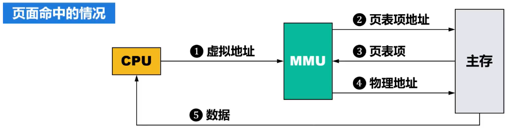
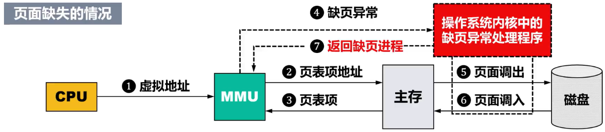
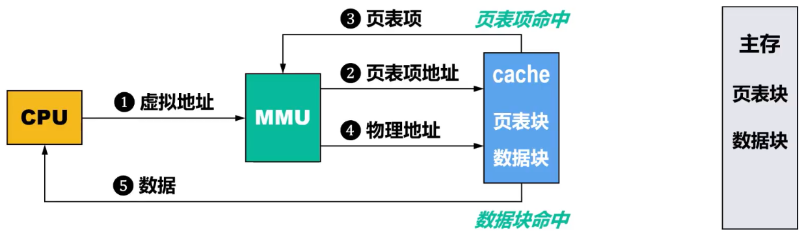
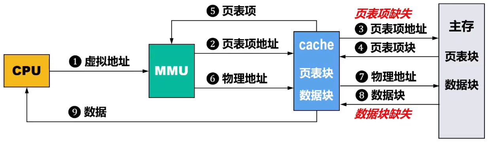
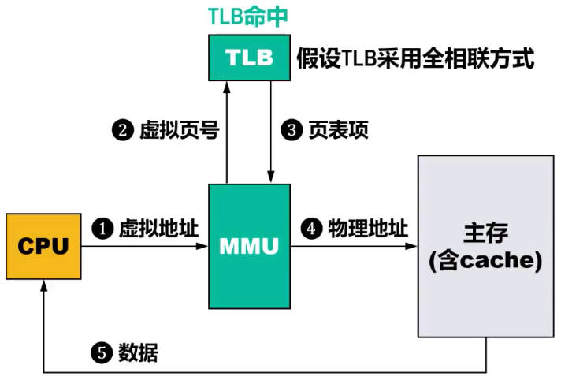
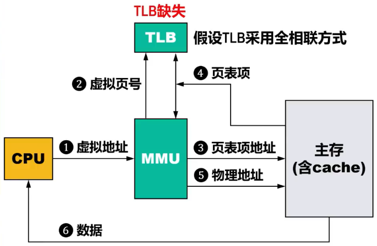
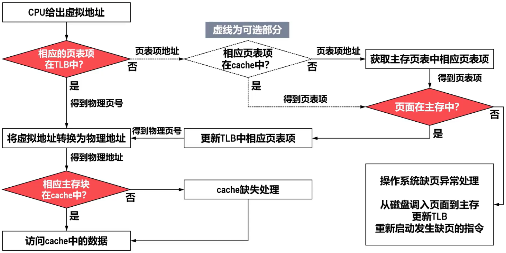
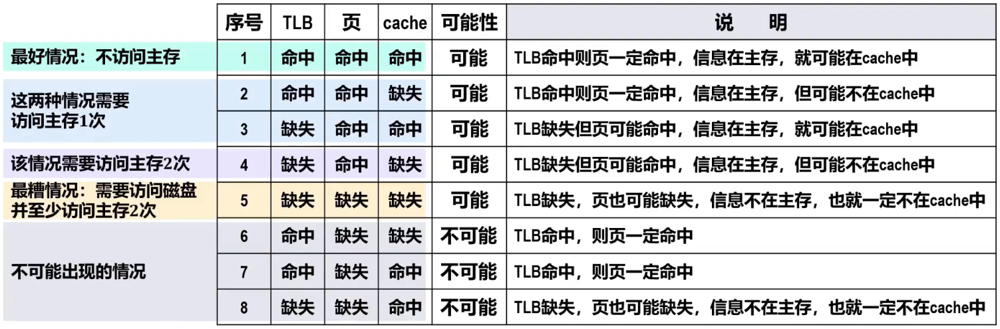

# 概述

- 主存的容量受限（一般远小于外存），且不同计算机所配置的==主存容量也不完全相同==
  - ==程序员==在设计程序时，==不==希望==受==到不同计算机的==不同主存容量限制==，这是一个需要解决的问题
- 现代操作系统往往都是==多任务操作系统==，在计算机系统中==同时有多个用户程序的进程运行==
  - 让更==多个程序的进程==（容量甚至大于主存容量）在容量受限的主存中有效而安全地==并发执行而不互相干扰==，这是另一个需要解决的问题
- 为了解决上述两个问题，==虚拟存储器技术==应运而生。目前，几乎所有的计算机中都采用了虚拟存储器技术
- 现代计算机一般都会采用虚拟存储器技术，==虚拟存储器==需要==硬件==和==操作系统协同工作==
  1. 在==操作系统引导完成之前==，CPU==使用物理地址访问主存==，此时为==实地址模式==（简称实模式）
  2. 在==操作系统引导完成之后==，进入==保护模式==（或称虚地址模式），此时CPU==使用虚拟地址访问主存==
- 与cache技术将cache作为主存的缓存相似，虚拟存储器技术是==将主存作为辅存的缓存==。因此，要实现虚拟存储器就需要考虑所交换==数据块的大小问题、地址映射问题、数据块替换问题、写入时的数据一致性问题==等。根据这些问题的不同解决方法，可将虚拟存储器分为以下三种不同类型
  - ==页式虚拟存储器==
  - ==段式虚拟存储器==
  - ==段页式虚拟存储器==

# 基本工作原理

- 可将==虚拟存储器==看做是主存和辅存构成的、单一的、可供CPU直接访问的超大容量主存
  - 程序员在进行编程时，面向的是虚拟存储器，相应地，使用的是==虚拟地址VA==
- 为了实现虚拟存储器，需要增加相应的软硬件
  - 软件：==操作系统OS==
  - 硬件：==存储器管理单元MMU==
- 具体访问过程实现可详见操作系统原理内存管理的虚拟内存管理
  - 若==数据缺失==，则由操作系统将数据从辅存调入到主存
  - 若==存储保护错误==，则由操作系统进行相应的异常处理
- 虚拟存储器利用==局部性原理==，从辅存调入程序到主存时，==并不是将程序的全部代码和相关数据调入主存==，通常只需要加载很小一部分即可，以提高主存的利用率
  - 这==与cache技术类似==，尽可能将辅存中的经常被访问的程序和相关数据的副本调入到主存中。当==主存满==时，需要将主存中最不经常访问的程序和相关数据进行==淘汰==

# 存储管理单元MMU

## 核心组件

- | 核心组件                                                     | 功能                                        | 作用                                                         |
  | ------------------------------------------------------------ | ------------------------------------------- | ------------------------------------------------------------ |
  | 页表地址寄存器（Page Table Base Register，PTBR）             | 存储当前进程的页表根目录的==物理地址==      | MMU在地址转换时，首先从这里获取页表起始位置                  |
  | TLB（Translation Lookaside Buffer）                          | 缓存最近使用的==页表项==，加速地址转换      | 若TLB命中（TLB hit），直接返回物理地址；若未命中（TLB miss），触发页表遍历 |
  | 页表遍历单元（Page Table Walker，PTW或称Table Walk Unit，TWU） | 当TLB未命中时，自动从内存中==逐级查找页表== | - 计算每一级页表项的物理地址 - 检查页表项的有效位、权限位，若无效则触发缺页异常（Page Fault） - 找到最终物理页号后，更新TLB |

# 页式虚拟存储器

## 概述

- 通用设计原理详见操作系统原理虚拟存储管理，这门课强调硬件架构部分
- 页式虚拟存储器的==缺页处理代价远大于cache数据缺失（未命中）的处理代价==。因此，通常将页式虚拟存储器中主存与辅存之间交换的==页面的大小设置得比较大==，常见的==页面大小为4KB==，也有更大容量的页面
- 由于缺页处理的代价较大，所以主存与辅存之间采用==全相联映射方式==，以提高命中率
- 由于辅存的访问速度远小于主存的访问速度，因此在进行写操作时，应采用的写入策略为==写回法==，而不是写穿法
- 每个进程都有一张常驻于主存的页表，==页表基址寄存器PTBR==用于记录==页表==在主存中的==首地址==
  - 进行==进程切换==时，只需要简单地==切换PTBR的值==，就可以实现==页表的快速切换==

## 访问流程

### 不结合快表TLB

#### 不结合cache

##### 页面命中情况

- 
  1. CPU给出一个==虚拟地址==，由==MMU==负责对该虚拟地址进行转换
  2. MMU利用==页表基址寄存器PTBR==和该虚拟地址中的==虚拟页号==部分生成==页表项地址==，通过页表项地址访问主存中的相应==页表项==
  3. 主存给MMU返回页表项
  4. 若页表项中==“有效位”为1==，则表明该页表项所对应的==虚拟页已==从辅存==调入主存==、页表项中“存放位置”字段存放的是==物理页号==，用物理页号与虚拟地址中==页内偏移==部分构造出==物理地址==，通过物理地址访问主存中的相应数据
  5. 主存给CPU返回数据

##### 页面缺失情况

- 
  1. CPU给出一个==虚拟地址==，由==MMU==负责对该虚拟地址进行转换
  2. MMU利用==页表基址寄存器PTBR==和该虚拟地址中的==虚拟页号==部分生成==页表项地址==，通过页表项地址访问主存中的相应==页表项==
  3. 主存给MMU返回页表项
  4. 若页表项中的==“有效位”为0==，则表明所访问的==页不在主存中==，MMU触发一次异常，调用操作系统内核中的==缺页异常处理程序==进行处理
  5. 若主存中相应的==页表已满==，则需要根据==替换算法==确定哪个页面被替换。如果该页面的==脏位为1==，则把该==页面调出到磁盘==，否则直接丢弃
  6. 缺页处理程序==从磁盘调入新的页面到主存==，并==更新页表中相应的页表项==
  7. 缺页处理程序==返回到原来的进程==，该进程中==之前引起缺页的指令会重新启动==，这次执行就不会缺页了，按之前介绍的页面命中情况的步骤2~5执行

#### 结合cache

##### 最理想情况（页表项、数据均在cache中）

- 页表项在cache中命中，数据也在cache中命中
- ==只需要访问2次cache==，就可获得数据
- 

##### 比较糟糕的情况（页表项、数据均不在cache中，但不发生缺页）

- 页表项在cache中缺失，数据也在cache中缺失
- ==需要访问2次主存==，才可获得数据
- 

##### 最糟糕的情况（页表项、数据均不在cache中，且数据也不在主存中）

#### Tip

- 综上可发现，采用虚拟存储技术会影响存储器的访问性能

### 使用快表TLB加速地址转换

#### 概述

- 为了加快MMU进行虚拟地址到物理地址转换的速度，现代处理器内部都包含有一个==转换后备缓冲器==（Translation Lookaside Buffer，==TLB==），专门用于==缓存经常访问的页表项==
- 可将TLB看作是一个容量较小的cache（只不过==仅用于缓存==经常访问的==页表项==），由于TLB的访问速度远高于主存，因此通常将TLB表称为==快表==，相应地将主存中的页表称为==慢表==
  - 为了提高查找速度，TLB一般采用==全相联==或==组相联==方式，出现TLB缺失时常采用==随机替换算法==
    - 

#### 不结合cache

##### TLB命中情况

- 

##### TLB缺失情况

- 

#### 结合cache

- 
- 
- ==cache缺失处理==由==硬件完成==
- ==缺页处理==由==操作系统==通过==缺页异常处理程序==来完成，即由==软件==完成
- ==TLB缺失处理==，既可以用==硬件==也可以用==软件==来完成。若用软件完成，则操作系统通过专门的==TLB缺失异常处理程序==来完成