# 概述

- 静态随机存取存储器SRAM的容量小、功耗大、成本高，但SRAM的访问速度远高于SDRAM
- 为了==提升CPU访问主存的性能==，通常会==在CPU与主存之间添加一个SRAM作为高速缓存cache==
  - 将主存中==经常访问==或==即将访问==的数据，复制一份==（调度）到cache中==，使得==大部分数据访问都可以在cache中进行==，从而提升系统性能
  - 依据==局部性原理==（可在操作系统笔记中内存管理查看详细内容）

# 相关概念

## 数据命中（hit）、命中访问时间

- 数据命中：从缓存中查找到数据
- 命中访问时间，记为t~c~
  - cache内的查找时间
  - cache访问时间
- 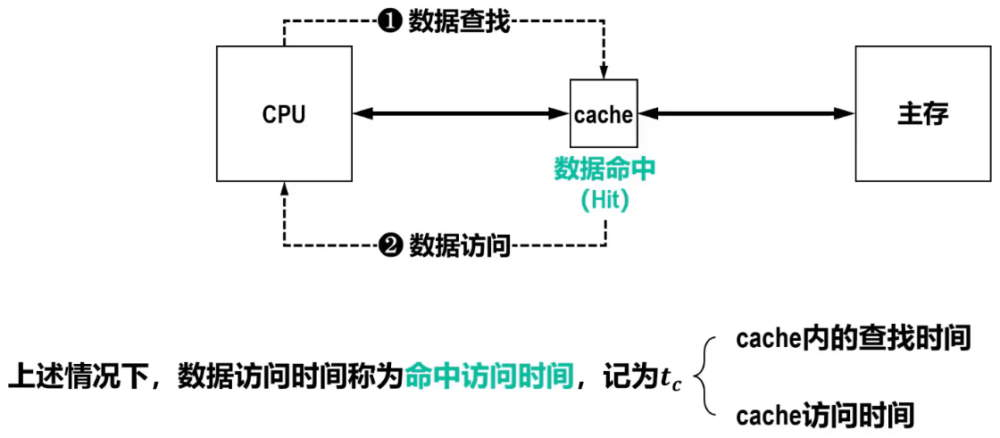

## 数据缺失（Miss）、缺失补偿（Miss Penalty）

- 数据缺失：没有从缓存中找到数据
- 缺失补偿
  - cache内的查找时间
  - 主存访问时间（较为漫长），记为t~m~（一般用t~m~表示缺失补偿）
  - cache访问时间
- 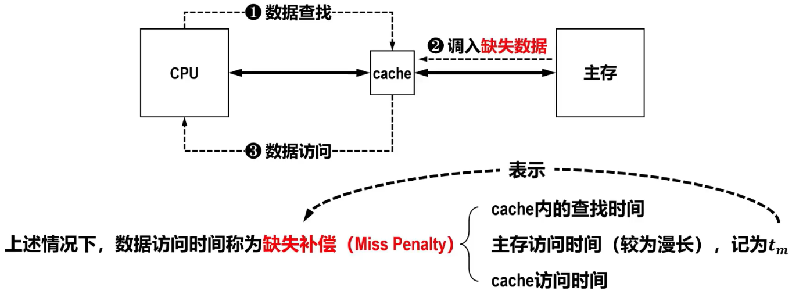

## 数据块

- 为了便于快速查找，主存和cache都被划分成若干个固定大小的==数据块（Block），每个数据块又包含若干个字==
  - 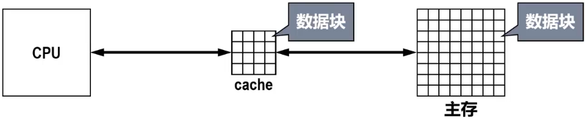
- 进行数据分块后，需要给主存内的数据块和cache内的数据块分配地址
  - ==数据块的地址==由==块地址==和==块内偏移地址==（简称块内偏移Offest）两部分构成
  - 由于cache容量比主存容量小很多，因此cache内的块地址长度小于主存内的块地址长度
  - 

# cache系统的性能评价

## ==命中率==（Hit Ratio）

- 命中cache次数记为n~c~，从主存访问信息次数记为n~m~，命中率记为h

  - $$
    h = \frac{n_c}{n_c + n_m}
    $$

- ==h越接近于1性能越好==

## ==缺失率==（Miss Ratio）

- 命中率记为h，缺失率记为1-h

## ==cache/主存系统的平均访问时间==

- 命中情况下的访问时间记为t~c~，数据缺失情况下的访问时间记为t~m~，cache/主存系统的平均访问时间记为t~a~

  - $$
    t_a = h t_c + (1 - h)t_m
    $$

- h越接近于1，t~a~越接近t~c~

## ==访问效率==

- 命中情况下的访问时间记为t~c~，cache/主存系统的平均访问时间记为t~a~，访问效率记为e

  - $$
    e = \frac{t_c}{t_a} = \frac{t_c}{h t_c + (1 - h)t_m} = \frac{1}{h + (1 - h) \frac{t_m}{t_c}} = \frac{1}{h + (1 - h)r}
    $$

- h越接近于1，e越接近1

- r一般为5~10，不能太大

# cache的读写操作

## cache读操作

### 基本流程

- 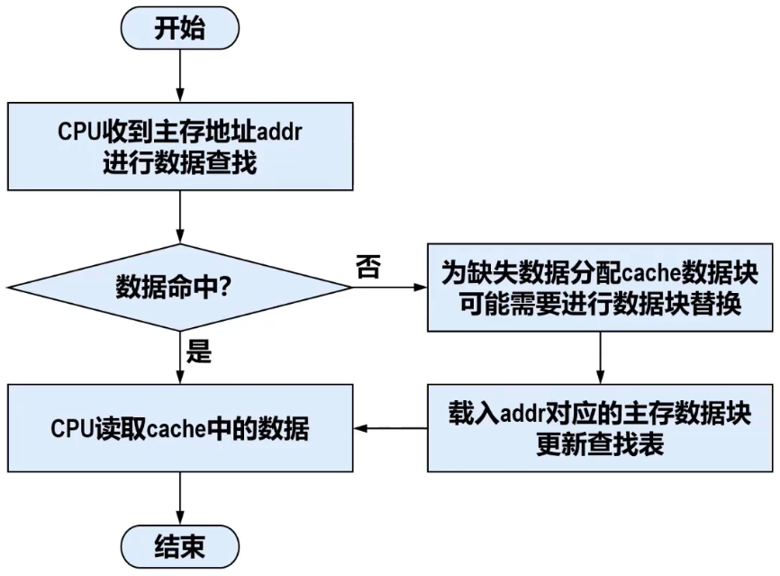

### Tip

- 读命中访问时间最短
- 构建cache系统时，尽可能==提高命中率==，以提升读操作性能
  - 通过较好的==替换策略==，将经常访问的==热数据保留==在cache中，将不经常访问的==冷数据淘汰==，来充分==利用时间局部性==，以提高命中率
  - 数据缺失时，会将缺失数据所在数据块中的其他数据一起载入，这种==预读策略==可以充分==利用空间局部性==来提高==顺序访问==的命中率

## cache写操作

### 基本流程

- 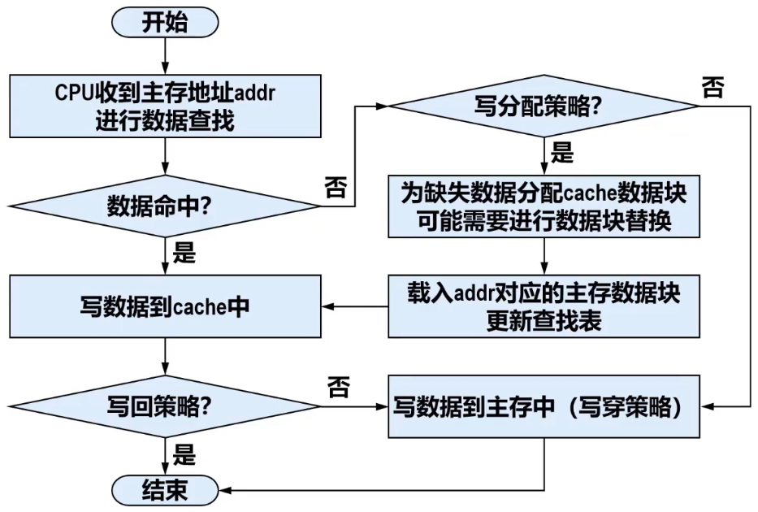

### Tip

- 采用==写回策略==时，将数据写入cache即可返回，写响应时间最短
  - 对于==突发的小数据量写入==，cache能明显提高写入性能
  - 由于cache容量很小，当==cache写满数据后==，需要将cache中的脏数据淘汰，这就需要先将脏数据迁移到主存中，然后从主存载入新数据块到cache后才能想cache写入新数据，该过程==写性能比没有采用cache的主存还要慢==

# 实现cache的关键技术

## 数据查找

## 地址映射

### 相关概念

- 在系统启动或复位时，每个cache行都是空的（其中的信息无效），只有载入了主存中的数据块后信息才有效
- 为了表明cache行中的信息是否有效，每个cache行需要一个有效位（valid bit）
- 将有效位清零，可以淘汰某cache行中的数据块，称为==冲刷==（flush）
- 载入一个新的数据块后，再将有效位置1
- 载入主存数据时还需要记录一些相关信息
  - 主存数据块地址标记
  - 脏数据标志位
  - 淘汰计数
- 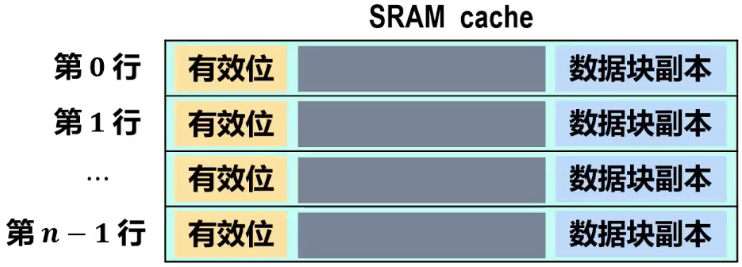

### 直接映射（Direct Mapping）

#### 映射规则

- 每个主存数据块映射到cache中的一个固定行
- cache行号 = 主存数据块号 mod cache行数

#### 信息的主存地址

- 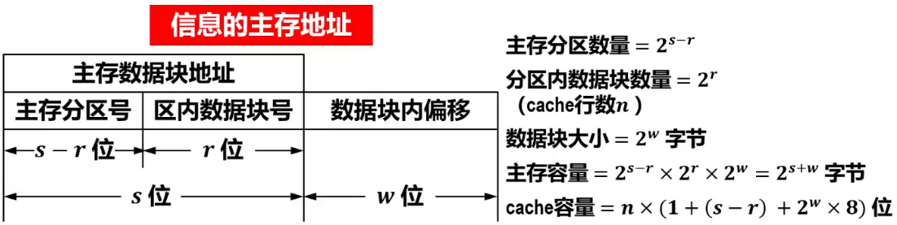
- 利用信息的主存地址与cache中数据块地址进行比对，判断是否命中
  - CPU要读取主存中的某个信息，通过该信息的主存地址的区内数据块号（cache行号）直接索引到对应的cache行
    - 若cache行中保存的主存分区号与信息的主存地址中的主存分区号相同且有效位为1（即有效）时，则数据命中
    - 若cache行中保存的主存分区号与信息的主存地址中的主存分区号不同且有效位为0（即无效）时，则数据缺失

#### 硬件逻辑实现（举例）

- 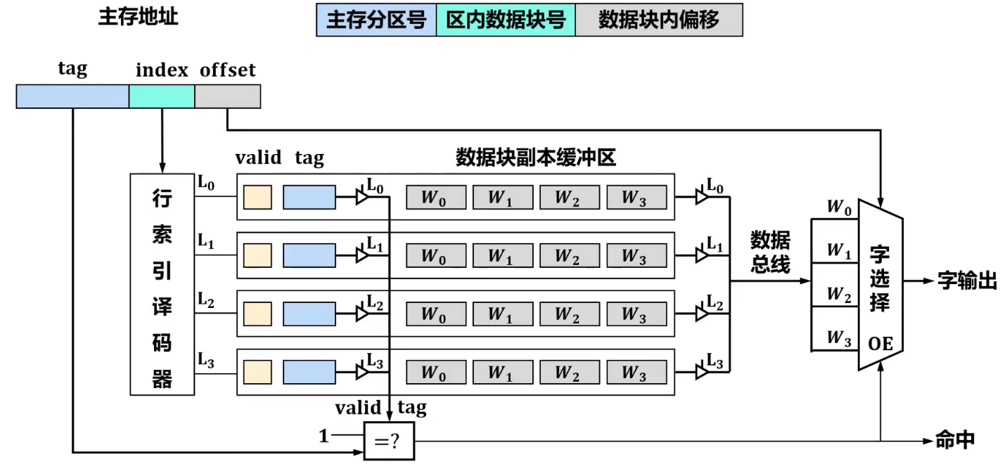

#### 特点

- 每个主存数据块映射到cache中的一个固定行
  - cache==利用率低==
  - cache==命中率低==
  - cache==冲突率高==（未满也可能发生数据块替换）
- 对于快速查找的硬件实现，==成本较低==（进需要译码器和一个比较器，而不像全相联映射需要相联存储器来实现），==适合于大容量cache使用==
- ==替换算法较为简单==，如果访问不命中则直接替换相应cache行即可。但是，若该cache行存在脏数据，则需要将脏数据写入二级存储器以保证数据一致性

#### Tip

- 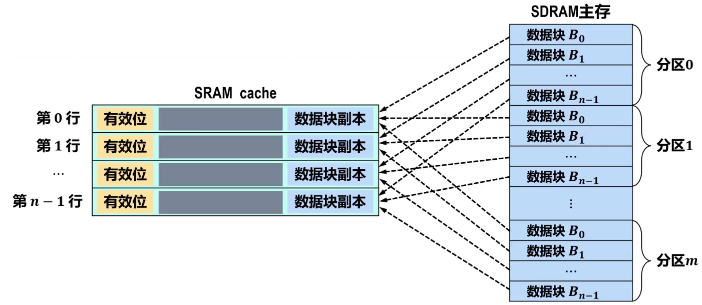
- 映射规则等效于将==主存按照cache大小进行了分区==
  - ==每个分区包含的数据块的数量与cahce的行数相同==

### 全相联映射（Full Associative Mapping）

#### 映射规则

- 新的主存数据块可以载入到cache中的任何一个==空行==
- 只有==cache满==时，才需要进行==数据替换==

#### 信息的主存地址

- 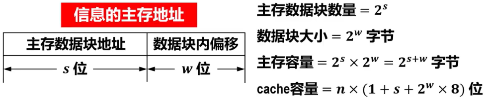
- 利用信息的主存地址与cache中数据块地址进行比对，判断是否命中
  - 直接将主存数据块地址与所有cache行中的主存数据块地址进行==并发比较==；所有cache行中有效位的值与1进行并发比较
    - 若读命中，则输出相应cache行数据块副本中块内偏移处的信息
    - 若写命中，则写入数据，同时将脏数据标志位置1
- 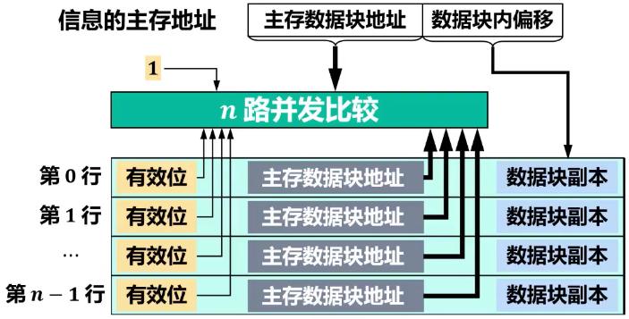

#### 硬件逻辑实现（举例）

- 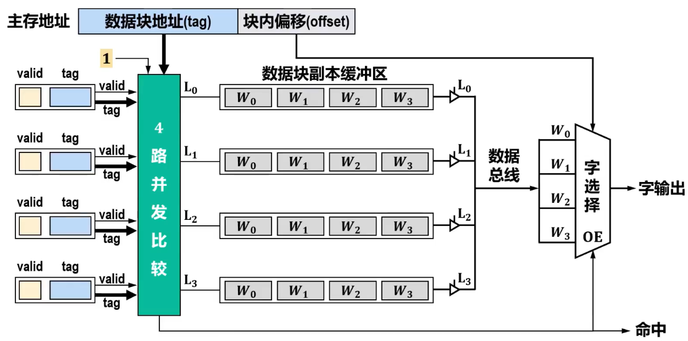

#### 特点

- 每个主存数据块都可映射到cache中的任何一个cache行
  - cache==利用率高==
  - cache==冲突率低==（只要cache中还有空行就不会发生数据块替换）
- 查找时需要并发比较所有cache行中的主存数据块地址，每个cache行对应一个比较电路，==硬件成本高，时间开销较大==，只适用于==小容量cache==使用
- ==cache满后==，当载入新主存数据块时，需要利用替换算法进行替换，==替换策略和算法较为复杂==

#### Tip

- 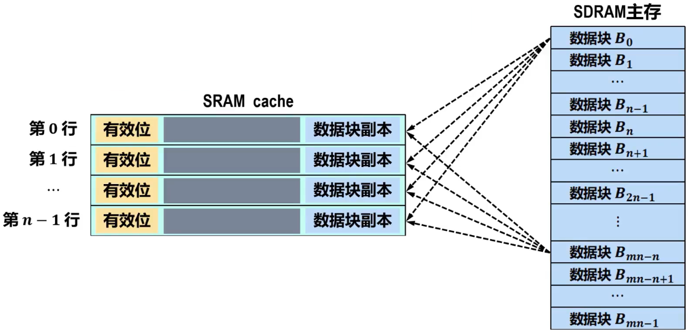
- 采用全相联映射方式的cache，在进行访存时，依据tag的内容（数据块地址）来查找cache行中的主存数据块，因而其查找主存数据块的过程是一种“按内容访问”的存取方式（==可理解为并不对地址进行移码，而直接将地址当作待比较的内容==），因此，它属于==相联存储器==（Content Addressable Memory，CAM）

### 组相联映射（Set Associative Mapping）

#### 映射规则

1. 将cache中的所有行划分乘固定大小的组，每组包含k行，称为==k路组相联==
2. 主存数据块采用==直接映射==方式对应到cache中固定的==组==
   - cache组号 = 主存数据块号 mod cache组数量
   - 等效于将主存数据块按cache组的数量进行了分区
     - 每个分区中包含的数据块的数量与cache组的数量相同
     - 每个分区中的数据块，各自对应某个固定的cache组
3. 主存数据块所对应的组内，采用==全相联映射==，可对应到==组内==任何一个==cache行==

#### 信息的主存地址

- 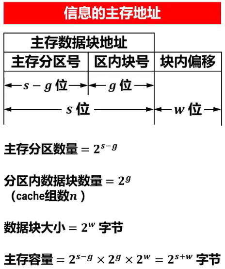
- 利用信息的主存地址与cache中数据块地址进行比对，判断是否命中
  1. 基于信息的主存地址的区内块号（组索引index）索引到相应的cache组
  2. 将信息的主存地址的主存分区号部分与所选cache组内所有行的标记tag、1与所选cache组内所有行的有效位进行全相联并发比较。如果匹配，则数据命中，否则数据缺失
- 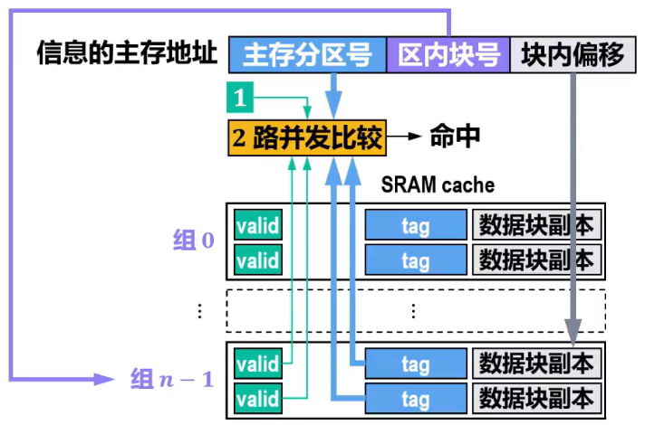

#### 硬件逻辑实现（举例）

- 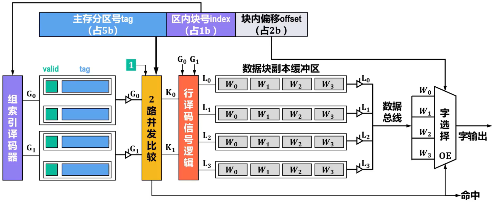

#### Tip

- 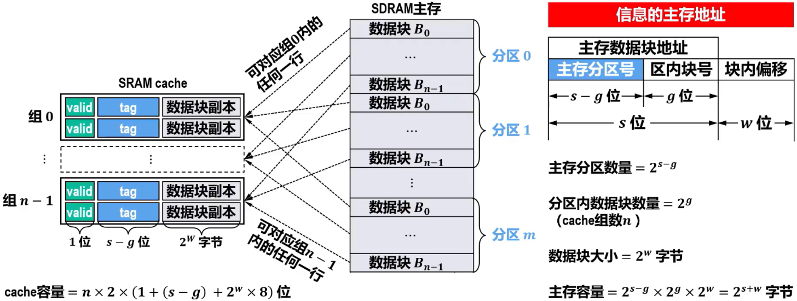
  - 计算cache总容量时忽略了写入策略的脏数据标志位、替换策略的淘汰计数等信息
- 与全相联相比，组相联映射将全相联并发比较限制在了单个cache组内，而不是整个cache
- ==cache组所包含cache行的数量（记为G~r~）==，决定了数据块==冲突的概率==和==全相联并发比较的复杂性==
  - ==G~r~越大==，则发生数据块==冲突的概率越低==，但==全相联并发比较电路越复杂==
  - ==选取适当的G~r~==，可使组相联映射的硬件开销比全相联映射的==硬件开销低很多==，而==性能上仍可接近==全相联方式
  - 早期cache容量不大，通常G~r~=2或4，即2路或4路组相联比较常用。随着技术的发展，cache容量不断增大，G~r~的值也随之增大，目前很多处理器的cache采用8路或16路组相联

### Tip

#### 三种地址映射方式的比较

- 三种地址映射方式下，==一个主存数据块对应的cache行的数量==是不同的

  - | 映射方式       | 对应关系                                                     |
    | -------------- | ------------------------------------------------------------ |
    | 直接映射方式   | ==一==个主存数据块只==对==应==一==个固定的cache行                        |
    | 全相联映射方式 | ==一==个主存数据块可==对==应==任何==一个cache行                          |
    | 组相联映射方式 | ==一==个主存数据块可==对==应==k==个cache行（k为每个cache组包含cache行的数量，称为k路组相联） |

- 一个主存数据块对应的cache行的数量，称为“==关联度==”

  - | 映射方式          | 关联度            |
    | ----------------- | ----------------- |
    | 直接映射方式      | ==1==             |
    | 全相联映射方式    | ==cache的总行数== |
    | k路组相联映射方式 | ==k==             |

- ==关联度==与==命中率==、==命中时间==、cache行中==标记tag==所占空间（额外开销）的关系如下

  - 关联度越低，命中率越低。因此，==直接映射方式的命中率最低，全相联映射方式的命中率最高==
  - 关联度越低，判断是否命中的开销越小，命中时间越短。因此，==直接映射方式的命中时间最短，全相联映射的命中时间最长==
  - 关联度越低，cache行中标记tag所占空间（额外开销）越少。因此==直接映射方式的额外空间开销最少，全相联映射方式的额外空间开销最大==

- 不同映射方式下，信息的主存地址划分

  - 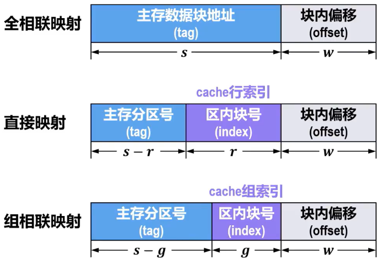

## 替换算法

### Remind

- | 映射方式       | 何时使用替换算法                                             | 常用替换算法                                                 |
  | -------------- | ------------------------------------------------------------ | ------------------------------------------------------------ |
  | 直接映射方式   | ==cache未满时就有可能出现冲突==，需要进行cache中内存数据块的替换 | 由于每个主存数据块只对应一个固定的cahce行，因此==不需要使用任何替换算法== |
  | 全相联映射方式 | ==cache已满后才有可能出现冲突==，需要进行cache中主存数据块的替换 | 随机替换                                                     |
  | 组相联映射方式 | ==cache未满时就有可能出现冲突==，需要进行cache中内存数据块的替换 | 随机替换                                                     |

### 随机替换

- 基本思想：==随机选取==一个cache行进行替换
- 优点：硬件实现最容易，速度最快
- 缺点：随机替换掉的数据可能马上又要用，从而降低命中率和cache的工作效率
- 随着cache容量的增大，随机替换算法的缺点所带来的负面影响会减小
- 通过仿真试验可发现，随机替换算法的性能只稍逊于LFU算法和LRU算法

### 先进先出FIFO算法

- 基本思想：将主存数据块==载入cache的先后顺序，作为替换顺序==。在需要进行替换时，选择最先载入主存数据块的cache行进行替换
- 实现方法：==记录==每个cache行==载入==主存数据块==时刻==（或称时间戳）
- 算法特点：实现较方便（==开销小==），但未考虑程序的访问局部性，因为最先进入cache的主存数据块也可能是目前经常要用的，因此，==可能导致cache的命中率不高==

### 最不经常用LFU算法

- 基本思想：==将被命中访问次数最少的cache行淘汰==
- 实现方法：需要为==每个cache行==设置一个==淘汰计数器==，新载入的cache行从0开始计数，每命中访问1次，被访问cache行的淘汰计数器加1。需要进行==替换==时，==计数值最小==的cache行被替换
- 算法特点：硬件==成本较高==（每行一个计数器）。淘汰计数器从cache上电后就开始记录，但==不能严格反映出近期的访问情况==

### 近期最少用LRU算法

- 基本思想：==将近期内最少被命中访问过的cache行淘汰==
- 实现方法：与LFU算法类似，也需要为==每个cache行==设置一个==淘汰计数器==。不同点是，cache行每被访问（载入/替换、命中）1次，==该cache行的计数器被清零，比其计数值小的其他行的计数器加1==（这样可满足LRU位的位宽限制）。需要进行==替换==时，==计数值最大==的cache行被替换
- 算法特点：硬件==成本较高==（每行一个计数器）。比较正确地==反映了程序的访问局部性==，因为近期最少使用的主存数据块，很可能是将来最少被访问的
- 淘汰计数器的数值，称为==LRU位==，其位数与cache组（当只有1个组时，则为全相联映射）的大小有关
  - 理论上，==n路组相联==（即每个cache组包含cache行的数量为n）时==LRU位的位数为log~2~n==，例如，2路组相联时LRU的位数为1，4路组相联时LRU位的位数为2
- 如果是==仅包含2个cache行的全相联映射==（或==2路组相联映射==），2选1完全==不需要淘汰计数器，仅需要一个二进制标志位==即可

## 写入策略

### 数据命中（写cache未命中）的情况

#### 写回法（Write-Back）

- 当写cache命中时，只将新数据==写入相应cache行而不立即写入主存==，只有当此cache行中的数据块被==替换时才将脏数据写回主存==
- 写回法==需要==为每个cache行配置一个==脏数据标志位==，简称为==脏位==（Dirty Bit），以标识该行中的数据块中是否包含有未写回主存的脏数据
  - ==Dirty Bit=1==，表明该行==有脏数据==，在该行数据块需要被替换时，首==先==将脏数据==写回==主存，然后==再==将该行数据块==替换==
  - ==Dirty Bit=0==，表明该行==没有脏数据==，在该行数据块需要被替换时，==直接替换==该行数据块即可
- 可大大==降低写主存的次数==
- 存在cache与主存中==数据不一致的潜在隐患==，可能导致DMA操作时出现数据不一致的问题

#### 写穿法（Write-Through）

- 当写cache命中时，==对cache和主存==中的同一数据块==都写入==同一新数据
- 写穿法==不需要==为每个cache行配置一个==脏数据标志位==，也就不需要相应的判别逻辑。在需要进行cache行中数据块替换时，直接替换即可
- 大大==增加了写操作的开销==
- 在==单CPU==系统中，可使==cache与主存的一致性得到保证==

#### Tip

- 对于目前主流的多核CPU和DMA高速外设，无论采用写回法还是写穿法，都可能导致cache与主存中的数据不一致，需要其他同步机制来解决

### 数据缺失（写cache未命中）的情况

#### 写分配法（Write-Allocate）

##### 写穿方式

1. 将新数据==写入==到==主存==中相应数据块的相应位置
2. 在cache中分配一个cache行，将主存中新数据所在数据块==载入==到该==cache行==

##### 写回方式

1. 在cache中分配一个cache行，将新数据所在主存数据块==载入==到该==cache行==中
2. 将新数据==写入==该==cache行==中数据块的==相应位置==

##### Tip

- 可以==充分利用空间局部性==
- 仍然需要从主存载入数据块到cache，==增加了读主存的开销==
- ==写回方式还存在cache与主存一致性问题==

#### 非写分配法（Not-Write-Allocate）

- > 仅将新数据==写入==到==主存==中相应数据块的相应位置，而==不载入==主存数据块到==cache==中

- ==没有很好地利用空间局部性==

- ==减少了读主存的开销==

# 分类和应用

## 概述

- 在计算机系统中，==存在性能差异==的地方都可以==使用cache技术==

## 硬件cache

### 统一cache

- 在cache发展的早期阶段，==指令和数据都存放在同一个cache中==，称为统一cache
- 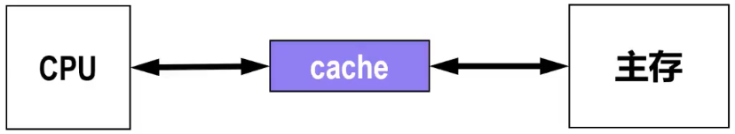
- 优点：设计和实现都相对简单
- 缺点：对于后面出现的==指令预取==技术（指令流水线的重要组成部分），==存取数据与取指令会发生冲突==

### 分离cache

- 为了支持指令预取技术（指令流水线的重要组成部分），将cache分成==各自独立的数据cache与指令cache==，则不存在存取数据与取指令发生冲突的问题，称为分离cache
  - 

### 多级cache

- 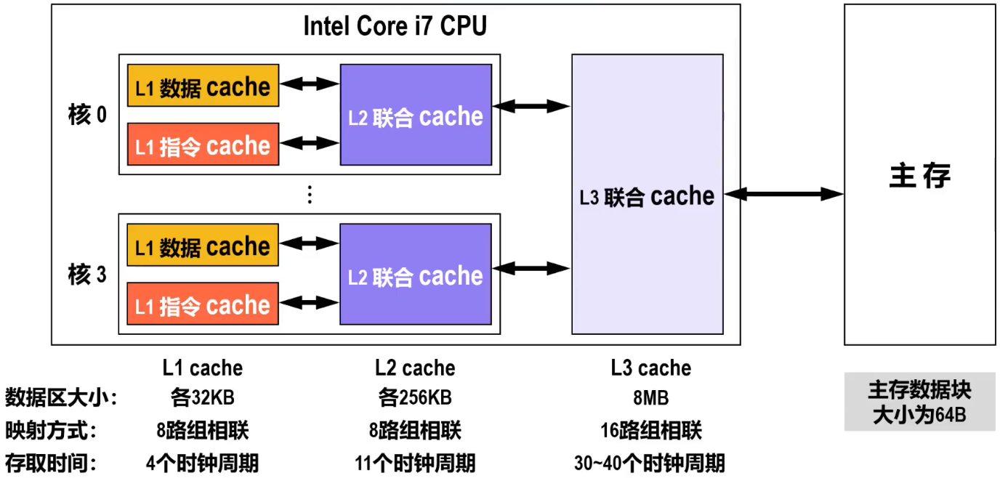

## 软件cache

### buffer cache

- “buffer cache”通常指==操作系统==或==数据库系统==中用于存储经常访问的数据的一种==缓存机制==
  - 操作系统使用“buffer cache”来==缓存文件系统的数据==，当应用程序请求读取或写入数据时，操作系统可从内存中的“buffer cache”中快速提供数据，而不是每次都从磁盘读取
  - 数据库系统使用“buffer cache”来==缓存数据库表和索引的数据==。当查询涉及到的数据已在“buffer cache”中时，数据库系统可以快速响应查询请求，而不需要从磁盘读取数据

### web cache

- 详细内容可见于计算机网络中应用层万维网的万维网缓存与代理服务