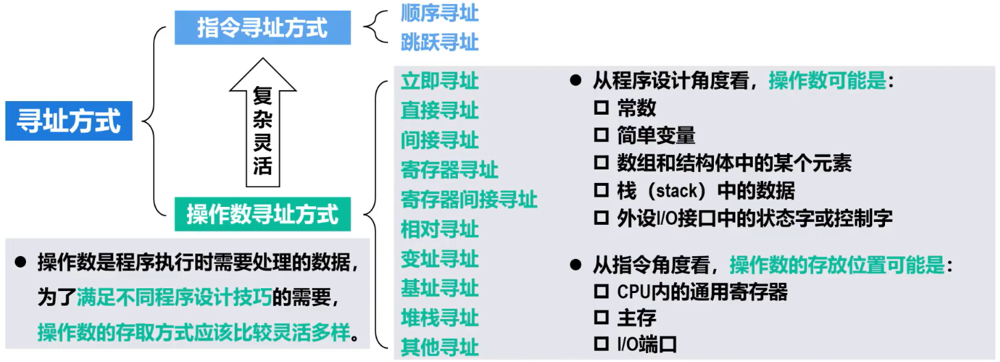
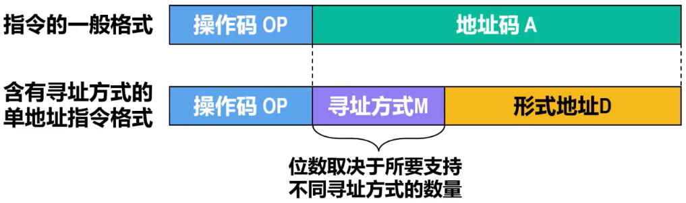

# 概述

- 寻址方式是指寻找==指令==或==指令中的操作数==的==有效地址==的方式
  - ==有效地址==可以是==主存地址==，也可以是==虚拟地址==（采用虚拟存储器技术）
- 寻址方式
  - 指令寻址方式
    - 顺序寻址
    - 跳跃寻址
  - 操作数寻址方式
    - 立即寻址
    - 直接寻址
    - 间接寻址
    - 寄存器寻址
    - 寄存器间接寻址
    - 相对寻址
    - 变址寻址
    - 基址寻址
    - 堆栈寻址
    - 其他寻址
- 操作数寻址方式比指令寻址方式更加复杂灵活
- 操作数是程序执行时需要处理的数据，为了==满足不同程序设计技巧==的需要，==操作数的存取方式应该比较灵活多样==
- 从程序设计角度看，==操作数可能是==
  - 常数
  - 简单变量
  - 数组和结构体中的某个元素
  - 栈（stack）中的数据
  - 外设I/O接口中的状态字或控制字
- 从指令角度看，==操作数的存放位置可能是==
  - CPU内存的通用寄存器
  - 主存
  - I/O端口
- 

# 指令寻址方式

## 顺序寻址

- 通常情况下，构成程序的所有机器指令==（指令序列）在主存中按顺序存放==
- 大多数情况下，==程序按照指令序列顺序执行==
  - 如果知道指令序列中第一条指令的有效地址，在该有效地址的基础上增加一条指令所占用主存单元的数量，就可以得到下一条指令的有效地址。这种寻找指令有效地址的方法就称为==指令的顺序寻址==

## 跳跃寻址

- 如果构成程序的指令序列中包含有==分支指令==或==跳转指令==，则当程序执行到这种指令时就会==改变执行顺序==。此时就要==采取跳跃寻址==
  - 分支指令通常用于==基于条件==来改变指令序列的执行顺序
  - 跳转指令通常用于==无条件==改变指令序列的执行顺序

# 操作数寻址方式

## 概述

- ==不同指令==可能采用==不同的操作数寻址方式==来获取操作数
  - 可将指令格式中的==地址码字段==划分为以下两部分
    - ==寻址方式（寻址特征）==字段M
    - ==形式地址==字段D
- 
- ==操作数寻址的过程，就是吧寻址方式M和形式地址D的不同组合转换成有效地址的过程==

## 立即寻址

- 
- 地址码格式
  - 寻址方式M：表示立即寻址的特征码
  - 形式地址D：操作数本身
- ==操作数与指令一起存放在主存==
  - ==取指==令时，==操作数随指令一起==被读取并送到CPU内的指令寄存器IR中
  - 指令==执行==时，直接从指令寄存器IR中获取操作数，==无需访问其他存储单元==
- ==特点==
  - ==取操作数快==
  - 形式地址D的位宽有限，限制了操作数的表示范围
- 立即寻址一般用于==变量赋初值==

## 直接寻址

- 
- 地址码格式
  - 寻址方式M：表示直接寻址的特征码
  - 形式地址D：操作数的主存地址
- ==操作数与指令分开存放在主存==
  - 指令中的==形式地址D，直接给出了操作数的主存地址==
  - ==取指==令时，==操作数不会随指令一起==被读取并送到CPU内的指令寄存器IR中
  - 指令==执行==时，需要==访问一次主存==以获取操作数
- ==特点==
  - ==操作数的地址直观，无需专门计算操作数的地址==
  - 形式地址D的位宽有限，限制了操作数的寻址范围
  - 操作数的地址位于指令中，因此不方便修改

## 寄存器寻址

- 
- 地址码格式
  - 寻址方式M：表示寄存器寻址的特征码
  - 形式地址D：操作数所在通用寄存器的编号
- ==操作数==存放在CPU内的==某个通用寄存器==中，指令存放在主存中
  - 指令中的==形式地址D，给出的是操作数所在通用寄存器的编号==
  - ==取指==令时，==操作数不会随指令一起==被读取并送到CPU内的指令寄存器IR中
  - 指令==执行==时，==只访问寄存器==（而不需要访问主存）
- ==特点==
  - ==获取操作数不需要访问主存==（从寄存器获取），==指令执行速度快==
  - 由于通用寄存器的数量少，因此==所需的形式地址D的位数就少==，有利于缩短指令字长，==节省存储空间==
  - 由于CPU内的寄存器数量有限，因此寄存器寻址不能为大量的操作数提供存储服务

## 间接寻址

- 
- 地址码格式
  - 寻址方式M：表示间接寻址的特征码
  - 形式地址D：操作数的间接地址
- ==操作数与指令分开存放在主存==
  - 指令中的==形式地址D==，给出的不是操作数的有效地址，而是操作数的==间接空间，间接地址所指向的主存单元中的内容才是操作数的有效地址==
  - ==取指==令时，==操作数不会随指令一起==被读取并送到CPU内的指令寄存器IR中
  - 指令==执行==时，需要==访问两次主存==以获取操作数
- ==特点==
  - ==相较于直接寻址，能用较短的形式地址D访问较大的主存空间==
  - ==相较于直接寻址，当需要修改操作数地址时不再需要改变指令中的形式地址D，只需要修改形式地址D指向的主存单元（存有操作数地址）即可==
  - 指令执行时，需要访问两次主存以获取操作数，降低了指令的执行速度

## 寄存器间接寻址

- 
- 地址码格式
  - 寻址方式M：表示寄存器间接寻址的特征码
  - 形式地址D：存放操作数地址的通用寄存器的编号
- ==操作数与指令分开存放在主存==
  - 指令中的==形式地址D==，给出的不是操作数的有效地址，而是==通用寄存器的编号==，而==该编号的通用寄存器，其内容就是操作数的主存地址==
  - ==取指==令时，==操作数不会随指令一起==被读取并送到CPU内的指令寄存器IR中
  - 指令==执行==时，需要==访问一次主存==以获取操作数
- ==特点==
  - ==具有间接寻址的优点（扩充了操作数的寻址范围，提高了编程灵活性），还比间接寻址少访问一次主存==
  - 与寄存器寻址的缺点类似，由于CPU内的寄存器数量有限，因此寄存器间接寻址不能为大量的操作数提供存储其主存地址的服务

## 偏移寻址

### 相对寻址

- 
- 地址码格式
  - 寻址方式M：表示相对寻址的特征码
  - 形式地址D：相对于当前PC值的偏移量用以形成操作数的主存地址
- ==操作数与指令分开存放在主存==
  - 指令中的==形式地址D==，是需要给程序计数器==PC中的内容加上的偏移量==，可正可负（用补码表示），这样就可以形成操作数的主存地址或转移目标地址
  - ==取指==令时，==操作数不会随指令一起==被读取并送到CPU内的指令寄存器IR中
  - 指令==译码或执行阶段==，==会计算操作数的主存地址==或==转移目标地址==
- ==特点和用途==
  - 程序设计时只需给定指令与操作数之间的相对距离，而==不必关心操作数在主存中的绝对地址==，可用于==实现共享代码的浮动==
  - 实现==程序跳转执行==

### 变址寻址

- 
- 地址码格式
  - 寻址方式M：表示变址寻址的特征码
  - 寄存器编号
  - 形式地址D
- 寄存器的内容+形式地址D形成操作数的主存地址
- ==操作数与指令分开存放在主存==
  - 指令中的寄存器编号n，指明使用CPU内部哪个寄存器==（通用寄存器或专用寄存器）==，来==存放变化的地址==，该寄存器成为==变址寄存器==，==其内部存放的地址与形式地址D相加==，即可得到==操作数的主存地址==
  - ==取指==令时，==操作数不会随指令一起==被读取并送到CPU内的指令寄存器IR中
  - 指令==执行==时，需要==访问一次主存==以获取操作数
- ==特点和用途==
  - ==变址寄存器n的内容可变==，而==形式地址D的值==设定后在指令执行过程中将==保持不变==。变址寄存器n的位数大于形式地址D的位数，==扩大了寻址范围（可表示整个存储空间）==
  - ==主要应用于对数组元素的访问==。将==数组的首地址赋值给==指令中的==形式地址D==，使==变址寄存器n的值按顺序变化==，既可以对数组中的个元素进行相同的操作

### 基址寻址

- 
- 变址寻址的变址寄存器内容可变，但形式地址D的值不变。基址寻址相反，基址寄存器内容不变，形式地址D的值可变
- 变址寻址和基址寻址的过程完全相同

### Tip

#### 变址寻址与基址寻址的不同

- | 操作数寻址方式 | 描述                                                         | 寄存器             | 形式地址D             |
  | -------------- | ------------------------------------------------------------ | ------------------ | --------------------- |
  | 变址寻址       | ==面向用户==，主要用于==处理程序循环问题==（例如对数组元素的访问），程序执行过程中用户可以改变变址寄存器的内容来实现指令或操作数的寻址 | 变址寄存器内容可变 | 形式地址D的值保持不变 |
  | 基址寻址       | ==面向系统==，主要用于==程序的重定位==。对于多道程序设计，用户编程使用的是虚拟地址，当系统管理程序将用户程序载入主存时，会为每个用户程序分配一个基地址。当某个用户程序运行时，分配给其的基地址被载入基地址寄存器，通过基址寻址方式实现虚拟地址到物理地址的转换。用户通过改变指令中的形式地址D来实现指令或操作数的寻址，而基址寄存器的内容只能由操作系统或系统管理程序通过特权指令设置，对用户透明 | 基址寄存器内容不变 | 形式地址D的值可变     |

#### 偏移寻址的共同点

- 都是通过某个寄存器的内容+形式地址D的值（也就是偏移量）得到操作数的有效地址
  - | 寻址方式 | 寄存器             |
    | -------- | ------------------ |
    | 相对寻址 | 程序计数器PC的内容 |
    | 变址寻址 | 变址寄存器的内容   |
    | 基址寻址 | 基址寄存器的内容   |

  

## 堆栈（Stack）寻址

- ==操作数存放在堆栈==
- 堆栈一般分为以下两种
  - 寄存器堆栈
    - 在==专用寄存器组==中划分出来的一块、按“后进先出”（LIFO）规则管理的储存区，也称为==硬堆栈==
    - 成本较高，不适合做大容量堆栈，较少使用
  - ==存储器堆栈==
    - 在==主存空间==中划分出来的一块、按“后进先出”（LIFO）规则管理的存储区，也称为==软堆栈==
    - 目前计算机普遍采用
    - 由于存储器堆栈是在主存中划分出来的一块特定存储区，而主存基于地址进行访问，因此，需要使用一个特定的寄存器来记录堆栈中存储单元的地址，该寄存器称为==堆栈指针（SP）==

## 复合寻址

### 概述

- 将常见的寻址方式进行组合，得到==复合寻址方式==
- 复合寻址方式主要用于==复杂指令集计算机CISC==

### 相对寻址+间接寻址

1. (PC) + D：相对寻址，得到存放操作数有效地址的主存单元的地址
2. ((PC) + D)：间接寻址，得到操作数的有效地址

### 变址寻址+间接寻址

1. (变址寄存器) + D：变址寻址，得到存放操作数有效地址的主存单元的地址
2. ((变址寄存器) + D)：间接寻址，得到操作数的有效地址

### 间接寻址+变址寻址

1. (D)：间接寻址，得到用于变址寻址的偏移量
2. (变址寄存器) + (D)：变址寻址，得到操作数的有效地址

## Tip

- 不同指令系统，可能采用了此课程所介绍的寻址方式中的一部分

- 此课程介绍的操作数寻址方式，都是单地址指令。对于多地址指令，每个地址字段的作用不同，因此每个地址字段都可能有各自的寻址方式字段

- | 操作数寻址方式      | 操作数的有效地址（主存地址或寄存器编号）EA，程序计数器PC，形式地址D，通用寄存器N，变址寄存器I，基地址寄存器B | 获取操作数需要的访存次数（不包括取指令） |
  | ------------------- | ------------------------------------------------------------ | ---------------------------------------- |
  | 立即寻址            | D为操作数本身                                                | 0                                        |
  | 直接寻址            | EA = D                                                       | 1                                        |
  | 寄存器寻址          | EA = N                                                       | 0                                        |
  | （单级）间接寻址    | EA = (D)                                                     | 2                                        |
  | 寄存器间接寻址      | EA = (N)                                                     | 1                                        |
  | 相对寻址            | EA = (PC) + D                                                | 1                                        |
  | 变址寻址            | EA = (I) + D                                                 | 1                                        |
  | 基址寻址            | EA = (B) + D                                                 | 1                                        |
  | 相对寻址 + 间接寻址 | EA = ((PC) + D)                                              | 2                                        |
  | 变址寻址 + 间接寻址 | EA = ((I) + D)                                               | 2                                        |
  | 间接寻址 + 变址寻址 | EA = (I) + (D)                                               | 2                                        |