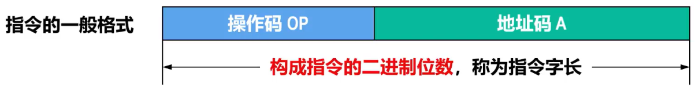
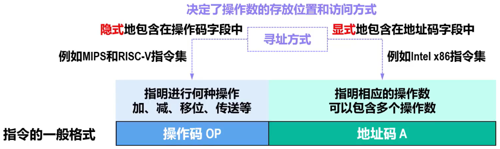
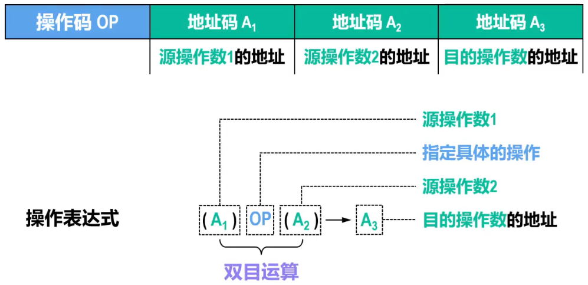
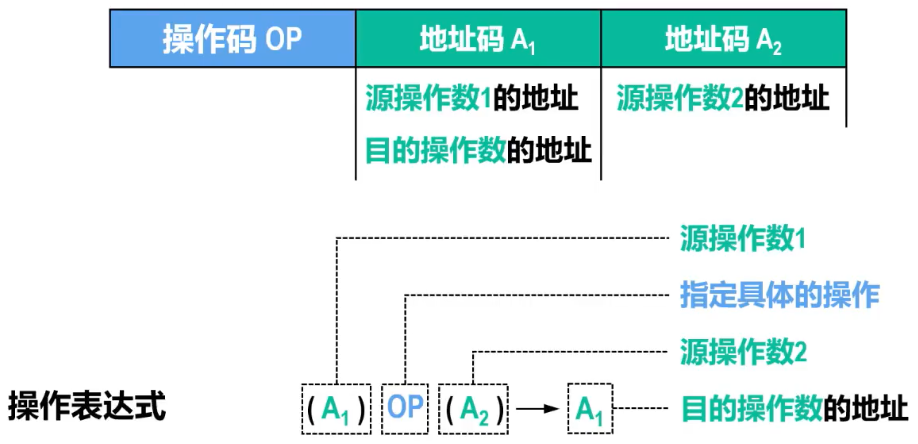
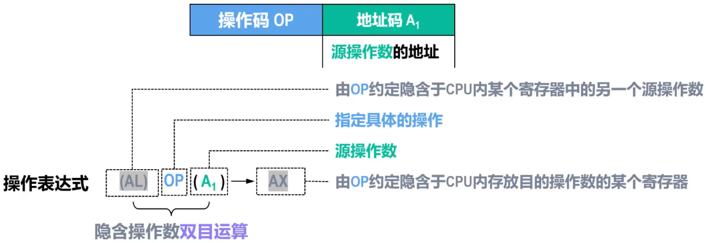

# 指令字长

## 概述

- 

## 定长指令系统

- 指令长度固定
- 结构简单，有利于指令顺序寻址、取指和译码
- 硬件实现较容易
- 平均指令长度较长、冗余状态较多（浪费存储器空间）
- 受指令长度限制，不容易扩展
- 在精简指令集计算机（RISC）中较为常用，例如MIPS系列

## 变长指令系统

- 指令长度可变
- 结构灵活，给取指和译码带来不便，取指过程可能涉及多次访存操作
- 硬件实现难度较大
- 平均指令长度较短、冗余状态较少
- 不受指令长度限制，可扩展性好
- 在复杂指令集计算机（CISC）中采用，例如Intel x86系列

## Tip

- 由于存储器的基本编址单位为字节，而指令是存储在存储器中的，所以无论是定长指令系统还是变长指令系统，指令字长都是字节的整数倍
- ==指令字长==越长，则占用==主存空间==就越大，所耗费的==访存时间==也就越长
- 根据==指令字长==与==机器字长==的关系，指令可分为以下三类（字长基于机器字长）
  - ==半字长指令==：CPU进行1次访存，可读取2条
  - ==单字长指令==：CPU进行1次访存，可读取1条
  - ==多字长指令==：需要进行多次访存
- 为了提高速度，一般会将最常用的指令设计为较短的指令格式

# 指令格式

## 一般格式

- 

## 地址码字段

- > 指明相应的操作数，可以包含多个操作数

- 操作数

- 操作数的地址

  - 主存地址

  - 寄存器编号

  - 外部设备端口的地址

  - 用于计算地址的偏移量

## 根据地址码字段分类

### 三地址指令

- 
- 操作数的寻址范围越大，需要地址码的位数就会越大，指令就会越长。所以三地址指令的地址码字段中的3个地址码、全部用于存储单元地址的情况并不多见，较为常见的是全部为寄存器（例如MIPS的指令），这样可以减少指令长度

### 二地址指令

- 
- 与三地址指令相同，二地址指令同样是为==双目运算类==设计的。但二地址指令为了压缩指令字长，将==运算结果==直接存放到==源操作数1的地址A~1~==中

### 一地址指令

- 
- 隐含操作数双目运算，进一步缩短了双目运算类指令的长度
- 例如x86架构中Mul BL指令，会将AL寄存器中的数据与BL寄存器中的数据相乘，结果存放在AX寄存器中

### 零地址指令

- 指令本身==不需要操作数==，例如以下x86指令
  - 空指令NOP
  - 等待指令WAIT
  - 停机指令HLT
  - 程序返回指令RET
- 指令==需要一个操作数==，该操作数隐含于CPU内的某个寄存器，例如以下x86指令
  - 用于将加法运算结果调整为压缩BCD格式的指令DAA
  - 用于将减法运算结果调整为压缩BCD格式的指令DAS

## 操作码字段

- > 操作码指定进行什么==操作（运算）==

- 不同指令的==操作码的编码值是不同的==

## 根据操作码字段分类

### Remind

- 根据==操作码的长度是否固定==（操作码字段的二进制位数），可分为以下两种操作码
  - 定长操作码
  - 变长操作码

### ==定长操作码==

- 操作码==长度固定==，并且其在指令中的==位置也是固定==的
- 指令==译码==简单，==硬件==实现==简单==
- 指令系统的规模（指令系统所包含的指令数量），决定了操作码的位数。若指令系统所包含的==指令数量x，操作码的位数为n==，则x和n应满足log~2~x <= n

### ==变长操作码==

- 操作码的==长度可变==，并且其在指令中的==位置也不固定==
- 可以有效==减少操作码的平均长度==，用较短的指令字长表示了==更多的指令==，并且给地址码流出了更多位数，以==增大寻址空间==
- 常见实现方法：==扩展操作码技术==

### Tip

- 扩展操作码技术的核心思想：==操作码的长度随地址码字段中地址码数量的减少而增加==

# 指令的操作类型

## 概述

- ==不同架构的计算机==，其结构、性能、应用领域是不同的，所采用的==指令系统之间的差异也是很大的==
- 尽管不同架构的计算机存在上述差异，但在其各自采用的指令系统中，所包含的指令的==基本操作类型==和==功能==是==相似==的
- 指令的基本操作类型
  - 数据传输指令
  - 算术和逻辑运算指令
  - 移位操作指令
  - 程序控制指令
  - 输入输出指令
  - 其他指令

## 数据传送指令

- 数据传送指令是==最基本、最常用==的指令
- 数据传送指令主要完成==两个部件之间的数据传送==操作
  - ==寄存器与寄存器==之间的数据传送
  - ==寄存器与存储器==之间的数据传送
- 有的计算机采用==通用的MOV指令==实现数据传送操作
- 有的计算机采用==LOAD指令==从主存单元==读取数据到寄存器==；采用==STORE指令==将寄存器中的==数据写入主存单元==
- 数据传送指令可以==字节、字、双字==为单位进行数据传送。有的指令系统甚至还支持==成组数据==传送（例如Intel x86的指令系统）

## 算术和逻辑运算指令

- 算术和逻辑运算指令用于==CPU所实现的最基本功能==
  - 算术运算：加（ADD）、减（SUB）、乘（MUL）、除（DIV）等
  - 逻辑运算：与（AND）、或（OR）、非（NOT）、异或（XOR）等
- 不同架构的计算机对算术运算指令的支持有很大差别
  - 有的计算机仅支持==二进制定点数的加、减、比较、求补==等最简单的指令，目的是为了让硬件实现最简单
  - 有的计算机除了支持基本的算术运算指令外，还支持==浮点运算==指令，==十进制运算==指令，甚至支持==乘方、开放、多项式计算==等指令
  - 有的大型机和巨型机除了支持==标量预算==指令外，还支持==向量运算==指令，可直接对整个==向量==或==矩阵==进行==求和、求积==运算

## 移位操作指令

- 移位操作详见 [移位运算.md](..\-003-运算方法和运算器\移位运算.md) 
- 移位操作指令就是用来告诉计算机要执行哪种移位操作，因此可分为
  - ==逻辑移位==指令：移位对象是==无符号数==
  - ==算术移位==指令：移位对象是==有符号数==
  - ==循环移位==指令：移位对象是==无符号数==
    - 小循环：不带CF标志位的循环移位
    - 大循环：带CF标志位的循环移位

## 程序控制指令

### 概述

- 程序控制指令用于控制程序的==运行顺序==和==分支==，这类指令可分为
  - ==转移==指令
  - ==循环控制==指令
  - ==子程序调用与返回==指令

### 转移指令

#### 无条件转移指令

#### 条件转移指令

- 一般根据状态标志寄存器（或条件码寄存器）中的==相关标志位==，来决定是否进行转移操作
- 相关标志位一般包括==进位标志CF、有符号溢出标志OF、结果为零标志ZF、结果位负标志NF==等，这些标志位一般==由前面的指令根据执行结果来设置==，并作为当前条件转移指令决定是否进行转移的条件

### 循环控制指令

- 为了实现循环程序的执行，循环控制指令一般包括以下功能
  - ==对循环控制变量的修改==
  - ==条件测试和判断==
  - ==地址转移==
- 综上所述，循环控制指令实际上是==功能更强的转移指令==

### 子程序调用与返回指令

- 在主程序执行过程中，但需要调用公用的子程序时，可执行==子程序调用指令，进入子程序==执行
- 当子程序执行完毕后，可以利用==返回指令，从子程序返回到主程序==继续执行
- 子程序调用指令中必须明确给出==子程序的入口地址==
- 在主程序中，==子程序调用指令的下一条指令的地址==称为==断点==，断点是==子程序返回主程序时的返回地址==
- 为了使子程序执行返回指令时能够正确返回主程序，主程序中的子程序调用指令应当具备==断点保护==的功能，一般情况下，==子程序调用指令==会将==断点==（子程序的返回地址）进行==压栈保护==，而==返回指令==则==从堆栈中取出断点并送入程序计数器PC==，这样就可使子程序返回到主程序中的断点处继续执行主程序

### Tip

- | 转移指令                 | 子程序调用与返回指令                         |
  | ------------------------ | -------------------------------------------- |
  | 条件转移指令需要满足条件 | 一般是无条件的                               |
  | 在同一程序内转移         | 不同程序之间转移                             |
  | 不需要返回原处           | 需要返回调用处，因此需要保护断点（返回地址） |

## 输入输出指令

- 输入输出指令一般简称为==I/O指令==，用于实现==主机与外部设备之间的信息传送==
  - 主机可向外部设备==发出各种控制命令==，从而控制外部设备的工作
  - 主机也可从外部设备端口寄存器中==读取外部设备的各种工作状态==
- 当外部设备与主存采用==统一编址模式时==，则==不需要专用的I/O指令，而使用访存指令==直接访问外部设备

## 其他指令

- 除了上述几种类型的指令外，还有一些实现其他控制功能的指令
  - ==停机==指令
  - 等待指令
  - 空操作指令
  - 开中断指令
  - 关中断指令
  - 特权指令
    - 特权指令主要==面向操作系统==，用于对==系统资源的分配和管理==，具有特殊的权限，因而==不直接提供给用户==使用
    - 在多任务、多用户的计算机系统中，必须要有特权指令的支持
- 在多处理器系统中，还包含有专用的==多处理机指令==