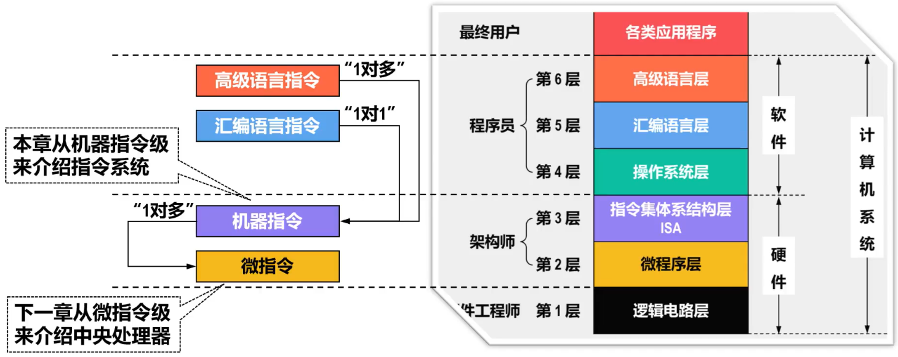

# 指令

- 计算机是按照程序员事先编制好的==程序==进行工作的
- 程序会被“翻译”（编译、汇编或解释）成一系列相应的==指令==，这些指令告诉计算机如何执行特定的任务
  - 指令是计算机硬件能够理解和执行的基本命令。这些命令包括算术运算、逻辑运算、数据传送、跳转等操作
  - 每条指令必须显式或隐式地提供以下信息
    1. 执行的操作
    2. 操作数的来源
    3. 操作结果的存放处
    4. 下一条指令的地址

# 指令集

- 一台计算机中所有指令的集合称为该计算机的==指令集==，也称为==指令系统==
- 指令系统是计算机软、硬件系统的设计基础
  - 软件设计人员需要根据指令系统设计计算机的==系统软件==
  - 硬件设计人员需要根据指令系统设计计算机的==硬件逻辑电路==
- 指令系统的设计直接影响计算机的性能和成本
- 