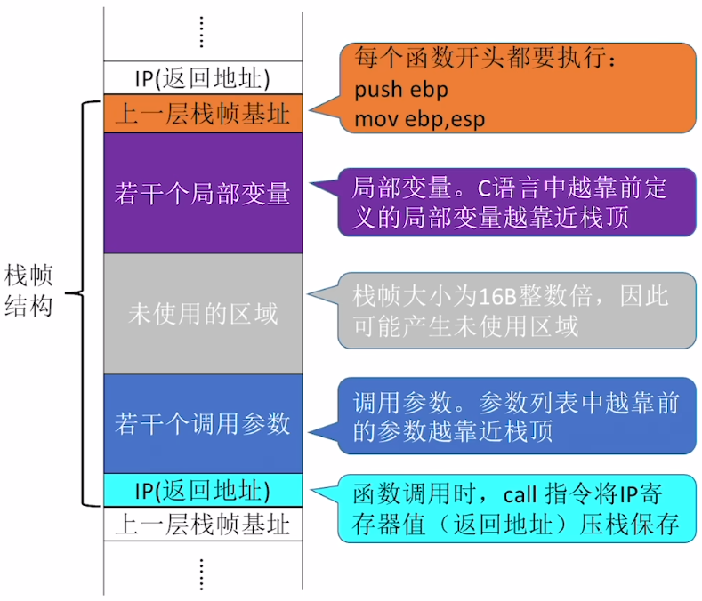

# 常用的x86汇编指令

## 算术运算指令

- 加
  - `add d,s`：计算d + s，结果存入d
- 减
  - `sub d,s`：计算d + s，结果存入d
- 乘
  - `mul d,s`：无符号数d × s，乘积存入d
  - `imul d,s`：有符号数d × s，乘积存入d
- 除
  - `div s`：无符号数触发edx:eax/s，商存入eax，余数存入edx
  - `idiv s`：有符号数触发edx:eax/s，商存入eax，余数存入edx
- 取负数
  - `neg d`：将d取负数，结果存入d
- 自增
  - `inc d`：d++，结果存入d
- 自减
  - `dec d`：d--，结果存入d

## 逻辑运算指令

- 与
  - `and d,s`：将d、s逐位相与，结果存入d
- 或
  - `or d,s`：将d、s逐位相或，结果存入d
- 非
  - `not d`：将d逐位取反，结果存入d
- 异或
  - `xor d,s`：将d、s逐位异或，结果存入d
- 左移
  - `shl d,s`：将d逻辑左移s位，结果存入d（通常s是常量）
- 右移
  - `shr d,s`：将d逻辑右移s位，结果存入d（通常s是常量）

# x86汇编语言AT&T格式和Intel格式

- |                        | AT&T格式                                                     | Intel格式                                                    |
  | ---------------------- | ------------------------------------------------------------ | ------------------------------------------------------------ |
  | 目的操作数d、源操作数s | `op s,d`<br />注：源操作数在左，目的操作数在右               | `op d,s`<br />注：源操作数在右，目的操作数在左               |
  | 寄存器的表示           | `mov %ebx,%eax`<br />注：寄存器名之前必须加`%`               | `mov eax,ebx`<br />注：直接写寄存器名即可                    |
  | 立即数的表示           | `mov $666,%eax`<br />注：立即数之前必须加`$`                 | `mov eax,666`<br />注：直接写数字即可                        |
  | 主存地址的表示         | `mov %eax,(af996h)`                                          | `mov [af996h],eax`                                           |
  | 读写长度的表示         | `movb $5,(af996h)`<br />`movw $5,(af996h)`<br />`movl $5,(af996h)`<br />注：指令后加b、w、l分别表示读写长度为byte、word、dword | `mov byte ptr [af996h],5`<br />`mov word ptr [af996h],5`<br />`mov dword ptr [af996h],5`<br />注：在主存地址前说明读写长度byte、word、dword |
  | 主存地址偏移量的表示   | `movl -8(%ebx),%eax`<br />注：偏移量(基址)<br />`movl 4(%ebx,%ecx,32),%eax`<br />注：偏移量(基址,变址,比例因子) | `mov eax,[ebx-8]`<br />注：[基址+偏移量]<br />`mov eax,[ebx+ecx*32+4]`<br />注：[基址+变址×比例因子+偏移量] |

# 选择语句的机器级表示

- 条件转移指令一般和cmp指令一起使用
- `cmp a,b`：比较a和b两个数
- 条件转移指令
  - `je <地址>`：jump when equal
  - `jne <地址>`：jump when not equal
  - `jg <地址>`：jump when greater than
  - `jge <地址>`：jump when greater than or equal to
  - `jl <地址>`：jump when less than
  - `jle <地址>`：jump when less than or equal to

# 循环语句的机器级表示

- 使用条件转移语句实现循环

- 使用loop指令

  - ```assembly
    mov ecx,500		#用ecx作为循环计数器
    Looptop:		#循环的开始
    ...
    loop Looptop	#ecx--，若ecx != 0，跳转到Looptop
    ```

  - 注：在x86架构处理器中，ecx作为循环计数器，所以是loop指令御用寄存器

- loopz和loopnz：判断ecx != 0 && ZF == 0和ecx != 0 && ZF == 1时，继续循环

# 函数调用的机器级表示

- EBP和ESP寄存器保存的是当前==栈帧==的栈底地址和栈顶地址
- 函数调用指令
  - `call <函数名>`
  - 控制转移指令，压栈保存下一条指令的地址（x86中）。然后跳转到目标地址
- 函数返回指令
  - `ret`
  - 根据call保存的地址返回上一层（实际上就是清栈了，当前esp就会指向压栈时保存的地址，直接控制转移）
- `push <地址>`
  - 将ESP增加，再将地址的内容放入ESP指向的位置
- `pop <地址>`
  - 将这个内容存储到地址位置，再将ESP减少
- 
  - 若干调用参数：给被调用者使用，被调用者通过基地址向栈帧外索址获得参数