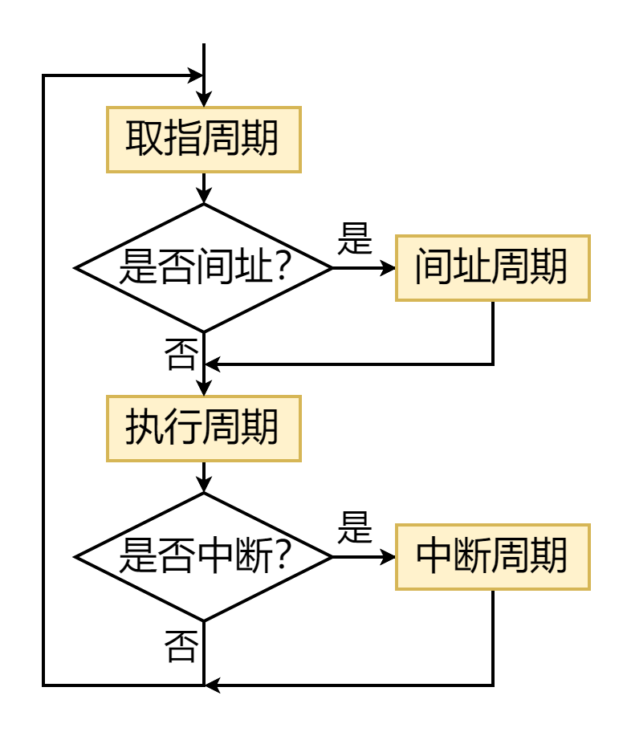

# 概述

- 中央处理器（Central Processing Unit，==CPU==），是整个==计算机的核心==
  - CPU会按照指令的要求，==控制计算机的各部件协调工作==，并且还要对信息处理过程中出现的==异常情况进行处理==
  - CPU上电复位后，就进入了“==取指、译码、执行指令==”的永久工作循环

# CPU的具体功能

## 程序控制

- ==控制程序的执行顺序==
  - 通常情况下，程序中的指令==按存储顺序自动执行==
  - 若遇到==分支指令且分支条件满足==、或遇到==跳转指令==，则会改变程序的执行顺序，CPU必须能够正确获取到下一条指令的地址

## 操作控制

- ==产生==指令执行过程中所需要的若干==操作控制信号==，以控制相应部件按指令规定的操作正确运行

## 时序控制

- ==控制==每个==操作控制信号==的==开始时刻==和==持续时长==，以便按规定的时序执行每个操作

## 异常和中断处理

- ==出现内部异常或外部中断请求==时，CPU应暂时==中断当前执行的程序==并进行==异常或中断处理==，处理完成后，还要==返回断点==继续执行程序
  - “未定义指令”、“整数除零”、“缺页”都属于内部异常
  - 外部设备产生中断请求

# CPU的基本组成

## 控制器

- 取指令
- 计算下一条指令的地址
- 对已取到的指令进行译码
- 生成指令对应的微操作控制信号序列
- 控制指令的执行步骤和数据流动方向

## 运算器

- 算术运算
- 逻辑运算或测试
- 数据加工

## Tip

- 

# CPU执行指令

## 概述

- 计算机的本质任务，就是==运行==事先编制好并存放在==主存中的程序==，进而实现用户应用
- CPU内的==控制器==按照程序所对应的==机器指令序列==逐条执行指令
  - CPU上电复位后，就进入“==取指、指令译码、执行指令==”的“==永久循环==”

## 指令的执行过程

- 

## 指令周期

### 概述

- 指令周期是指==CPU从主存存取并执行一条指令所需要的时间==
  - ==无条件转移指令==（例如JMP ADDR），只需要==取指阶段==（包含译码）和==执行阶段==
  - ==采用间接寻址方式的指令==，需要进行2次访才能取出操作数（先取操作数有效地址、然后从有效地址处取出操作数），因此，需要==取指阶段、间址阶段和执行阶段==
  - 当指令执行完毕后如果==出现中断请求==，CPU将进入==中断响应阶段==，进行保存断点、将中断处理程序入口地址送入程序计数器PC，进而==实现当前程序与中断处理程序的切换==
- 综上所述，一个完整的指令周期包含4个阶段
  - ==取指周期==
  - ==间址周期==
  - ==执行周期==
  - ==中断周期==

- 以上仅仅是一种==典型的指令周期划分方式==，但这并不意味着所有架构的计算机都是这样划分指令周期
- 除上述4个阶段外，还可能包括
  - ==总线周期==：完成总线操作以及总线控制权转移所需要的时间
  - ==I/O周期==：完成输入/输出操作所需要的时间
- ==不同指令的指令周期可能不同==
  - ==无条件转移指令==的指令周期仅包含==取指周期==和==执行周期==
  - ==采用间接寻址方式的指令==，其指令周期至少包含==取指周期、间址周期和执行周期==

### 机器周期

- 为了便于各指令同步，可将==指令周期==划分成若干个==机器周期==
  - 机器周期：一般是指==从主存取出一个存储字所需要的最短时间==
  - 每个==机械周期==由若干个==时钟周期==构成
- 

### 分类

- ==每个指令周期所包含的机器周期的数量、每个机器周期所包含的时钟周期的数量==并==不一定是固定的==，这与处理器架构的具体实现有关，一般分为以下两种
  - ==定长指令周期==：早期计算机常使用。所有指令的==指令周期相同==（指令周期所包含的机器周期的数量固定、机器周期所包含的时钟周期的数量也是固定的）
  - ==变长指令周期==：现代计算机常使用。各==指令按时钟周期（而不是机器周期）进行同步==，每条指令的执行所需的时钟周期数量“按需分配”，因此，机器周期的概念逐渐消失

### 指令周期流程

- 
  - 四个工作周期都有CPU访存操作，只是访存目的不同
    - 取指周期是为了取指令
    - 间址周期是为了取有效地址
    - 执行周期是为了取操作数
    - 中断周期是为了保存程序断点

## 指令周期各阶段数据流

### 概述

- 数据流是指为实现指令功能需要==依次访问的数据序列==
  - 在==指令周期的不同阶段==，需要依次访问的==数据序列不同==
  - ==不同指令的数据流很可能不同==

### 取指周期的数据流

- 

### 间址周期的数据流

- 

### 执行周期的数据流

- ==不同指令在执行周期的操作不同==，可能设计以下操作
  - CPU内部寄存器之间的数据传送
  - 对主存（或I/O）进行读写操作
  - 对算术运算单元ALU的操作
- 综上所述，==执行周期无法用统一的数据流图表示==

### 中断周期的数据流

- 

## 指令执行方案

### 单指令周期

- 对所有指令都选用相同的执行时间来完成
- 指令之间串行执行
- 指令周期取决于执行时间最长的指令的执行时间
- 优点：硬件设计简单
- 缺点：导致较短执行时间的指令会占用较长周期，会降低整个系统的运行速度

### 多指令周期

- 对不同类型的指令选用不同的执行步骤来完成
- 指令之间串行执行
- 可选用不同个数的时钟周期来完成不同指令的执行过程
- 优点：整个系统的运行速度相比于单指令周期快很多
- 缺点：需要更复杂的硬件设计

### 指令流水线

- 在每一个时钟周期启动一条指令，尽量让多条指令同时运行，但各自处在不同的执行步骤中
- 指令之间并行执行