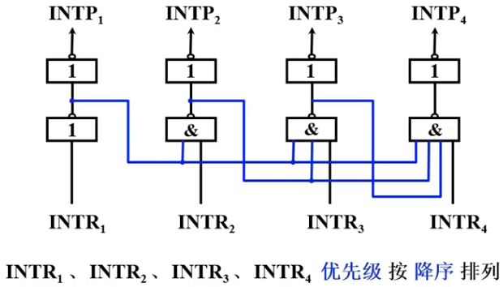

# 概述

## 基本概念

- 断点：中断响应时主程序停下的地址

## 引起中断的因素

- 人为设置的中断：例如“转管指令”
- 程序性事故：如定点溢出、浮点溢出、操作码无法识别、触发中出现“非法”等
- 硬件故障：电源掉电、插件接触不良、磁表面损坏等
- I/O设备：I/O设备被启动后，一旦准备就绪，就向CPU发出中断请求
- 外部事件：例如用户通过键盘来中断现行程序

## 中断的分类

### 可屏蔽中断INTR

- 通过可屏蔽中断请求线INTR向CPU发出的中断请求
- CPU可通过在中断控制器中设置相应的屏蔽字来决定是否屏蔽
- CPU根据该中断源是否被屏蔽来确定是否给予响应

### 不可屏蔽中断NMI

- 通过不可屏蔽中断请求线NMI向CPU发出的中断请求
- 这类中断CPU不能禁止响应，CPU快速处理这类紧急事件
- 一般是非常紧急的硬件故障，如电源掉电

# 中断请求

## 中断请求标记

- 中断请求触发器INTR
  - 作用：判断是哪个中断源提出请求（一个中断源一个INTR）
  - 触发器可集中设置在CPU内，组成中断请求标记寄存器（每一位对应一个中断源）；也可以分散到各个中断源中

## 中断判优逻辑

### 硬件排队

- 链式排队器
  - 在接口电路内分别设置各个设备的排队器
  - 每个接口电路中都设有一个非门和一个与非门
  - 当有一个或多个中断源提出中断请求时，排队器输出端INTR~i~只有一个高电平
- 例如：集中设置在CPU内的排队器

### 软件排队

- 通过编写查询程序实现
- 程序按中断源的优先级从高到低依次查询各个中断源是否有中断请求

- 

# 中断处理

## 中断响应

### 中断响应的条件

- 在中断系统设有“==允许中断触发器EINT==”，它可以被开中断指令置1，被关中断指令置0
- ENIT = 1时，CPU允许响应中断源的请求；反之CPU禁止响应中断

### 响应中断的时间

- CPU总是在==指令执行周期结束后==发送查询信号到每一个中断源的中断请求触发器INTR中。若有请求，则查询信号会将中断请求触发器INTR的输出端置1，将中断请求信号发送到排队电路。CPU根据排队电路执行中断程序进入中断周期
- 为了防止因某些指令执行时间很长，导致CPU在执行周期结束时查询中断请求过迟而出错，可在指令执行过程中设置若干个查询断点，CPU在每个查询断点均发出查中断询信号，以便发现有中断请求便可及时响应

### ==中断隐指令==

- CPU内部硬件逻辑的一部分，并非软件编写的显式指令，是CPU硬件电路检测到异常或中断时==自动执行的一系列原子操作==
- 具体操作
  1. 硬件==关中断==
  2. 保护最小上下文
     - 断点PC中的值存于特定地址（0号地址）内，断点进栈
     - 状态寄存器的值自动进栈
  3. 寻找服务程序入口地址

### 中断服务程序入口地址的寻找

#### 硬件向量法

- 利用硬件产生向量地址，根据向量地址找到中断服务程序的入口地址
- 利用向量地址找中断服务程序入口地址的方法（2种）
  - 无条件跳转指令：在向量地址指向的存储单元中放一条无条件转移指令
  - 中断向量表：设置中断向量表，该表在存储器内，存储单元的地址是向量地址，存储单元中的内容是入口地址。将入口地址加载到PC
- 硬件向量法寻找入口地址速度快，现代计算机普遍采用这种方法

#### 软件查询法

- 用软件寻找中断服务程序的入口地址
- 当查找到某一中断源有中断请求时，安排转移指令直接指向此中断源的中断服务程序的入口地址
- 便于修改优先级，更灵活

## 中断服务

## 保护现场和恢复现场

### 保护现场

- ==断点==：==中断隐指令==完成
- ==寄存器内容==：==中断服务程序==完成

### 恢复现场

- 均由==中断服务程序==完成

# 多重中断

## 概念

- 多重中断（中断嵌套）：CPU正在执行一个中断服务程序时，又有另一个中断源提出新的中断请求，CPU响应了这个新的中断请求，暂时停止正在运行的服务程序
- 单重中断：CPU对新的请求不予响应，等到执行完当前的中断服务程序后再响应

## 实现条件

- 提前设置==开中断==指令
- ==优先级别高==的中断源==有权中断优先级别低==的中断源

## 屏蔽技术

- 屏蔽触发器：每个中断请求触发器都有一个屏蔽触发器与之对应
  - 
- 屏蔽字：屏蔽触发器中的值。屏蔽字与中断源的优先级是一一对应的，为0时未屏蔽，为1则屏蔽
  - 
- 屏蔽技术可以改变处理优先等级
  - 响应优先级：不可改变
  - 处理优先级：可通过重新设置屏蔽字进行改变
  - 
  - 
- 屏蔽技术的其他作用：可以==认为地屏蔽==某个中断源的请求
- 采用屏蔽技术后，中断服务程序中需设置新的屏蔽字

## 多重中断的断点保护

- 中断系统对断点的保存都是在中断周期内，由中断隐指令实现的，对用户透明
- 断点可以保存在堆栈或指定的存储单元中

# 中断处理流程

## 单重中断

1. 中断隐指令
   1. 关中断
   2. 保护断点
   3. 中断服务程序寻址
2. 中断服务程序
   1. 保护现场
   2. 执行核心服务逻辑
   3. 恢复现场
   4. 开中断
   5. 中断返回

## 多重中断（采用屏蔽技术的可嵌套中断处理流程）

1. 中断隐指令
   1. 关中断
   2. 保护断点
   3. 中断服务程序寻址
2. 中断服务程序
   1. 保护现场
   2. ==置屏蔽字==
   3. ==开中断==
   4. 执行核心服务逻辑
   5. ==关中断==
   6. 恢复现场
   7. ==恢复屏蔽字==
   8. 开中断
   9. 中断返回

# 异常（内中断）

## 概述

- 由==CPU内部==产生的意外事件
- 由于是CPU内部触发的事件，所以不需要中断请求与中断请求的识别，直接跳过这两阶段==从中断隐指令开始==

## 分类

### 软件异常

#### 故障

- 引起故障的指令启动后、执行前被检测到指令有问题的异常事件
- 故障恢复后回到断点继续执行；无法恢复故障必须终止进程的执行

#### 自陷

- 预先安排好的异常事件
- 处理完异常事件后，返回到自陷指令的下一条指令执行（若自陷指令为转移指令，则返回到转移目标指令执行）

### 硬件异常

#### 终止

- CPU内部的硬件故障或严重错误
