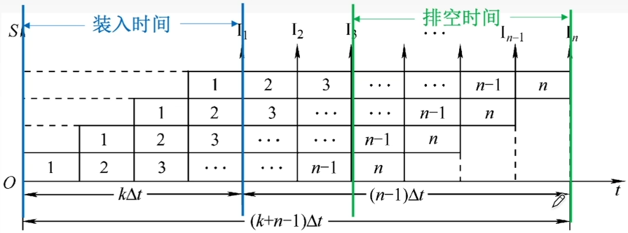
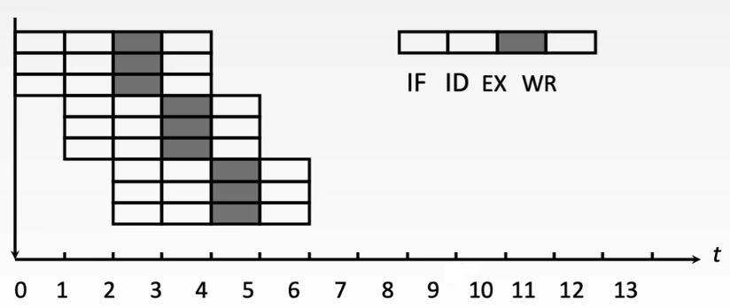

# 概述

- 指令执行过程划分为不同阶段，占用不同的资源，就能使多条指令同时执行
- 表示方法
  - 指令流程图：主要用于分析影响流水线的因素
  - 时空图：主要用于分析流水线的性能

# 性能指标

## 吞吐率TP

- > 单位时间内流水线所完成的任务数量，或是输出结果的数量

- $$
  设任务数为n，处理完成n个任务所用的时间为T_k，一条指令的执行分为k个阶段，每个阶段耗时\Delta t，一般取为一个时钟周期\\
  T_k = (k + n - 1) \Delta t\\
  流水线吞吐率TP = \frac{n}{T_k}=\frac{n}{(k + n - 1) \Delta t}
  $$

- 理想情况下

  - $$
    连续输入任务n \to \infty时，得最大吞吐率TP_{max}=\frac{1}{\Delta t}
    $$

## 加速比S

- 完成同样一批任务，不使用流水线所用的时间与使用流水线所用的时间之比

- $$
  设T~0~表示不使用流水线时的执行时间，T~k~表示使用流水线时的执行时间，一条指令的执行分为k个阶段，每个阶段耗时\Delta t，一般取为一个时钟周期\\
  流水线加速比S = \frac{T_0}{T_k} = \frac{k n \Delta t}{(k + n - 1)\Delta t} = \frac{k n}{k + n - 1}
  $$

## 效率E

- 流水线的设备利用率称为流水线的效率。在时空图上，流水线的效率定义为==完成n个任务占用的时空区有效面积==与==n个任务所用的时间与k个流水段所围成的时空区总面积==之比

- $$
  流水线效率E = \frac{n个任务占用的时空区有效面积}{n个任务所用的时间与k个流水段所围成的时空区总面积} = \frac{T_0}{k T_k}
  $$

- 

# 影响因素

## 结构相关（资源冲突）

- > 由于多条指令在同一时刻争用同一资源而形成的冲突

- 解决办法

  - 暂停相关指令
  - 资源重复配置

## 数据相关（数据冲突）

- > 一个程序中存在必须等前一条指令执行完才能执行后一条指令的情况

- 通过指令流程图分析耗时

- 解决办法

  - 暂停相关指令
    - 硬件阻塞（stall）：根据指令流程图分析耗时
    - 软件插入NOP
  - 数据旁路技术
  - 编译优化，调整指令顺序

## 控制相关（控制冲突）

- > 当流水线遇到转移指令和其他改变PC值的指令而造成断流的情况

- 解决办法

  - 分支预测
  - 预取两个方向的指令
  - 加快和提前形成条件码
  - 提高转移方向的猜准率

# 分类

## 按使用级别

### 部件功能级

- 复杂的算术逻辑运算组成流水线工作方式

### 处理机级

- 一条指令解释过程分成多个子过程

### 处理机间级

- 一种宏流水，其中每一个处理机完成某一专门任务，各处理机所得到的结果需存放在与下一个处理机所共享的存储器中

## 按完成功能

### 单功能

- 只能实现一种固定的专门功能的流水线

### 多功能

- 通过各段间的不同连接方式可以同时或不同时地实现多种功能的流水线 

## 按连接方式

### 动态

- 同一时间内，某些段正在实现某种运算时，另一些段进行另一种运算

### 静态

- 在同一时间内，流水线的各段只能按同一种功能的连接方式工作

## 按有无反馈信号

### 线性

- 从输入到输出，每个功能段只允许经过一次，不存在反馈回路

### 非线性

- 存在反馈回路

# 常见技术

## 多发技术

### 超标量流水线技术

- 每个时钟周期内可==并发多条独立指令==
- 要配置多个功能部件
- ==不能调整==指令的==执行顺序==
- 通过编译优化技术，把可并行执行的指令搭配起来
- 

### 超流水线技术

- 在==一个时钟周期==内==再分段==
- 在一个时钟周期内==一个功能部件使用多次==
- ==不能调整==指令的==执行顺序==
- 依靠编译程序解决优化问题
- 

### 超长指令字技术

- 由==编译程序挖掘==出指令间==潜在==的==并行性==
- 将==多条==能==并行操作==的指令组合成==一条==
- 具有==多个操作码字段==的==超长指令字==（可达几百位）
- 采用==多个处理部件==