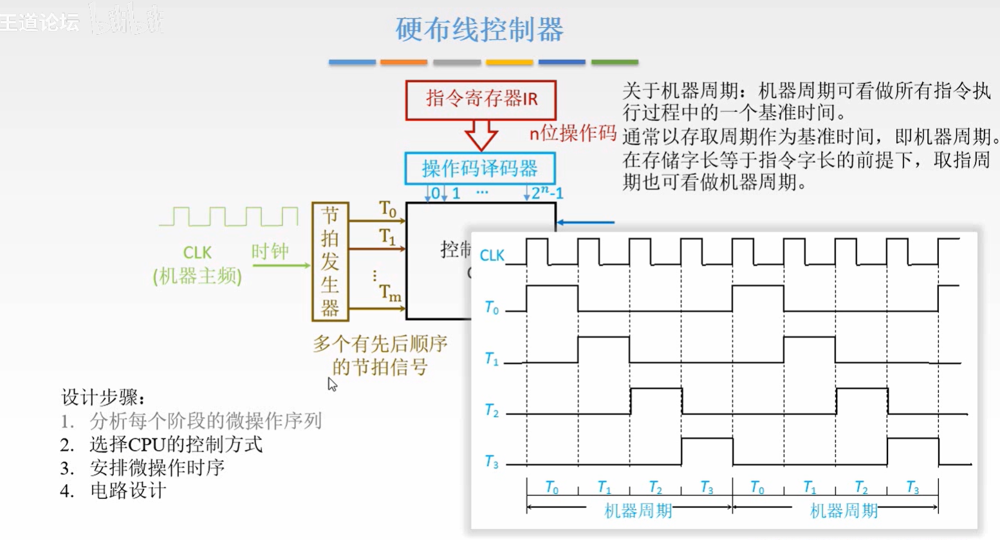
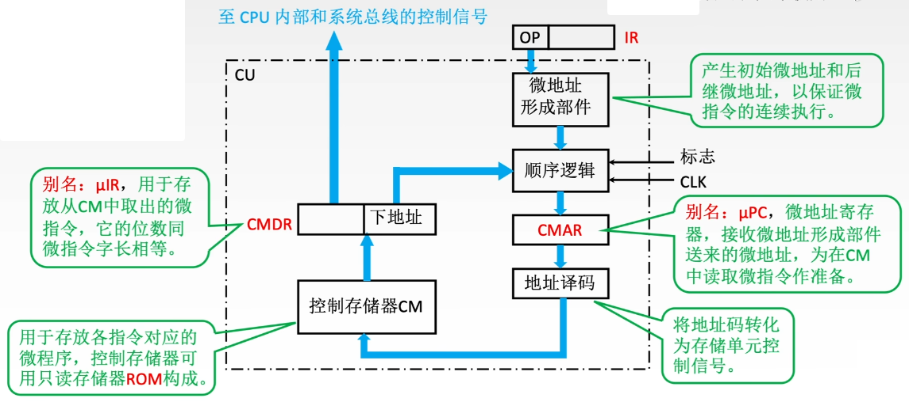
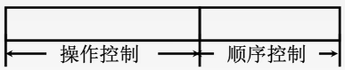
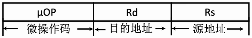
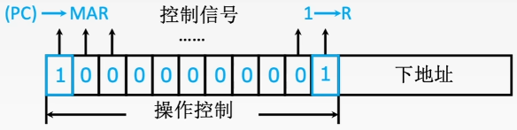
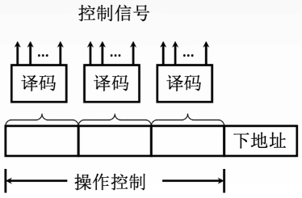
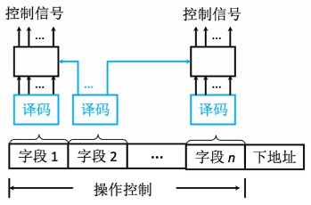
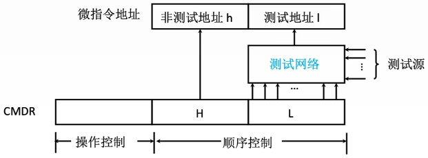

# 主要功能

- 从主存中取出一条指令，并指出下一条指令在主存中的位置
- 对指令进行译码或测试，产生相应的操作控制信号，以便启动规定的动作
- 只会并控制CPU、主存、输入和输出设备之间的数据流动方向

# 相关概念

- 微程序：微指令的有序集合，一条指令的功能由一段微程序来实现
  - 微指令：若干微命令的集合
    - 微命令：微操作的控制信号
    - 微操作：微命令的执行过程
  - 微周期：通常指从控制存储器中读取一条微指令并执行相应的微操作所需的时间

# 硬布线控制器

## 工作原理

- ==微操作控制信号==由组合逻辑电路根据当前指令码、状态和时序，即时产生
- 

## 控制单元

### 设计步骤

1. 分析每个阶段的微操作序列
2. 选择CPU的控制方式
3. 安排微操作时序
4. 电路设计

### 硬布线控制器的时序及微操作

### CPU控制方式

#### 同步控制方式

- > 整个系统所有的控制信号均来自一个==统一的时钟信号==

- 通常以最长的微操作序列和最繁琐的微操作作为标准，采用完全统一的、具有相同时间间隔和相同数目的时钟周期的机器周期来运行不同的指令

- 优点：控制电路简单

- 缺点：运行速度慢

#### 异步控制方式

- > ==不存在基准时标信号==

- 各部件按自身固有的速度工作，通过==应答方式==进行联络

- 优点：运行速度块

- 缺点：控制电路复杂

#### 联合控制方式

- > 对各种不同的指令的微操作实行==大部分采用同步控制、小部分采用异步控制==的办法

### 微操作时序安排原则

- 微操作的==先后顺序不得==随意==更改==
- ==被控对象不同==的微操作尽量安排在==一个时钟周期==内完成
- 占用==时间较短==的微操作尽量安排在==一个时钟周期==内完成并==允许有先后顺序==

### 电路设计流程

1. 列出操作时间表
2. 写出微操作命令的最简表达式
3. 画出逻辑图

## 特点

- 指令越多，设计和实现越复杂，因此一般用于RISC
- 扩充新指令，控制器设计就需要大改，所以扩充指令困难
- 纯硬件实现控制，执行速度很快。微操作控制信号由组合逻辑电路即时产生

# 微程序控制器

## 工作原理

- > 实现把==微操作控制信号==存储在一个专门的存储器（控制存储器）中

- 将每一条机器指令编写成一个微程序，这些微程序可以存到一个控制存储器中，用寻址用户程序机器指令的办法来寻址每个微程序中的微指令

- 处理取指周期、间址周期、中断周期的微指令序列通常是公用的。执行周期的微指令序列各不相同

- 取指周期的微指令序列固定从#0开始存放。执行周期的微指令序列的存放根据指令操作码确定

## CU的结构

- 
  - ==微地址形成部件==
    - 微地址即微指令在CM中的存放地址
    - 通过指令操作码形成对应微程序的第一条微指令的存放地址
  - 顺序逻辑：根据某些机器标志和时序信息确定下一条微指令的存放地址
  - ==微地址寄存器CMAR(μPC)==：指明接下来要执行的微指令的存放地址
  - 地址译码器：将 CMAR 内的地址信息译码为电信号，控制CM读出微指令
  - ==控制存储器CM==
    - 存放所有机器指令对应的微程序(微指令序列)
    - 用ROM实现，按地址寻访。通常在CPU出厂时就把所有微程序写入
  - ==指令寄存器CMDR（μlR）==：微指令寄存器，用于存放当前要执行的微指令。CM(μPC)->μIR

# 微指令

## 基本概念

- 相容性微命令：可以并行完成的微命令
- 互斥性微命令：不允许并行完成的微命令

## 格式

### 水平型微指令

- 一条微指令能定义多个可并行的微命令
- 
- 优点：微程序短，执行速度快
- 缺点：微指令长，编写微程序麻烦

### 垂直型微指令

- 一条微指令只能定义一个微命令，由微操作码字段规定具体功能
- 
- 优点：微指令短、简单、规整，便于编写微程序

### 混合型微指令

- 在垂直型的基础上增加一些不太复杂的并行操作
- 微指令较短，仍便于编写。微程序也不长，执行速度加快

## 编码方式

### 直接编码（直接控制）方式

- > 在微指令的操作控制字段中，==每一位代表一个微操作命令==

- 优点：简单、直观，执行速度块，操作并行性好

- 缺点：微指令字长过长，n个微命令就要求微指令的操作字段有n位，造成控存容量极大

- 

### 字段直接编码方式

- > 将微指令的控制字段分成若干“段”，==每段经译码后发出控制信号==

- 微命令字段分段的原则

  - ==互斥性==微命令分在==同一段内==，==相容性==微命令分在==不同段内==
  - ==每个小段==中包含的==信息位不能太多==，否则将增加译码线路的复杂性和译码时间
  - 一般==每个小段还要留出一个状态==，表示本字段不发出任何微命令。因此当某字段长度为3位时，最多只能表示7个互斥的微命令，==通常000表示不操作==

- 优点：可以缩短微指令字长

- 缺点：要通过译码电路后再发出微命令，因此比直接译码方式慢

- 

### 字段间接编码方式

- > 一个字段的某些微命令需由另一个字段中的某些微命令来解释

- 由于不是靠字段直接译码发出的微命令，故称为字段间接编码，又称隐式编码

- 优点：可以缩短微指令字长

- 缺点：削弱了微指令的并行控制能力，故通常作为字段直接编码方式的一种辅助手段

- 

 ## 地址形成方式

### ==断定法（下地址法）==

- 微指令格式中设置一个下地址字段，由微指令的下地址字段直接指出后继微指令的地址

### 根据机器指令的==操作码==形成

- 当机器指令取至指令寄存器后，微指令的地址由操作码经微地址形成部件形成

### ==计数器法==

- (CMAR) + 1 -> CMAR

### 分支转移

- 转移方式：指明判别条件
- 转移地址：指明转移成功后的去向

### 通过测试网络

- 

### 由硬件产生微程序入口地址

- ==第一条微指令地址==：由专门==硬件==产生（用专门的硬件记录取指周期微程序首地址）
- 中断周期：由==硬件==产生==中断周期微程序首地址==（用专门硬件记录）
