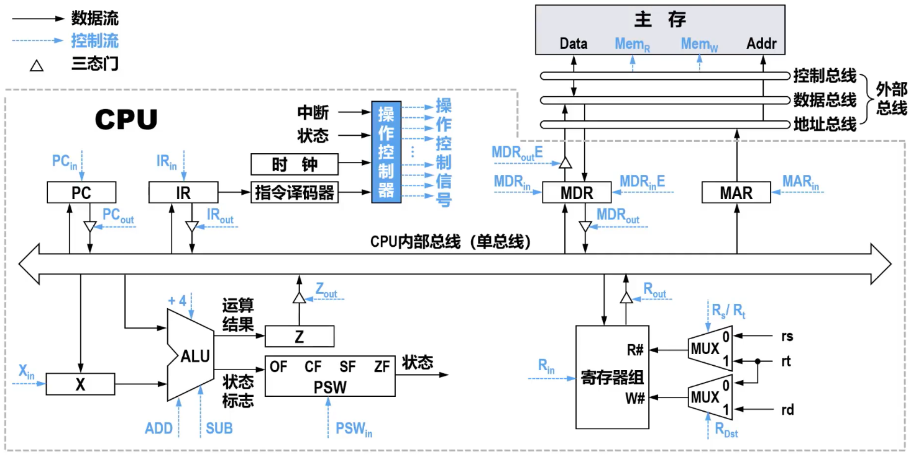

# 概述

- 数据通路是指==数据在各功能部件之间传送的路径==
  - ==CPU内部的数据通路==是指==运算器与各寄存器之间==的数据传送路径
- 数据在数据通路中的传送操作需要在==控制信号==的控制下进行
- 不同指令在指令周期的不同阶段可能使用不同的数据通路
- 同一指令在指令周期的不同阶段也可能使用不同的数据通路
- 综上所述，数据通路的结构对CPU内各种数据的传送路径、各种指令执行所需要的微操作（最基本的、不可再分割的动作）控制信号以及控制器的设计等都有重要影响
- ==数据通路的基本结构==可分为
  - ==总线==
  - ==专用通路==
- 
  - 对于采用单总线结构的CPU内部总线，CPU内的运算器、控制器、专用寄存器、通用寄存器等核心部件都通过这条内部的公共总线连接
    - 同一时刻只能有一个部件向总线发送数据，否则会出现数据冲突。因此，连接到总线上的部件都需要进行输出控制（使用图中所示的三态门），以防止总线上出现数据冲突。而各部件可同时接收总线上的数据
  - 本例中的单总线并不是指有一根物理传输线构成的总线，而是指CPU内各部件都共享该公共总线来传输信号

# CPU内部总线

## 单总线

- ALU需要配合暂存器使用

## 多总线

# 专用数据通路

- 多路选择器与三态门