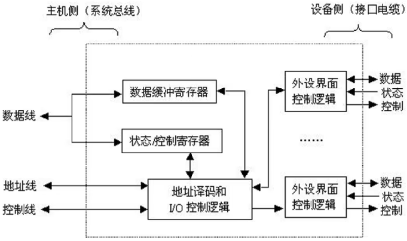

# 概述

- I/O接口又称I/O控制器（I/O Controller）、设备控制器，负责协调主机与外部设备之间的数据传输

# 基本概念

## IO硬件

- 输入设备、输出设备、外存设备、I/O接口（I/O控制器）

## IO软件

### IO指令

- CPU执行的指令，用于控制IO接口或控制通道

### 通道指令

- 通道执行的指令，与CPU机器指令不是一套东西

# 结构和作用

- 
- 内部接口：与系统总线相连，实质上是与内存、CPU相连，早年内部接口是并行传输，从2000年开始逐渐转向串行传输。串行传输综合来看抗干扰能力强、提升频率空间大。现有技术同成本下串行传输速率更高
- 外部接口：通过接口电缆与外设相连，外部接口的数据传输方式可能是串行方式，因此I/O接口需具有串/并转换功能
- | 结构                  | 作用                                                         |
  | --------------------- | ------------------------------------------------------------ |
  | 数据缓冲寄存器（DBR） | - 暂存即将输入输出的数据 - 主机和外设的速度匹配         |
  | 状态/控制寄存器       | - 命令字：CPU对设备发出的具体命令 - 状态字：设备的状态信息，供CPU检查 |
  | 串-并转换机构         | - 数据格式的转换                                             |
  | I/O控制逻辑           | - 根据命令字向设备发出控制信号                               |
  | 地址译码逻辑          | - 将地址信号映射到指定I/O端口                                |

# I/O端口Port

## Remind

- > I/O端口是指接口电路中可以被CPU直接访问的寄存器

## 种类

### 数据端口

- CPU可能读可能写

### 控制端口

- CPU只会写

### 状态端口

- CPU只会读

## 编址方式

### 统一编址

- I/O端口当做存储器的单元并进行地址分配，用统一的==访存指令==就可以访问I/O端口，又称存储器映射方式
- 靠不同的==地址码==区分内存和I/O设备，I/O地址要求相对固定在地址的某部分
- 优点
  - 不需要专门的输入/输出指令，所有访存指令都可直接访问端口，程序设计灵活性高
  - 端口有较大的编址空间
  - 读写控制逻辑电路简单
- 缺点
  - 端口占用了主存地址空间，使主存地址空间变小
  - 外设寻址时间长（地址位数多，地址移码速度慢）
- RISC常用

### 独立编址

- I/O端口地址与存储器地址无关，独立编制CPU需要设置==专门的输入/输出指令==访问端口，又称I/O映射方式
- 靠不同的==指令==区分内存和I/O设备
- 优点
  - 使用专用的I/O指令，程序编制清晰
  - I/O端口地址位数少，地址译码速度快
  - I/O端口的地址不占用主存地址空间
- 缺点
  - I/O指令类型少，一般只能对端口进行传送操作，程序设计灵活性差
  - 需要CPU提供存储器读/写、I/O设备读/写两组控制信号，增加了控制逻辑电路的复杂性

# 分类

## 并行接口、串行接口

## 程序查询接口、中断接口、DMA接口

## 可编程接口、不可编程接口