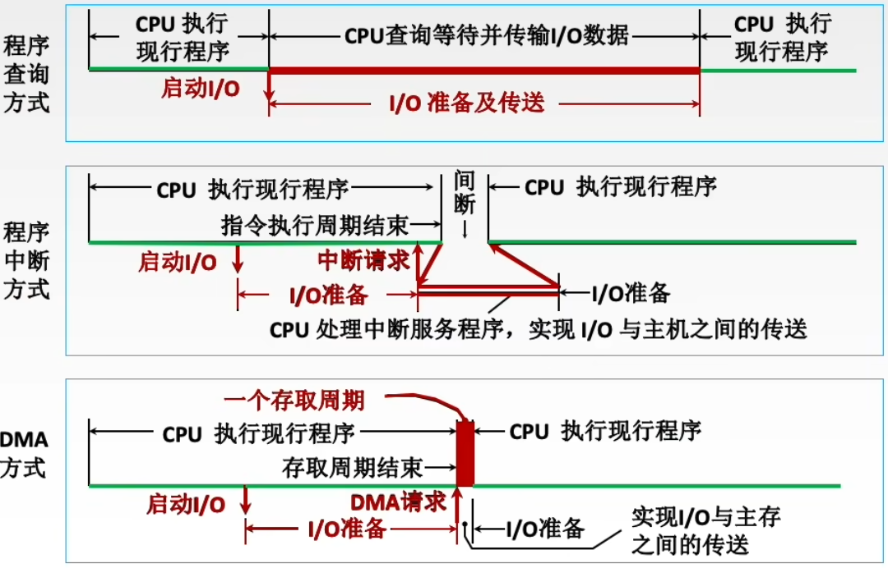

# 概述

- 结合操作系统的设备管理的设备控制中设备控制方式理解

# 程序查询方式

- 主要特点：CPU有踏步等待现象，CPU与I/O串行工作
- 优点：接口设计简单、设备量少
- 缺点：CPU在信息传送过程中要花费很多时间用于查询和等待，而且如果采用独占查询，则在一段时间内只能和一台外设交换信息，效率大大降低
- 独占查询：进程运行的100%的时间都在查询I/O状态，完全串行（是否完全阻塞CPU，归操作系统的进程管理）
- 定时查询：在保证数据不丢失的情况下，每隔一段时间进程就查询一次I/O状态。查询的间隔内CPU可以执行程序其他代码

# 程序中断方式

# DMA方式

## DMA控制器

### 工作原理

1. 传输数据前
   1. 接受外设发出的DMA请求（外设传送一个字的请求），并向CPU发出总线请求（要==在总线周期外==）
   2. CPU响应此总线请求，发出总线响应信号，接管总线控制权，进入DMA操作周期
2. 传输数据时
   1. 确定传送数据的主存单元地址及长度，并能自动修改主存地址计数和传送长度计数
   2. 规定数据在主存和外设间的传送方向，发出读写等控制信号，执行数据传送操作
3. 传输数据后：向CPU报告DMA操作的结束

### 组成

- 主存地址计数器：存放要交换数据的主存地址
- 传送长度计数器：记录传送数据的长度，计数溢出时，数据即传送完毕，自动发中断请求信号
- 数据缓冲寄存器：暂存每次传送的数据
- DMA请求触发器：设备准备好数据后将其置位
- 控制/状态逻辑：由控制和时序电路及状态标志组成，用于指定传送方向，并对DMA请求信号和CPU响应信号进行协调和同步
- 中断机构：数据传送完毕后触发中断机构，提出中断请求

## 传送过程

- 预处理：CPU完成寄存器初值的设置等准备工作
- 数据传送：CPU继续执行主程序，DMA控制器完成数据传送
- 后处理：CPU执行中断服务程序做DMA结束处理

## 传送方式

### 停止CPU访存

- 需要数据传送时，停止CPU访存，总线控制权交给DMA控制器
- 优点：控制简单
- 缺点：CPU处于不工作状态或保持状态未充分发挥CPU对主存的利用率

### 交替访存

- 将CPU周期分为DMA访存和CPU访存两个部分
- 优点：不需要总线使用权的申请、建立和归还过程
- 缺点：硬件逻辑更为复杂

### 周期挪用（周期窃取）

- I/O设备需要访存时，挪用一个或几个存取周期
- DMA访问主存有三种情况
  - CPU此时不访存：不冲突
  - CPU正在访存：存取周期结束让出总线
  - CPU与DMA同时请求访存：==I/O访存优先==

## 特点

# Tip

## 程序中断方式与DMA方式对比

- |          | 中断                                         | DMA                                             |
  | -------- | -------------------------------------------- | ----------------------------------------------- |
  | 数据传送 | 程序控制                                     | 硬件控制                                        |
  | 中断请求 | 传送数据                                     | 后处理                                          |
  | 响应     | 指令执行周期结束后响应中断（由中断系统决定） | 每个传输周期结束均可，总线空闲时即可响应DMA请求 |
  | 场景     | CPU控制，低速设备                            | DMA控制器控制，高速设备                         |
  |          | 优先级低于DMA                                | 优先级高于中断                                  |
  |          | 能处理异常事件                               | 仅传送数据                                      |

  