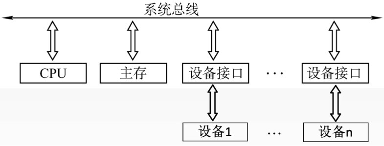
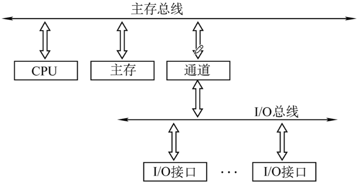
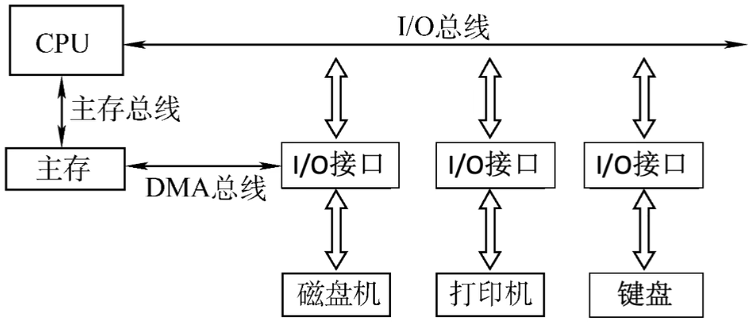
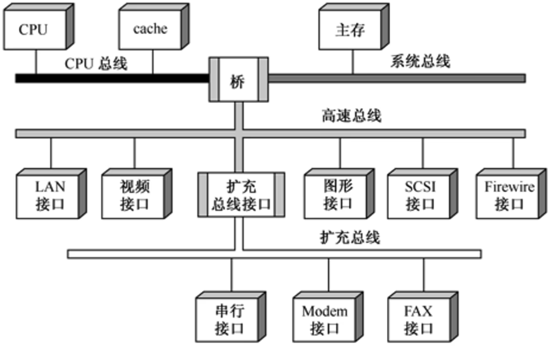
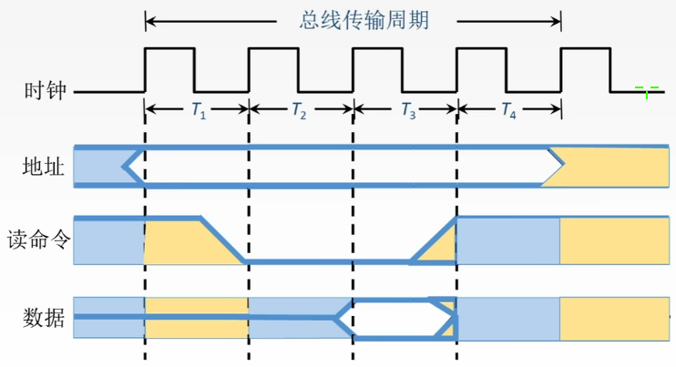
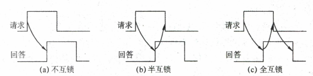
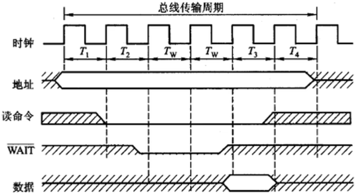

# 概述

## Remind

- 同一时刻==只能有一个部件发送==数据，==可有多个部件接受数据==

## 定义

- 总线是一组能为多个部件分时共享的公共信息传送线路

## 特性

### 机械特性

- 尺寸
- 形状
- 管脚数
- 排列顺序

### 电气特性

- 传输方向
- 有效的电平范围

### 功能特性

- 每根传输线的功能（地址、数据、控制）

### 时间特性

- 信号的时序关系

## 分类

### 按数据传输格式

- | 数据传输格式 | 优点                                                         | 缺点                                                         |
  | ------------ | ------------------------------------------------------------ | ------------------------------------------------------------ |
  | 串行         | - 只需要一条传输线，成本低廉，广泛应用于长距离传输 - 节省布线空间 | 在数据发送和接收的时候需要进行拆卸和装配，要考虑串行-并行转换的问题 |
  | 并行         | 总线的逻辑时序比较简单，电路实现较为容易                     | - 信号线数量多，占用更多的布线空间 - 远距离传输成本高昂 - 工作频率较高时，并行的信号线之间会产生严重干扰，对每条线等长的要求也较高，所以无法持续提升工作频率 |

### 按功能

#### 片内总线

- > 芯片内部的总线

- CPU芯片内部寄存器与寄存器之间、寄存器与ALU之间的公共连接线

#### 系统总线

##### Remind

- > 计算机系统内各功能部件（CPU、主存、I/O接口）之间相互连接的总线

##### 数据总线

- 传输各功能部件之间的数据信息，包括指令和操作数
- 位数（根数）与机器字长、存储字长有关
- ==双向==

##### 地址总线

- 传输地址信息，包括主存单元或I/O端口的地址
- 位数（根数）与主存地址空间大小及设备数量有关
- ==单向==

##### 控制总线

- 传输控制信息，包括CPU送出的控制命令（传出）主存（或外设）返回CPU的反馈信号（传入）
- 一根控制线传输一个信号
- ==双向==

#### 通信总线

- 连接计算机系统之间或计算机系统与其他系统（如远程通信设备、测试设备）之间的通信传送的总线，通信总线又称外部总线

### 按时序控制方式

#### 同步

#### 异步

# 总线结构

- 总线结构中的总线是系统总线，只不过每条总线用途不同，改变系统总线名称。他们都可分为控制、地址、数据三大子总线
- | 总线结构   | 描述                                                         | 优点                                                         | 缺点                                                         | 结构                                                         |
  | ---------- | ------------------------------------------------------------ | ------------------------------------------------------------ | ------------------------------------------------------------ | ------------------------------------------------------------ |
  | 单总线结构 | 一条系统总线，CPU、主存、I/O设备（通过I/O接口）都连接在这条总线上，允许I/O设备之间、I/O设备和CPU之间或I/O设备与主存之间直接交换信息 | ==结构简单，成本低，易于接入新的设备==                       | ==带宽低、负载重，多个部件只能争用唯一的总线，且不支持并发传送操作== | -  - 系统总线 |
  | 双总线结构 | 两条系统总线。一条主存总线，用于CPU、主存和通道之间的数据传送。一条I/O总线，用于多个外部设备与通道之间的数据传送 | ==将较低速的I/O设备从单总线上分离出来，实现存储器总线和I/O总线分离== | ==需要增加通道等硬件设备==                                   | -  - 主存总线 - I/O总线 |
  | 三总线结构 | 三条总线                                                     | ==提高了I/O设备的性能，使其更快地相应命令，提高系统吞吐量==  | ==同一时刻只能有一个总线工作，系统工作效率较低==             | -  - 主存总线 - I/O总线 - DMA总线 |
  | 四总线结构 | 四条总线（南桥北桥）。桥接器，用于连接不同的总线，具有数据缓冲、转换和控制功能。靠近CPU的总线速度较快。每级总线的设计遵循总线标准 |                                                              |                                                              | -  |

# 性能指标

## 传输周期（总线周期）

- ==一次总线操作所需要的时间==（包括申请阶段、寻址阶段、传输阶段和结束阶段），通常由若干个总线时钟周期构成

## 时钟周期

- 即==机器的时钟周期==。计算机有一个统一的时钟，以控制整个计算机的各个部件，总线也要受此时钟的控制，一般就是CPU的时钟周期，也可以由桥接器提供

## 工作频率

- 总线上各种操作的频率，为==总线周期的倒数==。==一秒内传送几次数据==

## 时钟频率

- 机器的时钟频率，为==时钟周期的倒数==。==一秒内多少个时钟周期==

## 总线宽度

- 又称总线位宽，总线上能够同时传输的数据位数，通常是指数据总线的根数

## 总线带宽

- 可理解为总线的数据传输率，即单位时间内总线上可传输的数据的位数，通常用字节/秒（B/s）表示
- 总线带宽 = 总线工作频率 × 总线宽度 (bit/s)

## 总线复用

- ==一组信号线在不同的时间传输不同的信息==，可以使用==较少的线==传输更多的信息，节省空间和成本。例如使用一组信号线同时作为地址总线和数据总线

## 信号线数

- 地址总线、数据总线和控制总线三种总线的根数的总和

## Tip

- 由于双沿技术，传输周期可能包含多个时钟周期，时钟周期可能包含多个传输周期

# 总线事务

## 总线周期的四个阶段

1. 申请分配阶段：需要使用总线的主模块（或主设备）提出申请，经总线仲裁机构决定下一传输周期的总线使用权授予某一申请者。也可将此阶段细分为==传输请求==和==总线仲裁==两个阶段
   1. 传输请求
   2. 总线仲裁
2. 寻址阶段：获得使用权的主模块通过总线==发出==本次要访问的从模块的==地址==及有关==命令==，启动参与本次传输的从模块
3. 传输阶段：主模块和从模块进行==数据交换==，可单向或双向进行数据传送
4. 结束阶段：主模块的==有关信息==均从系统总线上==撤除==，让出总线使用权

# 总线定时

## 概述

- 总线在双方交换数据的过程中时间上配合关系的控制，这种控制成为总线定时，他的实质是一种协议或规则

## 同步定时方式（同步通信）

- 总线控制器采用一个==统一的时钟信号==来协调发送和接收双方的传送定时关系。所有总线周期所包含的时钟周期数量相等且固定
- 
- ==优点==
  - 传送速度快，具有较高的传输速率
  - 总线控制逻辑简单
- ==缺点==：主从设备属于强制性同步，不能及时进行数据通信的有效检验，可靠性较差
- 适用于==总线长度较短==及总线==所接部件的存取时间比较接近==的系统

## 异步定时方式（异步通信）

- 没有统一时钟，也没有固定的时间间隔，依靠传送双方相互制约的握手信号来实现定时控制
- 主设备提出交换信息的请求信号，经接口传送到从设备。从设备接到主设备的请求后，通过接口向主设备发出回答信号
- 根据请求和回答信号的撤销是否互锁，分为以下三种类型
  - 不互锁方式：速度最快，可靠性最差
    - 主设备发出请求后，不等回答，经过一段时间自动撤销请求
    - 从设备接到请求后，发出回答，经过一段时间自动撤销回答
  - 半互锁方式
    - 主设备发出请求后，必须接到回答才撤销请求
    - 从设备接到请求后，发出回答，不必获知请求撤销，经过一段时间自动撤销回答
  - 全互锁方式：速度最慢，最可靠
    - 主设备发出请求后，必须接到回答才撤销请求
    - 从设备接到请求后，发出回答，必须获知请求撤销才撤销回答
  - Tip
    - 
- ==优点==：总线周期长度可变，能保证两个工作速度相差很大的部件或设备之间可靠地进行信息交换，自动适应时间的配合
- ==缺点==：比同步控制方式稍微复杂一些，速度比同步定时方式慢

## 半同步通信

- 同步在发送方用系统时钟前沿发信号、接收方用系统时钟后沿判断识别
- 异步在允许不同速度的模块和谐工作
- 统一时钟的基础上，增加一个等待响应信号WAIT，根据等待信号反馈，动态的调节传输周期所包含的时钟周期数
- 

## 分离式通信

- 一个总线传输周期
  - 主模块发地址、命令：使用总线
  - 从模块准备数据：不使用总线
  - 从模块向主模块发数据：使用总线
- 分离式通信就是将不使用总线的这段时间给其他总线操作
- 分离式通信传输周期
  - 子周期1：主模块申请占用总线，使用完后放弃总线使用权
  - 自周期2：从模块申请占用总线，将各种信息送至总线上
- 特点
  - 各模块均有权申请占用总线
  - 采用同步方式通信，不等对方回答
  - 各模块准备数据时，不占用总线
  - 总线利用率提高
